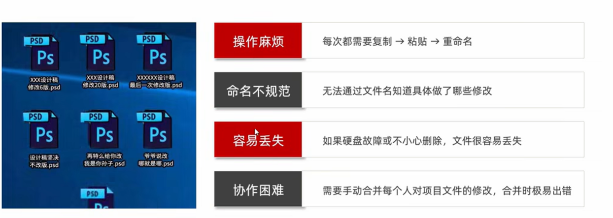
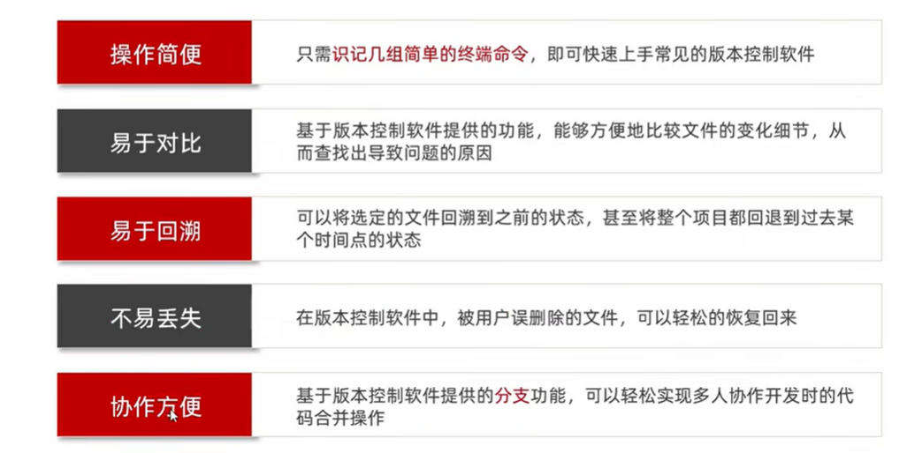
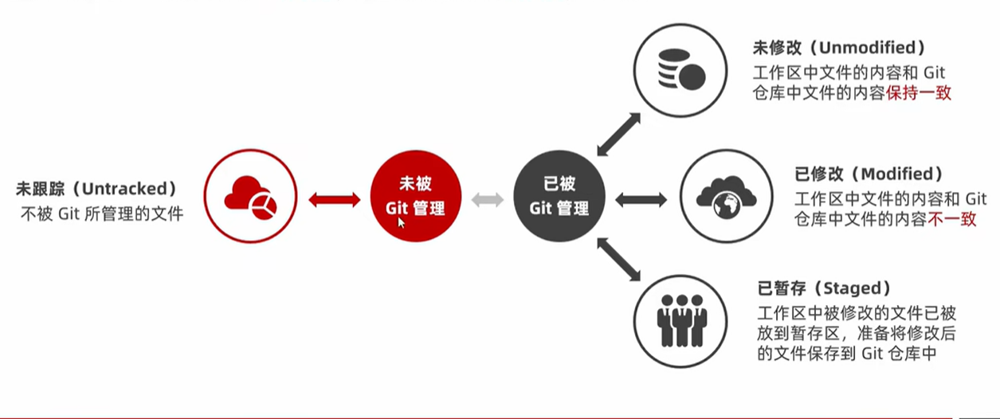
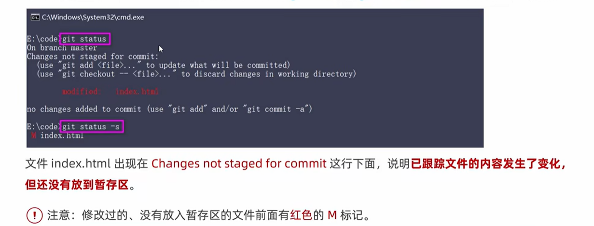

# 1.git

## 1.文件的版本

## 2.版本控制软件

版本控制软件概念：是一个记录文件变化，以便将来查阅特定的版本修订的系统，因此也叫做版本控制系统

通俗理解：把手动管理文件版本的软件，改为由软件管理文件的版本把这个负责管理文件版本的软件叫做版本控制软件

## 3.使用版本控制软件的好处

## 4.版本控制系统分类

- 本地版本控制系统：单机运行，使维护文件版本的操作工具化
- 集中化的版本控制系统：联网运行，支持多人协作开发；性能查、用户体验不好
- 分布式版本控制系统：联网运行，支持多人协作开发；性能优秀、用户体验好

### 4.1本地版本控制系统

特点：使用软件来记录文件的不同版本，提高了工作效率，降低了手动维护版本的出错率

缺点：

1. 单机运行、不支持多人协作开发
2. 版本数据库故障后，所有历史更新记录会丢失

### 4.2集中化的版本控制系统

特点：基于服务器、客户端的运行模式

典型代表：SVN

1. 服务器保存文件的所有更新记录 
2. 客户端只保留最新的文件版本

优点：联网运行、支持多人协作开发

缺点：

1. 不支持离线提交版本更新
2. 中心服务器崩溃后，所有人无法正常工作
3. 版本数据库故障后，所有历史更新记录会丢失

### 4.3分布式版本控制系统

特点基于服务器客户端的运行模式

- 服务器保存文件的所有更新版本
- 客户端是服务器的完整备份，并不是只保留文件的最新版本

优点：

1. 联网运行支持多人协作开发
2. 客户端断网后支持离线本地提交版本更新
3. 服务器故障或损坏后，可使用任何一个客户端的备份进行恢复

典型代表：git

# 2.什么是git

## 1.什么是git

Git是一个开源的分布式版本控制系统，是目前世界上最先进最流行的版本控制系统。可以快速高效地处理从很小到很大的项目版本管理

特点：项目越大越复杂，协同开发者越多，越能体现Git的高性能和高可用性

## 2.Git的特性

Git之所以快速和高效，主要依赖于它的以下两个特性：

1. 直接记录快照，而非差异比较
2. 近乎所有操作都是本地执行

### 2.1SVN的差异比较

传统的版本控制系统（例如SVN）是基于差异的版本控制，他们存储的是一组基本文件和每个文件随时间逐步累积的差异

好处是：节省了磁盘空间

缺点：耗时效率低

在每次切换版本的时候，都需要在基本文件的基础上，应用每个差异，从而生成目标版本对应的文件

### 2.2Git的记录快照

Git快照是在原有文件版本的基础上重新生成一份新的文件，类似于备份。为了效率，如果文件没有修改，Git不再重新存储该文件，而是只保留一个链接指向之前存储的文件

​	缺点：占用磁盘空间较大

​	优点：版本切换时非常快，因为每个版本都是完整的文件快照，切换版本时直接恢复目标版本的快照即可

​	特点：空间换时间

### 2.3近乎所有操作都是本地执行

在Git中的绝大多数操作都只需要访问本地文件和资源，一般不需要来自网上其他计算机的信息

特性：

1. 断网后依旧可以在本地对项目进行版本管理
2. 联网后，把本地修改的记录同步到云端服务器即可

## 3.Git中的三个区域

使用Git管理的项目，拥有三个区域，分别是工作区、暂存区、Git仓库

## 4.Git中的三种状态

已修改modified——>已暂存staged——>已提交committed

- 已修改：表示已经修改了文件，但还没将修改的结果放到暂存区
- 已暂存：表示对已修改文件的当前版本做了标记，使之包含在下次提交的列表中
- 已提交：表示文件已经安全地保存在本地的Git仓库中

注意：

- 工作区的文件被修改了，但还没有放到暂存区，就是已修改状态
- 如果文件已修改并放到暂存区，就属于已暂存的状态
- 如果Git仓库中保存着特定版本的2文件，就属于已提交状态

## 5.基本的Git工作流程

基本的Git工作流程如下

1. 在工作区中修改文件
2. 将你想要下次提交的更改进行暂存
3. 提交更新，找到暂存区的文件，将快照永久性存储到Git仓库

#### 1.工作区中文件的4种状态

工作区中的每一个文件可能都有的4种状态，这4种状态共分为两大类，如图所示：

#### 2.以精简的方式显示文件状态

使用 git status 输出的状态报告很详细，但有些繁琐，如果希望以精简的方式显示文件状态，可以使用如下两条完全等价的命令，其中-s是--short的简写形式：

- git status -s
- git status --short

未跟踪文件前面会有红色的？？标记

#### 3.跟踪新文件

使用git add开始跟踪一个文件。所以，要跟踪新文件，运行如下命令即可：

git add index.html(就是你要跟踪的文件的名字)

此时在运行git status命令，会看到index.html文件在Changes to be committed 这行的下面，说明已被跟踪，并处于暂存状态

以精简的方式显示文件的状态：新添加到暂存区中的文件前面有绿色的A标记

####  4.提交更新

现在暂存区中有一个index.html文件等待被提交到Git仓库中进行保存。可以执行git commit命令进行提交，其中-m选项后面是本次的提交消息，用来对提交的内容作进一步的描述

- git commit -m "新建了index.html文件"

nothing to commit，working tree clean工作区所有文件的状态都是未修改

#### 5.对已提交的的文件进行修改

目前，index.html文件已被Git跟踪，并且工作区和Git仓库中的index.html文件内容保持一致。当我们修改了工作区中的index.html的内容之后，再次运行git status和git status -s命令，会看到以下内容

#### 6.暂存已修改的文件

目前，工作区中index.html文件已被修改，如果要暂存这次修改，需要再次运行git add命令，这个命令是个多功能的命令，主要有如下3个功效

1. 可以用它开始跟踪新文件
2. 可以把已跟踪，且已修改的文件放到暂存区
3. 把有冲突的文件标记为已解决状态

#### 7.提交已暂存的文件

再次运行git commit -m "提交信息"命令，即可将暂存区中记录的index.html的快照，提交到Git仓库中进行保存 

#### 8.撤销对文件的修改

插销对文件的修改指的是：把对工作区中对应的文件的修改，还原成Git仓库中保存的版本

操作结果：所有的修改会丢失，且无法恢复！危险性比较高，请慎重操作

git checkout -- 文件

撤销操作的本质就是用Git仓库中保存的文件覆盖工作区中指定的文件

#### 9.向暂存区中一次性添加多个文件

如果需要被咱村的文件个数比较多，可以使用如下命令，一次性将所有的新增和修改过的文件加入暂存区

git add .

#### 10.取消暂存的文件

如果需要从暂存区中移除响应的文件，可以执行如下的命令

git reset HEAD 要移除的文件名称

git reset . 可以把暂存区里的都移除了