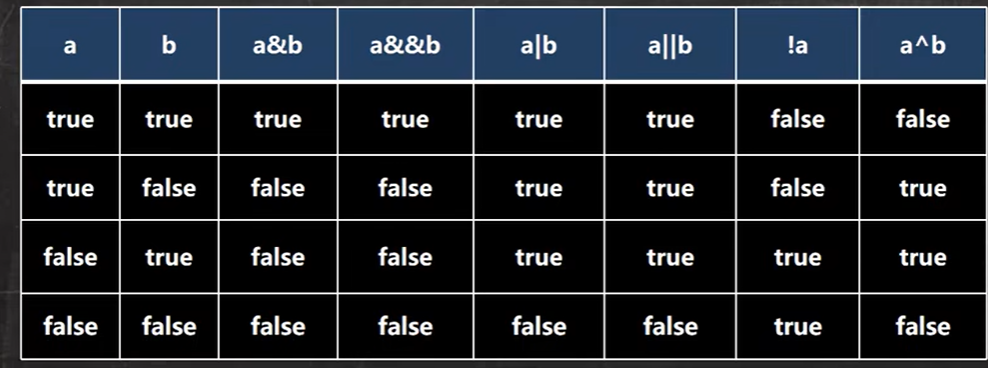

# 1.java初步了解

## 1. JAVA入门

### 1.1第一个java程序

```java
//这是java的快速入门，演示java的开发步骤
// 对代码的相关说明
// 1.public class Hello 表示Hello是一个类，是一个public（公有）的类
// 2.Hello{ }表示一个类的开始和结束
// 3.public static void main（String[] args）表示一个主方法，即我们程序的入口
// 4.main() { }表示方法的开始和结束
// 5.System.out.println("hello world~")表示输出“hello world~”到屏幕
// 6.；分号代表语句的结束
public class Hello {
	// 编写一个main方法
	public static void main(String[] args){
		System.out.println("hello world~");
	}
}
//一个源文件中最多有一个public类，其他类的个数不限
//class dog{ }
```


### 1.2java执行流程分析


### 1.3什么是编译

javac Hello.java

1. 有了java源文件，通过编译器将其编译成JVM可以识别的字节码文件。
2. 在该源文件目录下，通过javac编译工具对Hello。java文件进行编译
3. 如果程序没有出错，没有任何提示，但在当前目录下会出现一个Hello.class的文件，这个文件叫字节码文件，也是可以执行的java的程序

### 1.4什么是运行

1. 有了可执行的java程序(Hello.class字节码文件)
2. 通过运行工具java.exe对字节码文件进行执行，本质就是把这个.class文件装在到jvm机上执行

==注意：==对修改后的Hello.java源文件需要重新编译，生成新的class文件后，再进行执行，才能生效

## 2.java开发注意事项与细节说明

1. Java源文件以 .java 为扩展名。源文件的基本组成部分是类 (class)如本类中的Hello.类。
2. Java应用程序的执行入口是main(方法。它有固定的书写格式：public static void main(Stringl] args) (...}
3. Java语言严格区分大小写。

4. Java方法由一条条语句构成，每个语句以“;”结束
5. 大括号都是成对出现的，缺一不可。[习惯，先写{ }再写代码]
6. 一个源文件中最多只能有一个==public类==。其它类的个数不限。（==**注意：**==在java中编译后每一个类都对应就会有一个.class的文件）
7. 如果源文件包含一个public类，则文件名必须按该类名命名!
8. 一个源文件中最多只能有一个public类。其它类的个数不限，也可以将main方法写在非public类中，然后指定运行非public 类，这样入口方法就是非public 的main方法

## 3.java转义字符

### 3.1java常用的常用的转义字符

1. \t：一个制表位,实现对齐 
2. \n：换行符
3.  \\\：一个\
4. \\"：一个“ 
5. \\'：一个'
6. \r：一个回车 System.out.println("QR-KK\r朱墨")

```js
//\r的特别注意点
// 6. \r：一个回车 System.out.println("朱墨\rQR-KK")
// 解读
// 1.输出 朱墨
// 2.\r代表回车，光标会直接定位到朱墨前面然后把Q换成朱R换成墨然后依次加上
System.out.println("朱墨\rQR-KK");
System.out.println("朱墨\r\nQR-KK");//这样就可以正常输出想要的结果了
```

## 4.初学java易犯错误

1. 找不到文件

   解决方法：源文件名不存在或者写错，或者当前路径错误

2. 主类和文件名不一致

   解决方法：声明为public的主类应于文件名一直，负责编译失败

3. 缺少分号

   解决方法：编译失败，注意错误所在的行数，在到源代码中指定位置改错

4. 常见错误总结

   学习编程最容易犯得错是语法错误（初学者）。java要求你必须按照语法规则编写代码。如果你的程序违反了语法规则，例如：忘记了分号、大括号、引号、或者拼错了单词，java变编译器都会报语法错误。尝试去看懂编译器会报告的错误信息

## 5.注释（comment）

### 5.1注释介绍

用于注解说明解释程序的文字就是注释，注释提高了代码的阅读性(可读性);注释是==一个程序员必须要具有的良好编程习惯。==将自己的思想通过注释先整理出来，再用代码去体现。 

### 5.2注释类型

1. #### 单行注释

   基本格式

   格式：//注释文字

2. #### 多行注释

   基本格式

   格式：/*注释文字*/

   使用细节

   - 被注释的文字，不会被JVM（java虚拟机）解释执行
   - 多汗注释里面不允许有多行注释嵌套

3. #### 文档注释

   注释内容可以被JDK提供的工具javadoc所解析，生成一套以网页文件形式体现的该程序的说明文档，一般写在类

   基本格式

   格式/**  */

   如何生成

   ```java
   javadoc -d文件夹名 -xx -yy Demo3.java(要生成那些标签就是你之前写过的那些)
   ```

   

## 6.代码规范

1. 类、方法的注释，要以javadoc文档注释的方式来写
2. 非Java Doc的注释，往往是给代码的维护者看的，着重告述读者为什么这样写如何修改，注意什么问题等
3. 使用tab操作，实现缩进,默认整体向右边移动，时候用shift+tab整体向左移
4. 运算符和 = 两边习惯性各加一个空格。比如: 2 + 4* 5 + 345 -89
5. 源文件使用utf-8编码
6. 行宽度不要超过80字符
7. 代码编写次行风格和行尾风格

# 2.java基础

## 1.变量

### 1.1变量介绍

变量是程序的基本组成单位

不论是使用哪种高级程序语言编写程序，变量都是其程序的基本组成单位(类型+名称+值)，比如：

```java
class Test{
public static void main(String[] args){
int a=1;
int b=3;
b=89;
System.out.println(a);
System.out.println(b);
}
}
```

**概念**：变量就相当于内存中一个数据存储空间的表示，可以把变量看错门牌号可以根据门牌号找到房间，可以根据变量名找到值

#### 变量使用的注意事项

1. 变量表示内存中的一个存储区域 [不同的变量类型不同，占用的空间大小不同比如: int 4 个字节， double 就是 8个字节]
2. 该区域有自己的名称[变量名]和类型[数据类型]
3. 变量必须先声明，后使用，即有顺序
4. 该区域的数据可以在同一类型范围内不断变化
5. 变量在同一个作用域内不能重名
6. 变量=变量名+值+数据类型，这一点请大家注意。变量三要素

### 1.2+号的使用

1. 当左右两边都是数值型，则做加法运算
2. 当左右两边有一方为字符串，则做拼接运算
3. 运算顺序从左到右

### 1.3数据类型

java数据类型分为两大类：基本数据类型、引用数据类型

基本数据类型分为8种byte、short、int、long、float、double、char、boolean

引用类型【类、接口、数组】

每一种数据都定义了明确的数据类型，在内存中分配了不同大小的内存空间（字节）


#### 1.整数类型

java的整数类型就是用于存放整数值的，比如12,30,345等等

整数的类型：

| 类型          | 占用存储空间 | 范围                                     |
| ------------- | ------------ | ---------------------------------------- |
| byte[字节]    | 1字节        | -128~127                                 |
| short[短整型] | 2字节        | （-2^15）~2^15-1<br />-32768~32767       |
| int[整型]     | 4字节        | -2^31~2^31-1<br />-2147483648-2147483647 |
| long[长整型]  | 8字节        | -2^63-2^63-1                             |

整数类型使用细节：

1. java中各整数类型都是有固定的长度和范围的，不收具体操作系统的影响，以保证java程序的可移植性
2. java整型常量默认为int型，声明long型常量须后加’|‘或’L‘
3. java程序中变量常声明为int型，除非不足以表示大数，才使用long
4. bit：计算机中的最小存储单位byte：计算机中基本的存储单元1byte=8bit

#### 2.浮点类型

基本介绍：java的浮点类型可以表示一个小数，比如123.4/7.8、0.12等

分类：

| 类型         | 占用存储空间 | 范围                 |
| ------------ | ------------ | -------------------- |
| 单精度float  | 4字节        | -3.403E38~3.403E38   |
| 双精度double | 8字节        | -1.798E308~1.798E308 |

注意：

1. 关于浮点数在机器中存放形式的简单说明，浮点数=符号位+指数位+尾数位
2. 尾数部分可能丢失，造成精度损失（小数都是近似值）

**使用细节：**

1. 与整数类型类似，java浮点类型也有固定的范围和字节长度，不受系统影响

2. 浮点型默认是double型，声明float常量需要在后面加'f'或'F'

3. 浮点型常量有两种表示形式

   十进制形式：如5.12 512.of  .512（必须有小数点）

   科学计数法形式：如：5.12e2[]  5.12E-2 []

4. 通常情况下，应该使用double型因为它比flat型更精确

   double num1=2.1234567851；

   float num2=2.1234567851F；

5. 浮点数使用陷阱：2.7和8.1/3比较（当运行结果是小数时进行相等判断时要小心，应该是以两个数的差值的绝对值，在某个精度范围类判断）

#### 3.字符类型

基本介绍：

字符类型可以表示单个字符，字符类型是char，char是两个字节（可以存放汉字），多个字符我们用字符串String（）

字符类型使用细节：

1. 字符常量是用单引号（’ '）括起来的单个字符。例如：

   char c1='a'

2. java中还允许使用转义字符'\'来将其后的字符转变为特俗字符型常量。例如：char c3='\n';//'\n'表示换行符

3. 在java1中char的本质是一个整数，在输出时，会按照对应的unicode码对应的字符

4. 可以直接给char赋一个整数，人后输出时，会按照对应的unicode字符输出【97】

5. char类型是可以进行运算的，相当于一个整数，因为它有对应的Unicode码

#### 4.布尔类型：boolean

基本介绍

1. 布尔类型也叫boolean类型，boolean类型数据只允许取值true和false，无null
2. boolean类型占1个字节
3. boolean类型适用于逻辑运算，一般用于程序的流程控制

**使用细节：**不可以使用0或非0的整数替代false和true

### 补充知识：java中类的组织形式


### 1.4数据类型的转换

#### 1.自动数据类型的转换

自动数据类型转换，精度小的类型自动转换为精度打的类型这个就是自动类型转换

数据类型按精度（容量）大小排序

char-》int-》long-》float-》double

byte-》short-》int-》long-》float-》double

自动数据类型转换使用和细节

1. 有多种类型的数据混合运算时，系统首先自动将所有数据转换为容量最大的数据类型然后再进行计算
2. 当我们把精度大的数据类型赋值给精度小的数据类型时就会报错，反之就会进行自动类型转换
3. （byte，short）和char之间不会相互自动转换
4. bytw、short、char他们三者可以计算，在计算时首先转换为int类型

#### 2.强制数据类型转换

强制转换：

自动类型转换的逆过程，将容量大的数据类型转换为容量小的数据类型。使用时加上强制转换符（），但可能会造成精度降低或移除，格外要注意

强制类型转换细节

1. 当数据的大小从大到校就需要使用强制转换

2. 强制转换符号只针对于最近的操作回溯有效，往往会使用小括号提升优先级

   ```java
   //int x=(int)10*3.5+6*1.5;
   int y=(int)(10*3.5+6*1.5);
   System.out.println(y);
   ```

3. char类似性可以保存int的常量值，但不能保存int的变量值，需要强制转换

   ```java
   char c1=100;
   int m=100;
   char c2=m;
   char c3=(char)m;
   System.out.println(c2);
   ```

4. byte和short类型在进行运算时，当做int类型处理

#### 3.基本数据类型和String类型的转换

介绍：在程序开发中，我们经常需要将基本数据类型转成String类型或者将String类型转成基本数据类型

基本数据类型转1为String类型

语法：将基本类型的值+“”即可

String转基本数据类型

语法：通过基本类型的包装类调用parseXX方法即可

**注意点：**

1. 在将String类型转成基本数据类型时，要确保String类型能够转成有效的数据，比如我们可以把“123”，转成一个整数，但是不能把“hello”转成一个整数
2. 如果格式不正确，就会抛出异常，程序就会终止，这个问题会在异常处理章节中，会处理

## 2.运算符

### 2.1运算符介绍

运算符是一种特殊的符号用于表示数据的运算、赋值和比较等

### 2.2算术运算符

算术运算符是对数值类型的变量进行运算的，在java程序中使用的非常多


==注意：在%的本质看a%b=a-a/b*b==

例子：-10%3=》-10-（-10）/3*3(java中负数取整是向上取整)

### 2.3关系运算符（比较运算符）

1. 关系运算符的结果都是boolean型，也就是要么为true要么为false
2. 关系表达式 经常用在if结构的条件中或循环结构的条件中


细节说明

1. 关系运算符的结果都是boolean型，也就是要么是true，要么是false
2. 关系运算符组成的表达式，我们称之为关系表达式。a>b
3. 比较运算符“==”不能误写成“=”

### 2.4逻辑运算符

用于连接多个条件（多个关系表达式），最终的结果也是一个boolean值

逻辑运算符分为两类

1. 短路与&&，短路或||，取反！
2. 逻辑与，逻辑或|，^逻辑异或



说明逻辑运算规则：

1. a&b：&叫逻辑与：规则：当a和b同时为true，则结果为true，否则为false
2. a&&b：&&叫短路：规则：当a和b同时为true，则结果为true，否则为false
3. a|b:|叫逻辑或，规则：当a和b，有一个为true，则结果为true，否则为false
4. a||b：||叫短路或，规则：“当a和b，有一个为true，则结果为true否则为false
5. ！a：叫取反，或者非运算。当a为true，则结果为false，当a为false则则结果为true
6. a^b：叫逻辑异或，当a和b不同时，则结果为true，否则为false

- &&短路与和&逻辑与的区别：短路&&与中如果第一个条件为false则不往后判断但是逻辑&会，一般开发中常使用短路与&&因为这样效率高
- 短路||或与|逻辑或的区别短路或如果第一个条件为true不会判断，最终结果为true但是逻辑|不过第一个条件是啥结果都会判断完，开发中基本用||

### 2.5赋值运算符

赋值运算符就是将某个运算后的值，付给指定的变量

分类：

- 基本赋值运算符：=
- 复合赋值运算符
  - +=，-=，*=，/=，%=等，重点注意+=因为其他都是一个道理

```java
a+=b;
//等价于a=a+b
a-=b;
//等价与a=a-b
```

特点：

1. 运算顺序从右往左 int num=a+b+c

2. 赋值运算符的左边 只能是变量，右边可以是变量，表达式，常量值

   int num=20；int num2=78；int num3=a；

3. 复合赋值运算符等价于a=a+3；

4. 复合赋值运算符会进行==类型强制转换==

   byte b=2；b+=3;(等价于b=（byte）（b+3）)b++

### 2.6三元运算符

基本语法：条件表达式？表达式1：表达式2

1. 如果条件表达式为true，则执行表达式1
2. 如果为false，则执行表达式2

使用细节

1. 表达式1和表达式2要为可以赋给接收变量的类型（或可以自动转换）

2. 三元运算符可以转成if--else语句

   ```c
   int res=a>b?a++:--b;
   if(a>b) res=a++
       else--b
   ```

   

### 2.7运算符优先级

1. 运算符有不同的优先级，所谓优先级就是表达式运算中的运算顺序，如下表上一行运算符总优于下一行
2. 只有单目运算符、赋值运算符是从右向左运算的


### 补充1  标识符的命名规则和规范

#### 1. 标识符概念

1. java对于各种变量、方法和类等命名时使用的字符序列称为标识符
2. 凡是自己可以起名字的地方都叫标识符

#### 2.标识符的命名规则（必须遵守）

1. 由26个英文字母大小写。0-9.或$组成
2. 数字不可以开头。
3. 不可以使用关键字和保留字
4. java中严格区分大小写，长度无限制
5. 标识符不能包含空格

#### 3.保留字

java保留字：现有的java版本尚未使用，但是以后的版本可能作为关键字使用。自己明明标识符时要避免使用这些保留字

byValue，cast，fature，generic。inner，operator，outer，rest，var，goto，const

#### 4.标识符命名规范（专业）

1. 包名;多单词组成时所有字母都小写：aaa.bbb.ccc//比如 com.hsp.crm
2. 类名、接口名：多单词组成时，所有单词首字母大写：XxxxYyyyZzz
3. 变量名、方法名：多单词组成时，第一个单词首字母小写，第二个单词开始每个单词首字母大写;xxxYyyZzz
4. 常量名：所有字母都大写。多单词时每个单词都用下划线连接：XXX_YYY_ZZZ
   1. 后面学习到类包接口等时，就要这样遵守更详细的查阅文档

#### 5.关键字

关键字的定义和特点（不用背）

定义：被java语言赋予了特殊含义，用做专门用途的字符串单词

特点：关键字中所有字母都小写


### 补充2  键盘输入语句

#### 1.介绍

在编程中，需要接收用户输入的数据，就可以使用键盘输入语句来获取。input.java，需要一个扫描器（对象，就是Scaaner）

步骤：

1. 导入该类所在的包，java.util.*
2. 创建该类对象（声明变量）
3. 调用里面的功能  

## 3.程序控制结构

在程序中，程序运行的流程控制决定程序是如何执行的，是我们必须掌握的，主要有三大流程控制语句

1. 顺序控制
2. 分支控制
3. 循环控制

### 1.顺序控制

程序从上到下逐行地执行，中间没有任何判断和跳转

注意事项：

java中定义成员时采用合法的向前引用先定义在引用


### 2.分支控制（if，else，switch）

让程序有选择的执行，分支控制有三种

1. 单分支

   基本语法：

   if(条件表达式){

   ​	执行代码块；（可以有多条语句）

   }

   说明：当条件表达式为true时，就会执行{ }的代码，如果为false，就不执行

   ==特别说明==：如果{ }中只有一条语句，则可以不用{}，建议写上{}

2. 双分支

3. 多分支

### 3.循环控制（for，while，dowhile，多重循环）

### 4.break

### 5.continue

### 6.return


## 4.数组

### 1.数组

数据可以存放多个==同一类型==的数据，数组也是一种数据类型，是==引用类型==。即：数组就是一组数据

使用方式：

1. 动态初始化

   数据类型 数组名【】=new 数据类型【大小】

   int a[]=new int[5]

2. 动态初始化

   先声明数组

   语法：数据类型 数组名[];或者数据类型[] 数组名；

   创建数组

   语法：数组名=new 数据类型[大小]

   例子：a=new int[] a；

3. 静态初始化

   ==语法：数据类型 数组名[]={元素值，元素值...}==

   int a[]={2,3,4,5,65,7,7,5,3,22},如果知道数组有多少元素，具体值，上面的用法相当于：int a[]=new[长度]

==**数组使用注意事项和细节：**==

- 数组是多个想通类型的数据的组合，实现对这些数据的统一管理

- 数组中的元素可以是任意数据类型，包括基本类型和引用类型，但是不能混用

- 数组创建后，如果没有赋值的话，是有默认值的不同数据类型默认值如下

  

- 使用数组的步骤1.声明数组并开辟空间2.给数组各个元素赋值3.使用数组

- 数组的下标是从0开始的

- 数组下标必须在指定范围内使用，否则报：下标越界异常

- 数组属索引类型，数组行数据是对象（object）

#### 补充1：数组赋值机制

1. 基本数据类型赋值，这个值就是具体的数据，而且互相不影响
2. 数组在默认情况下是引用传递，赋的值是地址

值传递和引用传递区别图示：

1.值传递（值拷贝）


2.引用传递（地址拷贝）


数组拷贝（内容拷贝）

将int []arr1={10,20,30};拷贝到arr2数组要求数据空间是独立的

**解决思路：**创建一个新数组，开辟新的数据空间，大小就用arr1.length

效果图：


然后遍历即可

#### 补充2：数组反转

要求把数组的元素内容反转

arr{11，22,33，44，55,66}-》{66,55,44,33,22,11}

方法1：观察规律变量交换位置处理

方法2：逆序赋值定义一个新数组通过逆序的方式让要交换的数组反向赋值给新数组得到结果最后让原数组=新数组将其地址改了

#### 补充3：数组添加

要求：实现动态的给数组添加元素效果，实现对数组扩容

1. 原始数组使用静态分配int[] arr={1,2,3}

2. 增加的元素 4 ，直接放在数组的最后arr={1,2,3,4}

   arrNew={1,2,3,4}

3. 用户可以通过如下方法来决定是否继续添加，添加成功，是否继续？

处理方法：定义一个新数组，然后定义长度时在原数组的长度基础上+1然后进行遍历，依次将原数组的值拿过来，完成后将4赋给arrNew[3]=4；然后将原数组的地址改为新地址即可

### 2.排序

排序是将一群数据，依指定的顺序进行排列的过程

排序的分类：

1.内部排序

指将需要处理的所有数据都加载到内部存储中进行排序。包括（交换式排序法。选择式排序法和插入式排序法）

2.外部排序法

数据量过大，无法全部加载到内存中，需要借助外部存储进行排序。包括（合并排序和直接排序法）

#### 冒泡排序

冒泡排序的基本思想是，通过对待排序序列从后向前（从下标较大的元素开始），依次比较相邻元素的值，若发现逆序则交换，使值较大的元素逐渐从前移向后部，就像水底的气泡一样逐渐向上冒

冒泡思想：


### 3.查找

在java中，我们常用的查找有两种

1. 顺序查找
2. 二分查找


### 4.多维数组（暂时只讲二维数组）

什么是二维数组？

1.  从定义上来看int[   \][ ]
2. 相当于原来的一维数组的每个元素是一维数组，就构成了

==注意：==二维数组要是遍历的话得用双层for循环

#### 1.二维数组的使用

使用方式1：动态初始化

语法：类型[][] 数组名=new 类型[大小] [大小]

二维数组在内存中的存放形式


使用方式2：动态初始化

1. 先声明：类型 数组名 [] [];
2. 在定义（开辟空间）数组名=new 类型[大小] [大小]
3. 赋值（有默认值，比如int 类型的就是0）
