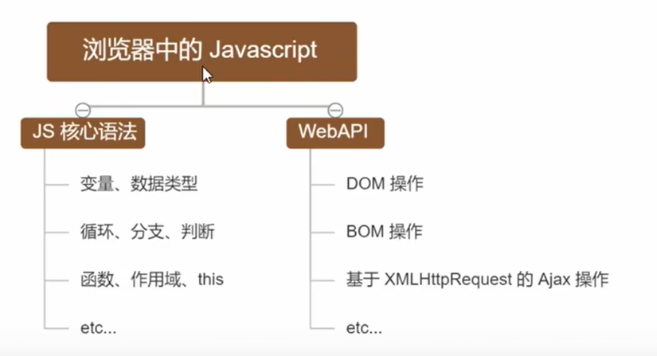
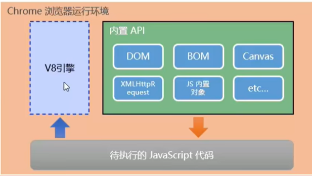
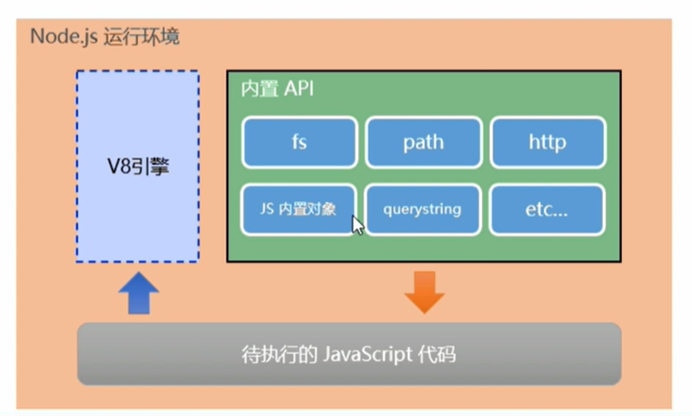

# 1.初识Node.js与内置模块

## 1.初识Node.js

### 1.1回顾与思考

#### 1.已经掌握了哪些技术

- HTML
- CSS
- JavaScript

#### 2.浏览器中的JavaScript的组成部分



#### 3.思考：为什么JavaScript可以在浏览器中被执行

不同的浏览器使用不同的JavaScript解析引擎：

- Chrome 浏览器=》V8
- Firefox 浏览器 =》OdinMonkey（奥丁猴）
- Safri 浏览器=》JSCore
- IE浏览器=》Chakra（查克拉）
- etc...

其中，Chrome浏览器的V8解析引擎性能最好！

#### 4.思考：为什么JavaScript可以操作DOM和BOM

每个浏览器都内置了DOM、BOM这样的API函数，因此，浏览器中的JavaScript才可以调用它们

#### 5.浏览器中的JavaScript运行环境

运行环境是指代码正常运行所必需的必要环境



总结：

1. V8引擎负责解析和执行JavaScript代码
2. 内置API是由运行环境提供的特殊接口，只能在所属的运行环境中被调用

#### 6.思考：JavaScript能否做后端开发

可以但是需要借助node.js的运行环境

### 1.2Node.js简介

### 1.什么是Node.js

Node,js is a JavaScript runtime built on Chrome's V8 JavaScript engine.
Node.js 是一个基于 Chrome V8 引擎的 JavaScript 运行环境。

 Node.js的官网地址：http://nodejs.org/zh-cn/

#### 2.Node.js的JavaScript运行环境



注意：

1. 浏览器是JavaScript的前端运行环境
2. Node.js是JavaScript的后端运行环境
3. Node.js中无法调用DOM和BOM等浏览器内置API

#### 3.Node.js可以做什么

Nodejs 作为一个JavaScript 的运行环境，仅仅提供了基础的功能和 AP1。然而，基于 Node.js 提供的这些基础工能，很多强大的工具和框架如雨后春笋，层出不穷，所以学会了 Node.js，可以让前端程序员胜任更多的工作和岗位

1. 基于Express框架（http://www.expressjs.com.cn/）可以快速构建Web
2. 基于Electron框架（https://electronjs.org/）
3. 基于restify框架（http://restify.com/）可以快速构建API接口项目
4. 读写和操作数据库、创建实用的命令行工具辅助前端开发、etc...

Node.js的学习路径：

JavaScript基础语法+Node.js内置API模块（fs.path.http等）+第三方API模块（express、mysql等）

### 1.3Node.js环境的安装

如果希望通过Node.js来运行JavaScript代码，则必须在计算机上安装Node.js环境才行

http://nodejs.org/en/

#### 1.区分LTS版本和Current版本的不同

- LTS为长期稳定版，对于追求稳定性的企业级项目来说，推荐安装LTS版本的Node.js
- Current 为新特性尝鲜版，对热衷于尝试新特性的用户来说，推荐安装 Current 版本的 Node.js。但是Current 版本中可能存在隐藏的 Bug或安全性漏洞，因此不推荐在企业级项目中使用Current 版本的 Node.js。

#### 2.查看已安装的Node.js的版本号

打开终端，在终端输入命令node -v后。按下回车键，即可查看已安装的Node.js的版本号

### 3.什么是终端

终端（英文：Terminal）是专门为开发人员设计的，用于实现人机交互的一种方式

作为一名合格的程序员，我们有必要识记一些常用的终端命令，来协助我们更好的操作与使用计算机

### 1.4在Node.js环境下执行JavaScript代码

1. 打开终端
2. 输入node要执行的js文件的路径

#### 1.终端里的快捷键

在Windows的powershell或cmd终端中，我们可以通过如下快捷键，来提高终端的操作效率：

1. 使用上方向键，可以快速定位到上一次执行的命令
2. 使用tab键，能够快速补全路径
3. 使用esc键，能够快速清空当前已输入的命令
4. 输入cls命令，可以清空终端

## 2.fs文件系统模块

### 2.1什么是fs文件系统模块

fs模块是Node.js官方提供的，用来操作文件的模版，他提供了一系列的方法和属性，用来满足用户对文件的操作需求

例如：

- fs.readFile()方法，用来读取指定文件中的内容
- fs.writeFile()方法，用来向指定的文件中写入内容

如果要在JavaScript代码中，使用fs模版来操作文件，则需要使用如下的方式先导入它：

```javascript
const fs =require('fs')
```

### 2.2读取指定文件中的内容

#### 1. fs.readFile（）的语法格式

使用fs.readFile()可以读取指定文件中的内容，语法格式如下：

```js
fs.readFile(path[,options],callback)
```

参数解读：

- 参数1：==必选==参数，字符串、表示文件的路径
- 参数2：可选参数，表示以什么==编码格式==来读取文件
- 参数3：==必选==参数，文件读取完成后，通过回调函数拿到读取的结果

#### 2.fs.readFile()的示例代码

以utf8的编码格式，读取指定文件的内容，并打印err和dataStr的值：

```js
const fs=require('fs')
fs.readFile('./files/11.text','utf8',function(err,dataStr){
console.log(err)
console.log('-----')
console.log('dataStr')
})
```

#### 3.判断文件是否读取成功

可以判断err对象是否为空，从而知晓文件读取结果

### 2.3向指定文件中写入内容

#### 1. fs.writeFile()的语法格式

```js
fs.writeFile(file,data[.options],callback)
```

参数解读：

1. 参数1：==必选==参数，需要指定一个文件路径的字符串，表示文件的存放路径
2. 参数2：==必选==参数，表示要写入的内容
3. 参数3：可选参数，表示以什么格式写入文件内容，默认是utf8
4. 参数4：==必选==参数，文件写入完成后的回调函数

#### 2.fs.writeFile()的示例代码

向指定的文件路径，写入文件内容

```js
const fs=require('fs')
fs.writeFile('./2.txt','Hello Node.js!',function(err){
console.log(err)
})
```

如果文件写入成功，则err的值等于null

如果写入失败，则err的值等于一个 错误对象

#### 3.判断文件是否写入成功

可以判断err对象是否为null，从而知晓文件写入结果

```js
fs.writeFile('./files/3.txt', 'ok123', function(err) {
  // 2.1 如果文件写入成功，则 err 的值等于 null
  // 2.2 如果文件写入失败，则 err 的值等于一个 错误对象
  // console.log(err)

  if (err) {
    return console.log('文件写入失败！' + err.message)
  }
  console.log('文件写入成功！')
})

```

