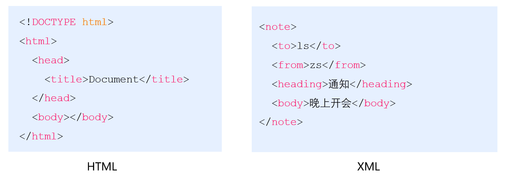
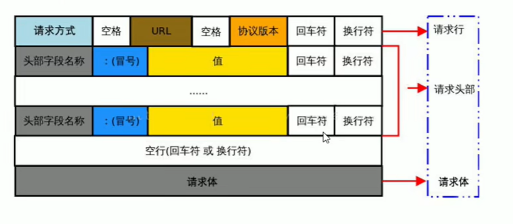
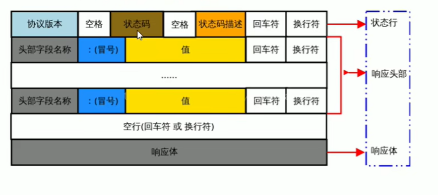

# 1.服务器的基本概念与初识Ajax

## 1.客户端与服务器

### 1.1上网的目的

上网的==本质目的：==通过互联网的形式来==获取与消费资源==

### 1.2服务器

上网过程中，负责==存放与对外提供资源==的电脑，叫服务器

### 1.3客户端

上网过程中，负责==获取与消费==的电脑叫做客户端

## 2.url地址

### 2.1URL地址概念

URL（全称是UniformResourceLocator）中文叫==统一资源定位符==，用于标识互联网上每个资源的唯一存放位置，浏览器只有通过URL地址，才能正确定位资源存放位置，从而成功访问到对应的资源

常见的URL举例：

http://www.baidu.com

### 2.2URL地址的组成部分

URL地址一般分为三部分组成

1. 客户端与服务器之间的==通信协议==
2. 存有该资源的==服务器名称==
3. 资源在服务器上的==具体存放位置==

## 3.客户端与服务器的通信过程

### 3.1图解客户端与服务器的通信过程


**注意：**

1. 客户端与服务器之间的通信工程，分为==请求-处理-响应==三个步骤
2. 网页的每一个资源都是通过 ==请求-处理-响应==的方式从服务器获取回来的

### 3.2基于浏览器的开发者工具分析通信过程

1. 打开Chrome浏览器
2. Ctrl+shift+i打开Chrome的开发者工具
3. 切换到Network页面
4. 选中Doc页签
5. 刷新页面，分析客户端与服务器的通信过程

## 4.服务器对外提供了哪些资源

### 4.1例举网页中常见的资源

- 文字内容
- image图片
- Audio音频
- video视频
- and so on

思考：网页中的数据是不是资源

### 4.2数据也是资源

==网页中的数据，也是服务器对外提供的一种资源==例如股票数据，各行业排行榜等

#### 4.3数据是网页的灵魂

- HTML是网页的骨架
- css是网页的颜值
- JavaScript是网页的行为
- 数据是网页的灵魂

骨架颜值行为皆为数据服务

数据在网页中无处不在

### 4.4网页中如何发送请求数据

==数据用网上服务器对外提供的一种资源==。只要是资源，必然通过 ==请求-处理-响应==的方式进行获取

如果要在网页中请求服务器上的数据资源，则需要用到==XMLHttpRequest==对象

XMLHttpRequest(简称xhr)是浏览器提供的js成员，通过它可以请求服务器上的数据资源

最简单的用法 varxhrObj=new XMLHttpRequest（）

### 4.5资源的请求方式

客户端请求服务时，==请求的方式==有多种，最常见的两种请求方式分别为==get和post==请求

- get请求通常用于获取服务端资源（向服务器要资源）

  例如：根据URL地址，从服务器获取HTML文件、css文件、js文件、图片文件、数据资源等

  - post请求通常用于向服务器提交数据（往服务器发送资源）

    例如登录时向服务器提交的的登录信息、注册时向服务器提交的注册信息、添加用户时向服务器提交的用户信息等==各种数据提交操作==

## 5.了解Ajax

### 5.1什么是Ajax

Ajax的全称是Asynchronous JavaScript And XML（异步JavaScript和XML）

通俗的理解：在网页中利用XMLHttpRequest对象和服务器进行数据交互的方式，就是Ajax

### 5.2为什么要学Ajax

之前所学的技术，只能把网页做的更美观漂亮、或添加一些动画效果，但是Ajax能能让我们轻松实现网页与服务器之间的数据交互

### 5.3Ajax的典型应用场景

用户名检测：注册用户时，通过Ajax的形式，动态==检测用户名是否被占用==

搜索提示：当输入搜索关键字时，通过Ajax的形式，动态==加载搜索提示框提示列表==

数据分页显示：当点击页码值的时候，通过Ajax的形式，==根据页码值动态刷新表格的数据==

数据的增删改查：数据的添加、删除、修改、查询操作，都需要通过Ajax的形式实现数据交互

## 6.jQuery中的Ajax

### 6.1了解jQuery中的Ajax

浏览器中提供的的==XMLHttpRequest用法比较复杂==，所以jQuery对XMLHttpRequest进行了封装，提供了一系列Ajax相关的函数，极大的降低了Ajax的使用难度

jQuery中发起的Ajax请求最常用的三个方法如下：

- $.get()
- $.post()
- $.ajax()(既可以获取也可以提交)

### 6.2$.get()函数的语法

jQuery中的$.get()函数的功能单一，专门用来发起get请求，从而将服务器上的资源请求到客户端来进行使用

语法：

```ajax
$.get(url,[data],[callback])
```

三个参数各自代表的值

| 参数名   | 参数类型 | 是否必选 | 说明                     |
| -------- | -------- | -------- | ------------------------ |
| ==url==  | string   | 是       | 要请求的资源地址         |
| data     | object   | 否       | 请求资源期间要携带的函数 |
| callback | function | 否       | 请求成功时回调函数       |

#### 6.2.1$.get()发起==不带函数==请求

使用$.get()函数发送不带函数的请求时，直接提供请求的url地址和请求成功之后的回调函数即可，示例代码如下：

```js
$.get('http://www.liulongbin.top:3006/api/getbooks',function(res){
console.log(res)//这里的res是服务器返回的数据
})
```

6.2.1$.get()发起==带函数==请求

使用$.get()函数发送带函数的请求时，代码如下

```js
$.get('http://ww.liulongbin.top:3006/api/getbooks',{id:1},funtion(res){
console.log(res)
})
```

### 6.3$.post()函数的语法

jQuery中$.post()函数的功能单一，专门用来发起post请求，从而向服务器提交数据

$.post()函数的语法如下:

```js
$.post(url,[data],[callback])
```

其中三个参数各自代表的含义如下：

| 参数名   | 参数类型 | 是否必选 | 说明                     |
| -------- | -------- | -------- | ------------------------ |
| ==url==  | string   | 是       | 提交数据的地址           |
| data     | object   | 否       | 要提交的数据             |
| callback | function | 否       | 数据提交成功时的回调函数 |

使用$post()向服务器提交数据的示例代码如下：

```js
 $.post('http://www.liulongbin.top:3006/api/addbook', {
                    bookname: '水浒传', author: '施耐庵', publisher: '上海图书出版社'
                }, function (res) {
                    console.log(res);
                })
```

### 6.4$.ajax()函数的语法

相比于$.get()和$.post()函数，jQuery中提供的$.ajax()函数，是一个功能比较综合的函数，它允许我们对Ajax请求进行更详细的配置

$.ajax()函数的基本语法：

```js
$.ajax({
type:'',//请求的方式，例如GET或post
url:'',//请求的URL地址
data:{},//这次请求要携带的数据
success:function(res){}//请求成功之后的回调函数
})
```

#### 6.4.1使用$.ajax()发起GET请求

使用$.ajax()发起GET请求时，只需要==type属性==的值设置为'==GET=='即可

代码示范：

```js
$.ajax({
type:'GET',//请求方式
url:'https://ajax-base-api-t.itheima.net/api/addbook',//请求的URL地址
data:{ id:1},//这次请求要携带的数据
success:function(res){//请求成功后的回调函数
console.log(res)
}
})
```

#### 6.4.1使用$.ajax()发起GET请求

使用$.ajax()发起GET请求时，只需要==type属性==的值设置为'==POST=='即可

代码示例：

```js
$.ajax({
type:'POST',//请求的方式
url:'https://ajax-base-api-t.itheima.net/api/addbook'//请求的URL地址
data:{//要提交的数据
bookname:'水浒传',
author:'施耐庵',
publisher:'上海图书出版社'
}，
success:function(res){//请求成功之后的回调函数
console.log(res)
}
})
```

## 7.接口

### 7.1接口的概念

使用Ajax请求数据时，==被请求的URL地址==，就叫做==数据接口==（简称==接口==），同时，每个接口必须有==请求方式==

例如：

http://www.liulongbin.top:3006/api/getbooks 获取图书列表的接口（GET请求）

http://www.liulongbin.top:3006/api/addbooks 添加图书的接口（POST请求）

### 7.2分析接口的请求过程

1. 通过GET方式请求接口的过程

   

2. 通过POST方式请求接口的过程

   

### 7.3接口测试工具

1. 什么是接口测试工具

   为了验证接口能否被正常访问，我们常常需要使用接口测试工具，来对数据进行测试

   好处：接口测试工具能让我们在==不写任何代码==的情况下，对接口进行==调用==和==测试==

2. 下载并安装PostMan

   访问PostMan的官方下载地址：

   http://www.getpostman.com/downloads/

   下载所需的安装程序后直接安装即可

### 7.4使用PostMan测试GET接口

步骤：

1. 选择请求的方式
2. 填写需要测试的URL
3. 填写请求的参数
4. 点击send按钮发起GET请求
5. 查看服务器响应结果

### 7.5使用PostMan测试POST接口

步骤：

1. 选择请求的方式
2. 填写需要测试的URL
3. 选择body面板并勾选数据格式
4. 填写要发送到服务器的数据
5. dianjisend按钮发起POST请求

### 7.6接口文档

1.什么是接口文档

接口文档，顾名思义就是==接口的说明文档，它是我们调用接口的依据==。好的接口文档包含了对接口URL,参数以及输出内容的说明，我们参照接口文档就能方便的知道接口的作用，以及接口如何调用

2.接口文档的组成部分

接口文档可以包含很多信息，也可以按照需精简，不过一个合格的接口文档，应该包含一下6项内容，从而为接口调用提供依据

1. **==接口名称==：**用来标示每个接口的简单说明，如==登录接口，获取图书列表接口等==
2. 接口URL;接口调用地址
3. 调用方式：接口的调用方式，如GET或POST
4. 参数格式：接口需要传递的参数，每个参数必须包含==参数名称、参数类型、是否必选、参数说明==这4项内容
5. 响应格式：接口的返回值的详细描述，一般包含==数据名称、数据类型、说明==3项内容
6. 返回示例（可选）：通过对象的形式，例举服务器返回数据的结构 

# 2.form表单与模板引擎

## 1.form表单的基本使用

### 1.1什么是表单

表单在网页中主要负责==数据采集功能==，HTML中的<form>标签，就是用于采集用户输入的信息，并通过<form>标签的提交操作，把采集到的信息提交到服务器端进行处理

### 1.2表单的组成部分

```html
<form>
<input type="text"name="email_or_mobile"/>
<input type="password"name="password"/>
<input type="checkbox"name="remember_me" checked />
<button type="submit">提交</button>
</form>
```

表单上有三部分组成的：

- 表单标签
- 表单域（表单域包括：文本框、密码框、隐藏域、多行文本框、复选框、下拉选择框和文件上传框等）
- 表单按钮

### 1.3< form>标签的属性

< form>标签用来采集数据，< form>标签的属性是用来规定==如何把采集到的数据发送到服务器==

| 属性    | 值                                                           | 描述                                     |
| ------- | ------------------------------------------------------------ | ---------------------------------------- |
| action  | URL地址                                                      | 规定当提交表单时，向何处发送表单数据     |
| method  | get或post                                                    | 规定以何种方式把表单数据提交到action URL |
| enctype | application/x-www-form-urlencodeed<br />multipart/form-data<br />text/plain | 规定在发送表单数据之前对其进行编码       |
| target  | _blank<br /> _self<br /> _parent<br /> _top<br />framename   | 规定在何处打开action URL                 |

1. #### action

   action属性用来规定当提交表单时，==向何处发送表单数据

   action属性的值应该是后端提供的一个URL地址，这个URL地址专门负责接收表单提交过来的数据

   当< form>表单在未指定action属性的情况下，action的默认值为当前页面的URL地址

   **==注意：当提交表单后，页面会立即跳转到action属性指定的URL地址==**

2. #### target

   tar属性用来规定==在何处打开actionURL==
   他的可选值有5个，默认情况下，target的值是_self，表示在相同的框架打开 action URL

   | 值          | 描述                         |
   | ----------- | ---------------------------- |
   | **_blank**  | 在新窗口打开                 |
   | **_self**   | moren。在相同框架中打开      |
   | _parent     | 在父框架集中打开（很少用）   |
   | _top        | 在整个窗口中打开（很少用）   |
   | *framename* | 在指定的框架中打开（很少用） |

3. #### method

   method属性用来规定==以何种方式==把表单数据提交到action URL

   它的可选值有两个，分别是get和post

   默认情况下，method的值为get，表示通过URL地址的形式，把表单数据提交到action URL

   **==注意：==**get方式适合用于提交少量的简单的数据

   post方式适合用来提交==大量、复杂的、或包含文件上传的数据==

   在实际开发中，< form>表单中的post提交方式用的最多，很少用get。咯如登录、注册、添加数据等表单操作、都需要使用post方式来提交表单

4. enctype

   enctype属性用来规定在==发送表单数据之前如何对数据进行编码==

   它的可选值有三个，默认情况下，enctype的值为application/x-www-form-urlencoded,表示在发送前所有编码的字符

   | 值                                | 描述                                                         |
   | --------------------------------- | ------------------------------------------------------------ |
   | application/x-www-form-urlencoded | 在发送前编码所有字符（默认）                                 |
   | multipart/form-data               | 不对字符编码<br />在使用包含文件上传控件的表单好时，必须使用该值 |
   | text/plain                        | 空格转换为”+“加号，但不对特殊字符编码。（很少用）            |

   **==注意：==**在涉及到==文件上传==的操作时，必须将entype的值设置为multipart/form-data

   如果不涉及到文件上传操作，则直接将enctype的值设置为application/x-www-form-urlencoded即可

### 1.4表单的同步提交及缺点

#### 1.什么是表单的同步提交

通过点击submit按钮，触发表单提交的操作，从而使页面页面跳转到action URL的行为，叫做表单的同步提交

#### 2.表单同步提交的缺点

1. < form>表单同步提交后，整个页面会发生跳转，==跳转到action URL所指向的地址==用户体验很差
2. < form>表单同步提交后，==页面之前的状态和数据会丢失==

==思考==：如何解决上述两个问题？

#### 3.如何解决表单同步提交的缺点

如果使用表单提交数据，会导致以下两个问题：

1. 页面会发生跳转
2. 页面之前的状态和数据会丢失

解决方案：表单只负责采集数据，Ajax负责将数据提交到服务器

## 2.通过Ajax提交表单数据

### 2.1监听表单提交事件

在jQuery中，可以使用两种方式监听到表单的提交事件：

```js
$('#forml').submit(function(e){
alert('监听到了表单的提交事件')
})
$('#forml').on('submit',function(e){
alert('监听到了表单的提交事件')
})
```

### 2.2阻止表单的默认提交行为

当监听到表单的提交事件后，可以调用事件对象的event。preventDeafault（）函数，来阻止表单的提交和页面的跳转，示例代码如下

```js
$('#forml').submit(function(e){
e.preventDefault()
})
$('#forml').on('submit',function(e){
e.preventDefault()
})
```

### 2.3快速获取表单中的数据

1. serialize（）函数

为了简化表单中数据的获取操作，jQuery提供了serialize（）函数，其语法格式如下：

```js
$(selector).serialize()
```

serialize()函数的好处：==可以一次性获取到表单中的所有的数据==

2. serialize（）函数示例

   ```js
   < form id="forml">
   <input type="text" name="username">
   <input type="password" name="password">
   <button type="submit">提交</button>
   </form>
   ```

   ```js
   $('#forml').serialize()
   //调用的结果
   //username=用户名的值&password=密码的值
   ```

   注意：在使用serialize（）函数快速获取表单元素时，==必须为每个表单元素添加name属性==

## 4.渲染UI结构时遇到的问题

```js
var rows = [];
$.each(res.data, function (i, item) {//循环拼接字符串
rows.push( '<li class="list-group-item"><span class="badge" style="background-color: #F0AD4E;">评论时间' + item.time + '</span><span class="badge" style="background-color:#5BC0DE;">评论人' + item.username + '</span>' + item.content + '</li>'）
})
$('#cmt-list').empty().append(rows.join(''))//渲染列表的UI结构

```

上述代码是通过==字符串拼接==的形式，来渲染UI结构

如果UI结构比较复杂，则拼接字符串的时候需要格外注意==引导之前的嵌套==。且一旦需求发生请求，==修改起来也非常麻烦==

### 4.2什么是模板引擎

模板引擎，顾名思义，他可以根据程序员指定的==模板结构==和==数据==，自动生成一个完整的HTML页面

### 4.3模板引擎的好处

1. 减少了字符串的拼接操作
2. 使代码结构更清晰
3. 使代码更易于阅读和维护

## 5.art-template模板引擎

### 5.1art-template简介

art-template是一个简约、超快的模板引擎、中文官网为http://aui.github.io/art-template/zh-cn/index.html

### 5.2art-template的安装

在浏览器中访问http://aui.github.io/art-template/zh-cn/index.html页面，找到下载链接后，鼠标右键，选择“==链接另存为==”，将art-template下载到本地，然后通过< script>标签加载到页面上进行使用

### 5.3art-template模板引擎的基本使用

#### 1.使用传统方式渲染UI结构

#### 2.art-template的使用步骤

1. 导入art-template
2. 定义数据
3. 定义模板
4. 调用template函数
5. 渲染HTML结构

### 5.4art-template标准语法

#### 1.什么是标准语法

art-template提供=={{ }}==这种语法格式，在=={{ }}==内可以进行==变量输出==，或==循环数组操作==，这种{{ }}语法在art-template中被称为标准语法

#### 2. 标准语法-输出

```js
{{value}}
{{obj.key}}
{{obj['key']}}
{{a?b:c}}
{{a||b}}
{{a+b}}
```

在{{ }}语法中，可以进行变量的输出、对象属性的输出、三元表达式输出、逻辑或的输出、加减乘除等表达式输出

#### 3. 标准语法-原文输出

```js
{{@  value}}
```

如果要输出的value的值中，包含了HTML标签结构，则需要使用原文输出语法，才能保证HTML标签被正常渲染

#### 4.标准语法输出-条件输出

如果要实现条件输出，则可以在{{ }}中使用**if...else if.../if**的方式，进行按需输出

```js
{{if value}}按需输出的内容{{/if}}
{{if v1}}按需输出的内容{{else if v2}}按需输出内容{{/if}}
```

#### 5.标准语法-循环输出

如果要实现循环输出，则可以在{{ }}内，通过each语法循环数组，当前循环的索引使用$index进行访问，当前的循环项使用$value进行访问

```js
{{each arr}}
	{{$index}}{{$value}}
	{{/each}}
```

#### 6.标准语法-过滤器

过滤器的本质，就是一个function处理函数

```js
{{value |filterName}}
```

过滤器语法类似于==管道操作符==，他的上一个输出作为下一个输出

定义过滤器的基本语法如下：

```js
remplatr.defaults.imports.fliterName=function(value){/*return处理的结果*/}
```

例子：

```js
<div>注册时间：{{regTime | dateFormat}}</div>
```

定义一个格式化时间的过滤器dateFormat如下：

```js
template.dafaults.imports.dateFormat =function(date){
	var y=date.getFullYear()
	var m=date.getMonth()+1
	var d=date.getDate()
	return y+'-'+m+'-'+d//注意，过滤器最后一定要return一个值
}
```

## 6.模板引擎实现原理

### 6.1正则与字符串操作

#### 1. 基本语法

exec()函数用于==检索字符串==中的正则表达式的匹配

如果有字符串中有匹配的值，==则返回该匹配值==，否则返回null

```js
RegExpObject.exec(string)
```

示例代码如下：

```js
var str='hello';
var pattern=/0/;
//输出的结果["o",index:4,input:"hello",groups:underfined]
console.log(pattern.exec(str));
```

#### 2.分组

正则表达式中（）包起来的内容表示一个分组，可以通过分组来提取自己想要的内容，示例代码如下：

```js
var str='<div>我是{{name}}</div>'
var pattern=/{{(a-zA-Z)}}/
var patternResult=pattern.exec(str)
console.log(patternResult)
//得到name相关的信息
//["{{name}}","name",index:7,input:"<div>我是{{name}}</div>",groups:underfined]
```

#### 3.字符串的replace函数

replace（）函数用于字符串中用一下字符替换另一些字符，语法格式如下：

```js
var result='123456'.replace('123','abc')//得到result的值为字符串'abc456'
```

示例代码如下：

```js
var str='<div>我是{{name}}</div>'
var pattern=/{{([a-zA-Z]+)}}/
var patternResult=pattern.exec(str)
str=str.repalce(patternResult[0],patternResult[1])//replace函数返回值为替换后的新字符串
//输出的内容是：<div>我是name</div>
console.log(str)
```

#### 4.多次replace

```js
var str='<div>{{name}}今年{{age}}岁了</div>'
var pattern=/{{\s*([a-zA-Z]+)\s*}}/

var patternResult=pattern.exec(str)
str=str.replace(patternResult[0],patternResult[1])
console.log(str)//输出<div>name今年{{age}}岁了</div>

patternResult=pattern.exec(str)
str=str.replace(patternResult[0],patternResult[1])
console.log(str)//输出<div>name今年age岁了</div>

patternResult=pattern.exec(str)
console.log(patternResult)//输出null
```

5. #### 使用while循环replace

   ```js
   var str='<div>{{name}}今年{{age}}岁了</div>'
   var pattern=/{{\s*([a-zA-Z]+)\s*}}/
   
   var patternResult=null
   while(patternResult=pattern.exec(str)){
   str=str.replace(patternResult[0],patternResult[1])
   }
   console.log(str)//输出<div>name今年age岁了</div>
   ```

   #### 6.replace替换为真值

   ```js
   var data={name:'张三'，age:20}
   var str='<div>{{name}}今年{{age}}岁了</div>'
   var pattern=/{{\s*([a-zA-Z]+)\s*}}/
   
   var patternResult=null
   while((patternResult=pattern.exec(str))){
   str=str.replace(patternResult[0],data[patternResult[1]])
   }
   console.log(str)
   ```

   

### 6.2实现简单的模板引擎

#### 1. 实现步骤

1. 定义模板结构
2. 预调用模板引擎
3. 封装template函数
4. 导入并使用自定义的模板引擎

#### 2.定义模板结构

```js
//定义模板结构
<script type="text/html" id="tpl-user">
<div>姓名:{{name}}</div>
<div>年龄:{{ age }}</div>
<div>性别：{{  gender}}</div>
<div>住址：{{address  }}</div>
</script>
```

#### 3.预调用模板引擎

```js
<script>
//定义数据
var data={ name:'zs',age:28,gender:'男',address:'北京顺义马坡'}
//调用模板函数
var htmlStr=template('tpl-user',data)
//渲染HTML结构
document.getElemetById('user-box').innerHTML=htmlStr
</script>
```

#### 4.封装template函数

```js
function template(id,data) {
var str=document.getElementById(id).innerHTML
var pattern =/{{\s*([a-zA-Z]+)\s*}}/
var pattResult =null
while((pattResult=pattern.exec(str))) {
str=str.replace(pattResult[0],data[pattResult])
}
return str
}
```

# 3.Ajax加强

## 1.XMLHttpRequest的基本使用

### 1.1什么是XMLHttpRequest

XMLHttpRequest（简称xhr）是浏览器提供的JavaScript对象，通过它，可以请求服务器上的数据资源，之前所学的jQuery中的Ajax函数，就是基于xhr对象封装出来的

### 1.2使用xhr发起GET请求

步骤：

1. 创建xhr对象
2. 调用xhr.open（）函数
3. 调用xhr.send（）函数
4. 监听xhr.onreadystatechange事件

```js
//1.创建XHR对象
var xhr=new XMLHttpRequest()
//2.调用open函数，指定 请求方式与URL地址
xhr.open('GET','https://ajax-base-api-t.itheima.net/api/getbooks')
//3.调用send函数，faqiAjax请求
xhr.send()
//4.监听onreadystatechange=function(){
	//4.1 监听xhr对象的请求状态readyState;
	//与服务器响应的状态 status 
	if(xhr.readyState ===4&&xhr.status === 200){
		//4.2打印服务器响应回来的数据
		console.log(xhr.responseText)
	}
}
```


### 1.3了解xhr对象的readyState属性

XMLHttpRequest 对象的readyState属性，用来表示当前Ajax请求所处的状态，每个Ajax请求必然处于以下状态中的一个:

| 值   | 状态             | 描述                                             |
| ---- | ---------------- | ------------------------------------------------ |
| 0    | UNSNT            | XMLHttpResquest对象已被创建，但尚未调用open方法  |
| 1    | OPENED           | open（）方法已经被调用                           |
| 2    | HEADERS_RECEIVED | send()方法已经被调用，响应头也已经被接收         |
| 3    | LOADING          | 数据接收中，此时response属性中已经包含部分数据   |
| 4    | DONE             | Ajax请求完成，这意味这数据传输已经彻底完成或失败 |

### 1.4使用xhr发起带参数的GET请求

使用xhr对象发起呆参数的GET请求时，只需要在调用xhr.open期间，为URL地址指定参数即可：

```js
//...省略不必要的代码
xhr.open('GET','https://ajax-base-api-t.itheima.net/api/getbooks?id=1')
//...省略不必要的代码
```

这种在URL地址后面拼接的参数，叫做==查询字符串==

### 1.5查询字符串

### 1.什么是查询字符串

定义：查询字符串（url 参数）是指在URL的末尾加上用于向服务器发送信息的字符串（变量）

格式：将英文的？放在URL的末尾，然后加上参数=值，想加上多个参数的话，使用&符号进行分隔。以这个形式，可以将想要发送给服务器的数据添加到URL中。

```js
//不带参数的url地址
https://ajax-base-api-t.itheima.net/api/getbooks
//带一个参数的URL地址
https://ajax-base-api-t.itheima.net/api/getbooks?id=1
//带两个参数的URL地址
https://ajax-base-api-t.itheima.net/api/getbooks?id=1&bookname=西游记
```

#### 2.GET请求携带参数的本质

无论使用$.ajax(),还是使用$.get(),又或者使用xhr对象发送GET请求，当需要携带参数的时候，本质上，都是直接将参数以查询字符串的形式，追加到URL地址后面，发送到服务器的

```js
$.ger('url',{name:'zs',age:20},function( ){ })
//等价于
$.get('url?name=zs&age=20',function( ){  })
$.ajax({method:'GET',url:'url',data:{name:'zs',age:20},success: finction( ){ }})
//等价于
$.ajax({method:'GET',url:'url?name=zs&age=20',success:function(){}
})
```


### 1.6URL编码与解码

#### 1.什么是URL编码

URL地址中，只允许出现英文相关的字母、标点符号、数字，因此，在URL地址中不允许出现中文字符

如果URL中需要包含中文这样的字符，则需要对中文字符惊醒==编码（转义）

==URL编码的原则：==使用安全的字符（没有特殊用途或者特殊意义的可打印字符）去表示那些不安全的字符

URL编码原则的通俗理解：使用==英文字符==去表示==非英文字符==

```js
https://ajax-base-api-t.itheima.net/api/getbooks?id=1&bookname=西游记
//经过URL编码后，URL地址变成了如下格式
https://ajax-base-api-t.itheima.net/api/getbooks?id=1&bookname=%E8%A5%BF%E6%B8%B8%E8%AE%B0
```

#### 2.如何对URL进行编码与解码

浏览器提供了URL编码与解码的API，分别是：

- 嗯codeURI()编码的函数
- decodeURI()解码的函数

```js
encodeURI('黑马程序员')
//输出字符串
decodeURI(%E9%BB%91%E9%A9%AC)
//输出字符串 黑马
```

####  3.URL编码的注意事项

由于浏览器会自动对URL地址进行编码操作，因此，大多数情况下，程序员不需要关心URL地址的编码与解码操作

更多关于URL编码的知识，请参考如下博客

https://blog.csdn.net/Lxd_0111/article/details/78028889

#### 1.7使用xhr发起POST请求

步骤：

1. 创建xhr对象

2. 调用xhr.open()函数

3. ==设置Content-Type属性==（固定写法）

   ```js
    xhr.setRequestHeader('content-Type', 'application/x-www-form-urlencoded')
   ```

   

4. 调用xhr.send()函数，同时指定要发送的数据,数据以查询字符串的形式提交给服务器

   ```js
   xhr.send('bookname=水s&author=施&publisher=社')
   ```

   

5. 监听xhr.onreadystatechange事件

## 2.数据交换格式

### 2.1什么是数据交换格式

数据交换格式，就是==服务器端==与==客户端==之间进行数据传输与交换的格式

前端领域。经常提及的两种数据交换格式分别是==XML==和==JSON==，其中XML用的比较少，所以重点学JSON

### 2.2XML

#### 1.什么是XML

XML的英文全称是EXtensible Markup Language，即==可拓展标记语言==。因此，XML和HTML类似，也是一门标记语言



#### 2.XML和HTML的区别

XML和HTML虽然都是标记语言，但是，他们两者之间没有任何的关系

- HTML被设计用来描述网页上的内容，是网页内容的载体
- XML被设计用来==传输和存储数据==，是数据的载体

#### 3.XML的缺点

```js
<note>
	<to><ls/to>
	<from>zs</from>
	<heading>通知</heading>
	<body>晚上开会</body>
</note>
```

1. XML格式臃肿，和数据无关的代码多，体积大，传输效率低
2. 在JavaScript中解析XML比较麻烦

### 2.3JSON

#### 1.什么是JSON

概念：JSON的英文全称是JavaScrip Object Notation，即“JavaScript对象表达法”。简单的来讲，==JSON就是JavaScript对象和数组的字符串表示方法==，它使用文本表示一个JS对象和数组的信息，因此，==JSON的本质就是字符串==

作用：JSON是一种轻量级的文本数据交换格式，在作用上类似于XML，专门用于存储和传输数据，但是JSON比XML更小、更快、更易解析

现状：JSON是在2001年开始被推广和使用的数据格式，到现在为止，==JSON已经成为了主流的数据交换格式==

#### 2.JSON的两种结构

JSON就是用字符串laibiaoshiJavaScript的对象和数组。所以，JSON中包含==对象==和==数组==两种结构，通过这两种结构的互相嵌套，可以表示各种复杂的数据结构

- ==对象结构：==对象结构在JSON中表示{ }括起来的内容，数据结构为{key:val,key:val,...}的键值对结构。其中，key必须是使用==英文的双引号包裹==的字符串，value的数据结构可以是==数字、字符串、布尔值、null、数组、对象==6种类型
- ==对象结构：==数据结构在JSON中表示为[ ]括起来的内容。数据结构为["java","javascript",30,true...]。数组中数据的类型可以是==数字。字符串、布尔值、null、数组、对象==6种类型

#### 3.JSON语法注意事项

1. 属性名必须用双引号包裹
2. 字符串类型的值必须使用双引号包裹
3. json中不允许使用单引号表示字符串
4. JSON中不能写注释
5. JSON的最外层必须是对象或数组格式
6. 不能使用underfined或函数作为JSON的值

==JSON的作用==：在计算机与网络之间存储和传输数据

==JSON的本质==：用字符串来表示JavaScript对象数据或数组数据

#### 4.JSON和JS对象之间的关系

JSON是JS对象的字符串表示法，它使用文本表示一个JS对象的信息，本质是一个字符串。例如：

```js
//这是一个对象
var obj={a:'Hello',b:'World'}
//这是一个JSON字符串，本质是一个字符串
var json='{"a":"hello","b":"World"}'
```

#### 5.JSON和JS对象的互转

要实现JSON字符串转换为JS对象，使用JSON.parse()方法：

```js
var obj=JSON.parse('{"a":"Hello","b":"World"}')
//结果是{a:'hello',b:'World'}
```

要实现从JS对象转换为JSON字符串，使用JSON.stringify()方法：

```js
var json=JSON.stringify({a:'Hello',b:'World'})
//结果是'('{"a":"Hello","b":"World"}')'
```

#### 6.序列化和反序列化

把数据对象转换为字符串的过程，叫做序列化，例如：调用JSON.stringify()函数的操作，叫做JSON序列化

把字符串转换位数据对象的过程叫做反序列化，例如：调用JSON.parse()函数的操作，叫做JSON反序列化

## 3.要实现的效果

```js
//1.导入自定义的ajax函数库
<script src="./itheima.js"></script>
<script>
    //2.调用自定义的itheima函数，发起Ajax数据请求
    itheima({
    method:'请求类型',
    url:'请求地址',
    data:{
        /*请求参数对象*/
    }
    success:function(res){
    //成功的回调函数
    consol.log(res) //打印数据
}
})
</script>
```

### 3.2定义options参数选项

itheima()函数是我们自定义的Ajax函数，它接收一个配置对象作为参数，配置对象中可以配置如下属性：

- method 请求的类型
- url 请求的URL地址
- data 请求携带的数据
- success 请求成功之后的回调函数

### 3.3处理data参数

需要把data对象，转化为查询字符串的格式，从而提交给服务器，因此提前定义resolveData函数如下：

```js
/**
 *处理data参数
 * @param(data)需要发送到服务器的数据
 * @return(string)返回拼接好的查询字符串 name=zs&age=10
 */
 function resolveData(data){
 var arr=[]
 for (let k in data){
  arr.push(k+'='+data[k])
 }
 return arr,join('&')
 }
```

### 3.4定义itheima函数

在itheima()函数中，需要创建xhr对象，并监听 onreadystatechange事件：

```js
function itheima(options){
var xhr=new XMLHttpRequest()
//拼接查询字符串
var qs=resolveData(option.data)
//监听请求状态改变的事件
xhr.onreadystatschange=function(){
if(xhr.readyState====4&&xhr.status===200){
var result=JSON.parse(xhr.responseText)
options.success(result)
		}
	}
}
```

### 3.5判断请求的类型

不同的请求类型，对应xhr对象的不同操作，因此需要对请求类型进行if...else....的判断：

```js
if(options.method.toUpperCase()==='GET'){
//发起GET请求
xhr.open(options.method,options.url+'?'+qs)
xhr.send()
}else if(options.method.toUpperCase==='POST'){
//发起POST请求
xhr.open(options.method,option.url)
xhr.setRequestHeader('Content-Type','application/x-www-form-urllendcoded')
xhr.send(qs)
}
```

## 4.XMLHttpRequest Level 2的新特性

### 4.1认识XMLHttpRequest Level2

#### 1.旧版XMLHttpRequest的缺点

1. 只支持文本数据传输，无法用来读取和上传文件
2. 传送和接收数据时，没有进度信息，只能提示有没有完成

#### 2.XMLHttpRequest Level 2的新功能

1. 可以设置HTTP请求的时限
2. 可以使用FormData对象管理表单数据
3. 可以上传文件
4. 可以获得数据传输的进度信息

### 42.设置HTTP请求时限

有时，Ajax操作很耗时。而且无法预知要花多少时间。如果网速很慢，用户可能要等很久。新版本的XMLHttpRequest对象，增加了timeout属性，可以设置HTTP请求的时限

```js
xhr.timeout=3000
```

上面的语句，将最长等待时间设为3000毫秒。过了这个时限，就会自动停止HTTP请求。与之配套的还有一个timeout事件，用来指定回调函数

```js
xhr.ontimeout=function(event){
alert('请求超时！')
}
```

### 4.3FormData 对象管理表单数据

Ajax操作往往用来提交表单数据，为了方便表单处理，HTML5新增了一个FormData对象，可以模拟表单操作

```js
//1.新增FormData对象
var fd=new FormData()
//2.为FormData添加表单项
fd.append('uname','zs')
fd.append('upwd','123456')
//3.创建XHR对象
var xhr=new XMLHttpRequest()
//4.指定请求类型与URL地址
xhr.open('POST','https://ajax-base-api-t.itheima.net/api/addbook')
//5.直接提交FormData对象，这与提交网页表单的效果，完全一样
xhr.send(fd)
```

FormData对象也可以用来获取网页表单的值，示例代码如下：

```js
//获取表单元素
var form=document.querySelector('#foemal')
//监听表单元素的submit事件
form.addEventListener('submit',function(e){
e.preventDefault()
//根据form表单创建FormData对象，会自动将表单数据填充到FormData对象中
var fd=new FormData(form)
var xhr=new XMLHttpRequest()
xhr.open('post','https://ajax-base-api-t.itheima.net/api/addbook')
xhr.send(fd)
xhr.onreadystatechange=function(){}
})
```

### 4.4上传文件

新版XMLHttpRequest对象，不仅可以发送文本信息，还可以上传文件

实现步骤：

1. 定义UI结构
2. 验证是否选择了文件
3. 向FormData追加文件
4. 使用xhr发起上传文件请求的请求
5. 监听onreadystateChange事件

#### 1.定义UI结构

```js
//1.文件选择框
<input type="file" id="filel"/>
//2.上传按钮
<button id="btnUpload">上传文件</button>
<br />
//3.显示上传到服务器上的图片

```

#### 2.验证是否选择了文件

```js
//1.获取上传文件的按钮
var btnUpload=document.querySelector('#btnUpload')
//2.为按钮添加click事件监听
btnUpload.addEventListener('click',function(){
	//3.获取到选择的文件列表
	var files=document.querySelector('#filel').files
	if(files.length<=0){
	return alert('请选择要上传的文件！')
	}
	//...后续业务逻辑
})
```

#### 3.向FormData中追加文件

```js
//1.创建FormData对象
var fd=new FormData()
//2.向FormData中追加文件
fd.append('avatar',files[0])
```

#### 4.使用xhr发起上传文件的请求

```js
//1.创建xhr对象
var xhr=new XMLHttpRequest()
//2.调用open函数，指定请求类型与URL地址，其中，请求类型为POST
xhr.open('POST','https://ajax-base-api-t.itheima.net/api/upload/avatar')
//3.发起请求
xhr.send(fd)
```

#### 5.监听onreadystatechange事件

```js
xhr.onreadystatechange=function(){
if(xhr.readyState===4&&xhr.status===200){
var data=JSON.parse(xhr.responseText)
if(data.status===200){
//上传文件成功
//将服务器返回的图片地址，设置为标签的src属性
document.querySelector('#img').src='https://ajax-base-api-t.itheima.net'+data.url
		}else{//上传文件失败
		console.log(data.message)
		}
	}
}
```

###  4.5显示文件上传进度

新版本的XMLHttpRequest对象中，可以通过监听xhr.upload.onprogress事件，来获取文件上传进度

语法格式如下：

```js
//创建XHR对象
var xhr=new XMLHttpRequest()
//监听xhr.upload的onprogress事件
xhr.upload.onprogress=function(e){
//e.lengthComputable是一个布尔值，表示当前上传的资源是否具有可计算的长度
if(e.lengthComputable){
//e.loaded 已传输的字节
//e.total 需传输的总字节
var percentComplete=Math.ceil((e.loaded/e.total)*100)
	}
}
```

##  5.jQuery实现文件上传

### 5.1jQuery实现文件上传

#### 1.定义UI结构

```js
//1.导入jQuery
<scrpit src="./lib/jquery.js"></script>
//2.文件选择框
<input type="file" id="file1"/>
//3.上传文件按钮
<button id="btnUpload">上传</button>
```

#### 2.验证用户是否选择了文件

```js
$('#btnUpload').on('click',function(){
//1.将jquery对象转化为DOM对象。并获取选中的文件列表
var files=$('#file1')[0].files
//2.判断是否选择了文件
if(files.length<=0){
	return alert('请选择图片后再上传！')
}
})
```

#### 3.向FormData中追加文件

```js
//向FormData中追加文件
var fd=new ForData
fd.append('avatar',files[0])
```

#### 4.使用jquery发起上传文件请求

```js
$.ajax({
 method:'power',
    url:'https://ajax-base-api-t.itheima.net/api/upload/avatar'
    data:fd,
    //不修改Content-Type属性，使用FormData默认的Content-Type值
    contentType:false,
    //不对FormData中的数据进行url编码，而是将FormData数据原样发送到服务器
    prooessData:false,
    success:function(res){
    console.log(res)
}
})
```

### 5.2jquery实现loading

#### 1.ajaxStart（callback）

Ajax请求开始时，执行ajaxStart函数，可以在ajaxStart的callback中显示loading效果，示例代码如下：

```js
//自jquery版本1.8起，该方法只能被附加到文档身上
$(document).ajaxStart(function(){
    $('#loading').show()
})
```

注意：$(document).ajaxStart()函数会监听当前文档内所有的Ajax请求

#### 2.ajaxStop（callback）

Ajax请求结束时，执行ajaxStop函数，可以在ajaxStop的callback中隐藏loading效果，示例代码如下：

```js
//自jQuery版本1.8起，该方法只能附加到文档身上
$(document).ajaxStop(function(){
$('#loading').hide()
})
```

## 6.axios

### 6.1什么是axios

Axios是专注于网络数据请求的库

相比于原生的XMLHttpRequest对象，axios简单易用

相比于jQuery，axios更加轻量化，只专注于网络数据请求

### 6.2axios发起GET请求

axios发起get请求的语法：

```js
axios.get('url',{parms}:{/*参数*/}).then(callback)
```

具体的请求示例

```js
//请求的URL地址
var url='https://ajax-base-api-t.itheima.net/api/get'
//请求的参数对象
var paramsObj={ name:'zs',zge:20}
//调用axiosget()发起get请求
axios.get(url,{params:paramsObj}).then(function(res){
//res.data是服务器返回的数据
var result=res.data
console.log(res)
})
```

### 6.3axiso发起POST请求

axios发起POST请求的语法

```js
axios.post('url',{/*参数*/}).then(callback)
```

具体的请求示例如下

```js
//请求的URL地址
var url='https://ajax-base-api-t.itheima.net/api/post'
//要提交到服务器的数据
var dataObj={
location:'北京'，
address:'顺义'
}
//调用axios.post()发起POST请求
axios.post(url,dataObj).then(function(res){
//res.data是服务器返回的数据
var result=res.data
console.log(result)
})
```

###   6.4直接使用axios发起请求

axios也提供了类似于jQuery中$.ajax()的函数，语法如下：

```js
axios({
method:'请求类型',
url:'请求的地址',
data:{/*post数据*/},
params:{/*GET参数*/}
}).then(callback)
```

# 4.跨域与JSONP

## 1.了解同源策略与跨域

### 1.1同源策略

#### 1.什么是==同源==

如果两个页面的协议、域名、和端口都相同，则两个页面具有相同的源

例如，下表给出了相对于http://www.test.com/index.html页面的同源检测

| URL                                | 是否同源 | 原因                                |
| ---------------------------------- | -------- | ----------------------------------- |
| http://www.test.com/other.html     | 是       | 同源（协议、域名、端口相同）        |
| http://www.test.com/about.html     | 否       | 协议不同（http和https）             |
| http://blog.test.com/movie.html    | 否       | 域名（www.test.com与blog.test.com） |
| http://www.test.com:7001/home.html | 否       | 端口不同（默认的80端口与7001端口）  |
| http://www.test.com:80/main.html   | 是       | 同源（协议、域名、端口相同）        |

#### 2.什么是==同源策略==

同源策略（英文全称Same origin policy）是浏览器提供的一个安全功能

MDN官方给定的概念：同源策略限制了从一个源加载的文档或脚本如何与来自另一个源的资源进行交互。这是一个用于隔离潜在恶意文件的重要安全机制

通俗理解：浏览器规定，A网站的JavaScript，不允许和非同源的网站C之间，进行资源交互，例如：

1. 无法读取非同源网页的Cookie、LocalStorage和indexedDB
2. 无法接触非同源网页的DOM
3. 无法向非同源地址发送Ajax请求

### 1.2跨域

#### 1.什么是跨域

同源指的是两个URL的协议、域名、端口一致、反之，则是跨域

出现跨域的根本原因：浏览器的同源策略不允许非同源的URL之间进行资源交互

网页：http://www.test.com/index.html

接口：http://www.api.com/userlist

#### 2.浏览器对跨域请求的拦截

**注意：浏览器允许发起跨域请求，但是，跨域请求回来的数据，会被浏览器拦截，无法被页面获取到！**

数据回来的时候被同源策略拦截了

#### 3.如何实现跨域数据请求

现如今，实现跨域数据请求，最主要的两种解决方案，分别是==JSONP和CORS==

JSONP:出现的比较早，兼容性好（兼容低版本IE）是前端程序员为了解决跨域问题，被迫想出来的一种==临时解决方案==缺点是**==只支持GET请求，不支持POST请求==**

CORS:出现的较晚，它是W3C标准，属于跨域Ajax请求的根本解决方案。支持GET和POST请求。缺点是不兼容某些低版本的浏览器

## 2.JSONP

### 2.1什么是JSONP

JSONP(JSON with Padding)是JSON的一种的“使用模式”。可用于解决主流浏览器的跨域数据访问的问题

### 2.2JSONP的实现原理

由于==浏览器同源策略的限制==，网页无法通过Ajax请求非同源的接口数据，但是< script>标签不受浏览器同源策略的影响，可以通过src属性，请求非同源js脚本

因此，JSONP的实现原理，就是通过< scipt>标签的src属性，请求跨域的数据接口，并通过==函数调用==的形式，接收跨域接口响应回来的数据 

### 2.3自己实现一个简单的JSONP

定义一个success回调函数:

```js
<script>
	function success(data){
		console.log('获取到data数据')
		console.log(data)
	}
</script>
```

通过< script>标签，请求接口数据

```js
<script src='https://ajax-base-api-t.itheima.net/api/jsonp?callback=success&name=zs&age=20'>

</script>
```

### 2.4JSONP的缺点

由于JSONP是通过< script>标签的src属性来实现跨域数据获取的，所以，JSONP只支持GET数据请求，不支持POST请求

注意：JSNOP和Ajax之间没有任何关系，不能把JSONP请求数据的方式叫做Ajax，因为JSNOP没有用到XMLHttpRequest这个对象

### 2.5jQuery中的JSONP

jQuery提供的$.ajax()函数，除了可以发起真正的Ajax数据请求之外，还能够发起JSONP数据请求，例如：

```js
$.ajax({
url:'https://ajax-base-api-t.itheima.net/api/jsonp?callback=success&name=zs&age=20',
//如果要使用$.ajax()发起JSONP请求，必须指定datatype为jsonp
dataType:'jsonp',
success:function(res){
console.log(res)
}
})
```

默认情况下，使用jQuery发起JSONP请求，会自动携带一个callback=jQueryxxx的参数，jQueryxxx是随机生成的一个回调函数名称

### 2.6自定义参数及回调函数的名称

在使用jQuery发起JSONP请求时，如果想要自定义JSONP的参数以及回调函数名称，可以通过如下两个参数来指定

```js
$.ajax({
 url:'https://ajax-base-api-t.itheima.net/api/jsonp?name=zs&age=20',
 dataType:'jsonp',
 //发送到服务器端的参数名称，默认值为callback
 jsonp:'callback',//jsonp属性一般不改
 //自定义的回调函数名称，默认值为jQueryxxx格式
 jsonpCallback:'abc',
 success:function(res){
 console.log(res)
 }
 
})
```

### 2.7jQuery中jsonp的实现过程

jQuery中JSONP，也是通过< script>标签的src属性实现跨域数据访问的，只不过，采用的是==动态创建和移除< script>标签==的方式，来发起jsonp数据请求

- 在发起JSONP请求的时候，动态向< header>中append一个<script> 标签
- 在JSONP请求成功以后，动态从<header>中移除append进去的script标签

## 3.案例-淘宝搜索

### 3.1要实现的UI效果

看素材

### 3.2获取用户输入的搜索关键词

为了获取到用户每次按下键盘输入的内容，需要监听输入框的keyup事件，示例代码如下：

```js
//监听文本框的keyup事件
$('#ipt').on('keyup',function(){
//获取用户输入的内容
var keywords=$(this).val().trim()
//判断用户输入的内容是否为空
if(keywords.length<=0){
return
}
//TODO:获取搜索建议列表
})
```

### 3.3封装getSuggestList函数

将获取搜索建议列表的代码，封装到getSuggestList函数中，示例代码如下：

```js
function getSuggestList(kw) {
$.ajax({
//指定请求的URL地址，其中，q是用户输入的关键字
url:'http://suggest.taobao.com/sug?q='+kw,
//指定要发送的是JSONP请求
dataType:'jsonp',
//成功回调函数
success:function(res){
console.log(res)
}
})
}
```

### 3.4渲染建议列表的UI结构

#### 1.定义搜索建议列表

```html
<div class='box'>
    //tab栏区域
    <div class="tabs"><div>
     //搜索区域
        <div class="search-box"></div>
        
        //搜索建议列表
        <div id="suggest-list"></div>
</box>
```

#### 2.定义模版结构

```js
//模板结构
<script type=text/html id="tpl-suggestList">
{{each result}}
<div class="suggest-item">{{$value[0]}}</div>
{{/each}}
</script>
```

####   3.定义渲染模板结构的函数

```js
//渲染建议列表
function renderSuggestList(res){
//如果没有需要渲染的数据，则直接return
if(res.result.length<=0){
return $('#suggest-list').empty().hide()
}
//渲染模板结构
var htmlStr=template('tpl-suggestList',res)
$('#suggest-list').html(htmlStr).show()
}
```

#### 4.搜索关键词为空时隐藏搜索建议列表

```js
$.('#ipt').on('keyup',function(){
//获取用户输入的内容
var keywords=$(this).val().trim()
//判断用户输入的内容是否为空
if(keywords.length<=0){
//如果关键词为空，则清空后隐藏搜索列表
return$('#suggest-list').empty().hide()
}
getSuggestList(keywords)
})
```

### 3.5输入框的防抖

#### 1.什么是防抖

==防抖策略（debounce）==是当事件被触发后，延迟n秒后再执行回调，如果在这n秒内事件又被触发，则重新计时

跟节流阀有差别

节流阀是叠加后必须按顺序进行（相当于冷却技能）

防抖是叠加后会把前面的取消掉（相当于回城）

#### 2.防抖的应用场景

用户在输入框中连续输入一串字符时，可以通过防抖策略，只在输入完后，才执行查询的请求，这样可以有效减少请求次数，节约请求资源

#### 3.实现输入框防抖

```js
var timer=null  //1.防抖动的timer
function debounceSearch(keywords){
//2.定义防抖的函数
timer=setTimerout(function(){
//发起JSONP请求
getSuggestList(keywords)
},500)
}
$('#ipt').on('keyup',function(){
//3.在触发keyup事件时。立即清空timer
clearTimeout(timer)
//...省略其它代码
debounceSearch(keywords)
})
```

### 3.6缓存搜索的建议列表

#### 1.定义全局缓存对象

```js
//缓存对象
var cachObj={}
```

#### 2.将缓存结果保存到缓存对象中

```js
//渲染建议列表
function renderSuggestList(res){
//...省略其它代码

//将搜索的结果，添加到缓存对象中
var k=$('#ipt').val().trim()
cachObj[k]=res
}
```

#### 3.优先从缓存中获取搜索建议

```js
//监听文本框的keyup事件
$('ipt').on('keyup',funxtion(){
//...省略其它代码

//优先从缓存中获取搜索建议
if(cacheObj[keywords]) {
return renderSuggestList(cacheObj[keywords])
}
//获取搜索建议列表
debounceSearch(keywords)
})
```

## 4.防抖与节流

### 4.1什么是节流

==节流策略==，顾名思义，可以减少一段时间内事件的触发频率

### 4.2节流的应用场景

1. 鼠标连续不断地触发某事件（如点击），在单位时间内只触发一次
2. 懒加载时要监听计算滚动条的位置，但不必每次滑动都触发，可以降低计算的频率，而不必去浪费CPU资源

### 4.3节流案例-鼠标跟随效果

#### 1.渲染UI结构并美化样式

```html
//UI结构

/*CSS样式*/
html,body {
margin :0;
padding:0;
overflow:hidden;
}
#angel {
position:absolute;
}
```

#### 2.不使用节流时实现鼠标跟随效果

```js
$(function(){
//获取图片元素
var angel=$('#angel')
//监听文档的mouseover事件
$(document).on('mousemove',function(e){
//设置图片的位置
$(angel).css('left',e.pageX+'px').css('top',e.pageY+'px')
})
})
```

#### 3.节流阀的概念

高铁卫生间是否被占用，由红绿灯控制，红灯表示占用，绿灯表示可使用

节流阀为空，表示可以执行下次操作；下次不为空，表示不能执行下次操作

当前操作执行完，必须吧节流阀重置为空，表示可以执行下次操作

每次执行操作之前必须先判断节流阀是否为空

```js
$(function(){
var angel=$('#angel')
var timer=null//1.预定义一个timer节流阀
$(document).on('mousemove',function(e){
 if(timer){
 return
 }
 //3.判断节流阀是否为空，如果不为空，则证明上次执行间隔不足16毫秒
 timer=setTimeout(function(){
$(angel).css('left',e.pageX+'px').css('top',e.pageY+'px')
timer=null//2.当设置了鼠标跟随效果后，清空timer节流阀，为了方便下次开启延时器
 }，16)
})
})
```

### 4.4总结防抖和节流的区别

- 防抖:如果事件被频繁触发，防抖能保证只有最有一次触发生效!前面N 多次的触发都会被忽略!
- 节流:如果事件被频繁触发，节流能够减少事件触发的频率，因此，节流是有选择性地执行一部分事件

# 5.http协议加强

## 1.HTTP协议简介

### 1.1什么是通信

通信，就是信息的传递和交换

通信三要素：

- 通信的主体
- 通信的内容
- 通信的方式

#### 1.现实生活中的通信

案例：张三要把自己考上郑大的好消息写信告诉自己的好朋友李四

其中：

通信的主题是张三和李四

通信的内容就是考上郑大

通信的方式就是写信

#### 2.互联网中的通信

案例：服务器把郑大的简介通过响应的方式发送给==客户端浏览器==

其中通信的主题就是服务器和客户端浏览器

通信的内容就是郑大的简介

通信的方式就是响应

### 1.2什么是通信协议

==通信协议==（Communication Protocol）是指通信的双方完成通信所必须遵守的规则和约定

通俗的理解：通信的双方采用约定好的格式来发送和接受信息，这种事先约定好的通信格式，就叫做通信协议

#### 1.现实生活中的通信协议

张三与李四采用写信的方式进行通信，在填写信封时，写信的双方需要遵守固定的规则，==信封的填写规则==就是一种通信协议

#### 2.互联网中的通信协议

客户端与服务器之间要实现==网页内容==的传输，则通信的双方必须遵守网页内容的传输协议

==网页内容==又叫==超文本==，因此网页内容的传输协议又叫做超文本传输协议（HypeText Transfer Protocol），简称HTTP协议

### 1.3HTTP

#### 1.什么是HTTP协议

http协议即超文本传送协议（HypeText Transfer Protocol），他规定客户端与服务器之间进行网页内容传输时所必须遵守的传输格式

例如：

- 客户端要以HTTP协议要求的格式把数据提交到服务器
- 服务器要以HTTP协议要求的格式把内容响应到客户端

#### 2.HTTP协议的交互模型

HTTP协议采用*==请求/响应==*的交互模型

## 2.HTTP请求消息

### 2.1什么是HTTP请求消息

由于HTTP协议属于客户端浏览器和服务器之间的通信协议。因此。客户端发起的请求叫做==HTTP请求==，客户端发送到服务器的消息，叫做HTTP请求消息

注意：HTTP请求消息又叫做HTTP请求报文

### 2.2HTTP请求消息的组成部分

HTTP请求消息由==请求行（request line），请求头部（header），空行和请求体==，4个部分组成

#### 1.请求行

请求行由请求方式，URL和HTTP协议版本3个部分组成，他们之间使用空格隔开


#### 2.请求头部

请求头部用来描述客户端的基本信息，从而把客户端的相关信息告知服务器。比如：==User-Agent==用来说明当前是什么类型的浏览器；==Content-Type==用来描述发送到服务器的数据格式；==Accep==t用来描述客户端能够接收什么类型的返回内容；==Accept-Language==用来描述客户端期望接收哪种人类语言的文本内容

请求头部由多行键值对组成，每行的键和值之间用英文的冒号分隔

**请求头部-常见的请求头字段**

| 请求头部        | 常见的请求头字段                             |
| --------------- | -------------------------------------------- |
| Host            | 要请求的服务器域名                           |
| Connection      | 客户端与服务器的连接方式（close或keepalive） |
| Content-Length  | 用来描述请求体的大小                         |
| Accept          | 客户端可识别的响应内容类型列表               |
| User-Agent      | 产生请求的浏览器类型                         |
| Content-type    | 客户端告诉服务器实际发送的数据类型           |
| Accept-Encoding | 客户端可接收的内容压缩编码形式               |
| Accept-Language | 用户期望获得的自然语言的优先顺序             |

关于更多请求头字段的描述，可以查看MDN官方文档

#### 3.空行

最后一个请求头字段的后面是一个空行，通知服务器请求头部至此结束

请求消息中的空行，用来分隔请求头部与请求体

#### 4.请求体

请求体中存放的，是要通过POST方式提交到服务器的数据

==注意：只有POST请求才有请求体，GET请求没有请求体==

#### 5.总结



## 3.HTTP响应消息

### 3.1什么是HTTP响应消息

响应消息就是服务器响应给客户端的消息内容，也叫做响应报文

### 3.2HTTP响应消息的组成部分

HTTP响应消息由状态行、响应头部、空行和响应体4个部分组成



#### 1.状态行

状态行由HTTP协议版本、状态码的描述文本3个部分组成，他们之间用空格隔开

#### 2.响应头部

响应头部用来描述服务器的基本信息，响应头部有多行键值对组成，每行的键和值之间用英文的冒号分隔

#### 3.空行

在最后一个响应头部字段结束后，会紧跟一个空行，用来通知客户端响应头部至此结束。响应消息中的空行，用来分隔响应头部与响应体

#### 4.响应体

响应体中存放的，是服务器响应给客户端的资源内容

## 4.HTTP请求方法

### 4.1什么是HTTP请求方法

HTTP请求方法，属于HTP协议中的一部分，请求方法的作用是：用来表明要对服务器上的资源执行的操作

最常用的请求方法是GET和POST

### 4.2HTTP的请求方法

| 序号 | 方法    | 描述                                                         |
| ---- | ------- | ------------------------------------------------------------ |
| 1    | GET     | ==(查询)==发送请求来获得服务器上的资源，请求体不会包含请求数据，请求数据放在协议头部 |
| 2    | POST    | ==(新增)==向服务器提交资源（例如提交表单或上传文件），数据被包含在数据体中提交 |
| 3    | PUT     | ==(修改)==向服务器提交资源，并使用提交的新资源，替换服务器对应的旧资源 |
| 4    | DELETE  | ==(删除)==请求服务器删除指定的资源                           |
| 5    | HEAD    | HEAD方法请求一个与GET请求的响应相同的响应，但没有响应体      |
| 6    | OPTIONS | 获取http服务器支持的http请求办法，允许客户端查看服务器的性能，比如ajax跨域时的预检等 |
| 7    | CONNECT | 建立一个由目标资源标识的服务器的隧道                         |
| 8    | TRACE   | 沿着到目标资源的路径执行一个消息环回测试，主要用于测试或诊断 |
| 9    | PATCH   | 是对PUT方法的补充，用来对已知资源进行局部更新                |

## 5.HTTP响应状态码

### 5.1什么是HTTP响应状态码

==HTTP响应状态码（HTTP Status Code）==，也属于HTTP协议的一部分，用来标识响应的状态

响应状态码会随着响应消息一起被发送到客户端浏览器，浏览器根据服务器返回的响应状态码，就能知道这次HTTP请求的结果是成功还是失败了

### 5.2HTTP响应状态码的组成及分类

HTTP状态码由三个十进制数字组成，第一个十进制数字定义了状态码的类型，后两个数字用来对状态码进行细分

HTTP状态码共分为5种类型

| 分类 | 分类描述                                                     |
| ---- | ------------------------------------------------------------ |
| 1xx  | 信息，服务器收到请求，需要请求者继续执行操作（实际开发中很少遇到1xx类型的状态码） |
| 2xx  | 成功，操作被成功接收并处理                                   |
| 3xx  | 重定向，需要进一步的操作以完成请求                           |
| 4xx  | 客户端错误，请求包含语法错误或无法完成请求                   |
| 5xx  | 服务器错误，服务器在处理请求的过程中发生了错误               |

#### 1. ==2xx成功相关==的响应状态码

2xx范围的状态码，表示服务器已成功接收道请求并进行处理，常见的2xx类型的状态码如下：

| 状态码 | 状态码英文名称 | 中文描述                                                |
| ------ | -------------- | ------------------------------------------------------- |
| 200    | OK             | 请求成功，一般用于GET和POST请求                         |
| 201    | Created        | 已创建，成功请求并创建了新的资源，通常用于POST或PUT请求 |

#### 2.==3xx重定向==相关的响应状态码

3xx范围的状态码，表示服务器要求客户端重定向，需要客户端进一步操作以完成资源的请求。常见的3xx类型的状态码如下

| 状态码 | 状态码英文名称    | 中文描述                                                     |
| ------ | ----------------- | ------------------------------------------------------------ |
| 301    | Moved Permanently | 永久移动，请求的资源已被永久移动到新的URI，返回信息包括新的URI，浏览器会自动定向到新的URI。今后任何请求都应使用新的URI代替 |
| 302    | Found             | 临时移动与301相似，但是资源只是临时被移动。客户端应继续使用原有URI |
| 304    | Not Modified      | 未修改，所请求的资源未修改。服务器返回此状态码时，不会返回任何资源（响应消息中不包含响应体）。客户端通常会缓存访问过的资源 |

### 3.==4xx客户端错误相关==的响应状态码

4xx范围的状态码 ，表示客户端的请求有非法内容，从而导致这次请求失败。常见的4xx的状态码如下：

| 状态码 | 状态码英文名称  | 中文描述                                                     |
| ------ | --------------- | ------------------------------------------------------------ |
| 400    | Bad Request     | 1.语义有无，当前这个请求无法被服务器理解。除非进行修改没否则服务器不应该重复提交这个请求<br />2.请求参数有误 |
| 401    | Unauthorized    | 当前请求需要用户验证                                         |
| 403    | Forbidden       | 服务器已经理解请求但是拒绝执行它                             |
| 404    | Not Found       | 服务器无法根据客户端的请求找到资源（网页）                   |
| 408    | Request Timeout | 请求超时。服务器等待客户端发送的请求时间过长，超时           |

#### 4. ==5xx服务端错误相关==的响应状态码

5xx范围的状态码，表示服务器未能正常处理客户端的请求而出现意外错误，常见的5xx类型的状态码如下：

| 状态码 | 状态码英文名称        | 中文描述                                                     |
| ------ | --------------------- | ------------------------------------------------------------ |
| 500    | Internal Server Error | 服务器内部错误，无法完成请求                                 |
| 501    | Not Implemented       | 服务器不支持该请求方法，无法完成请求方法，只有GET和HEAD请求方法是要求每个服务器必须支持的，请他请求方法在不支持的服务器上回返回501 |
| 503    | Service Unavailable   | 由于超载或系统维护，服务器暂时无法处理客户端的请求           |

