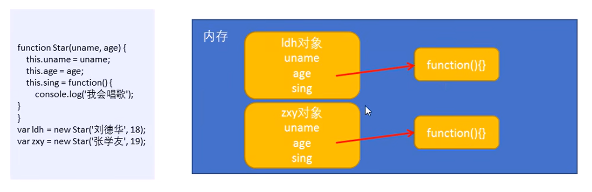
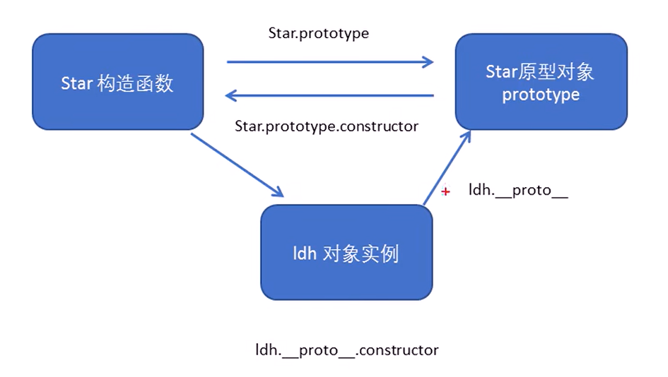
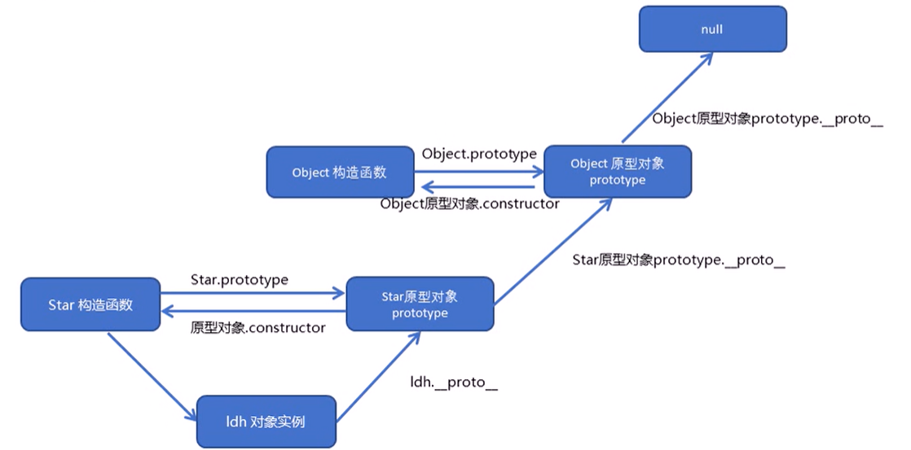
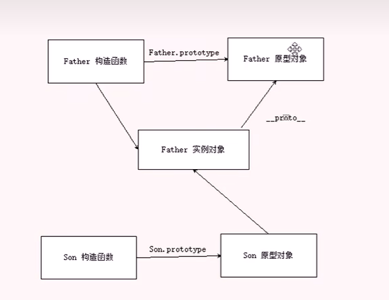
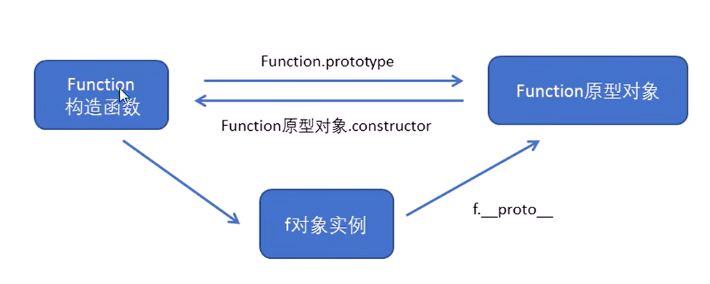
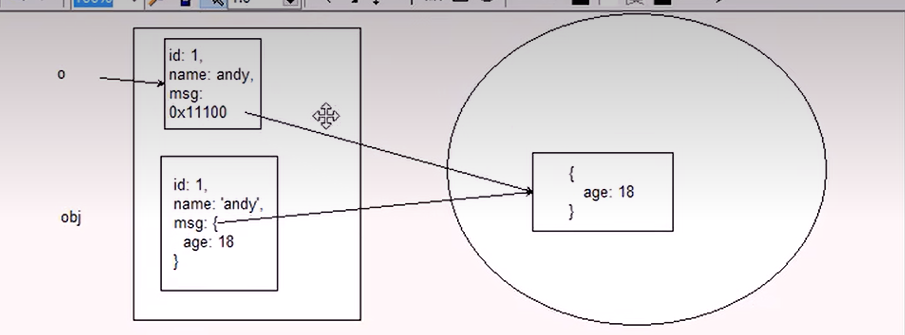
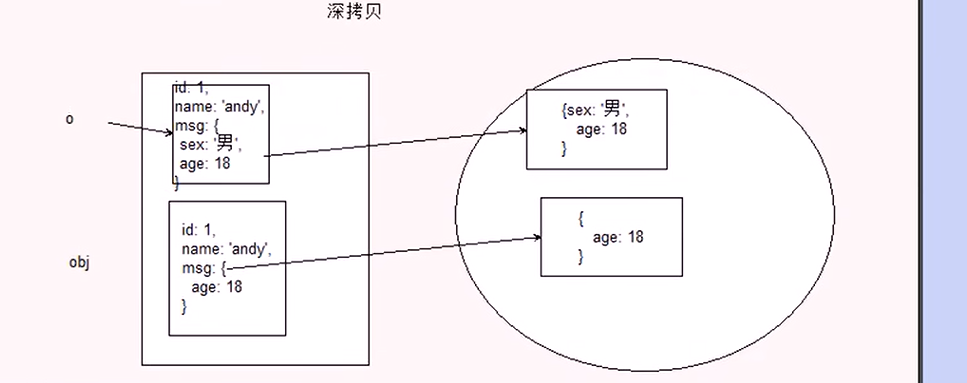
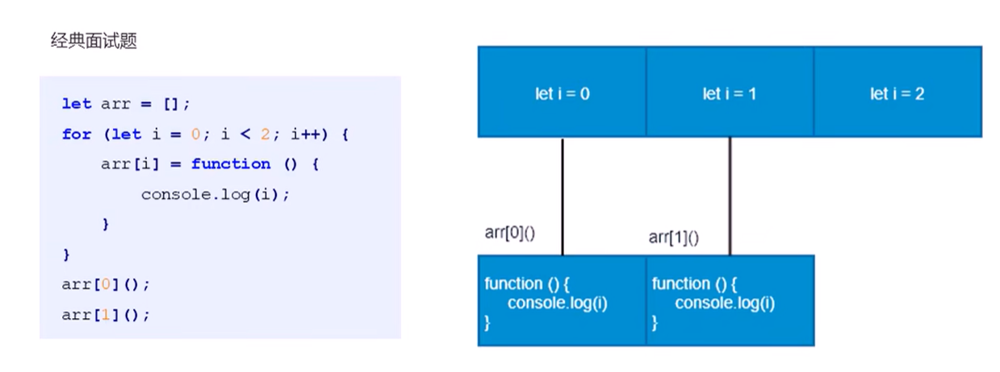
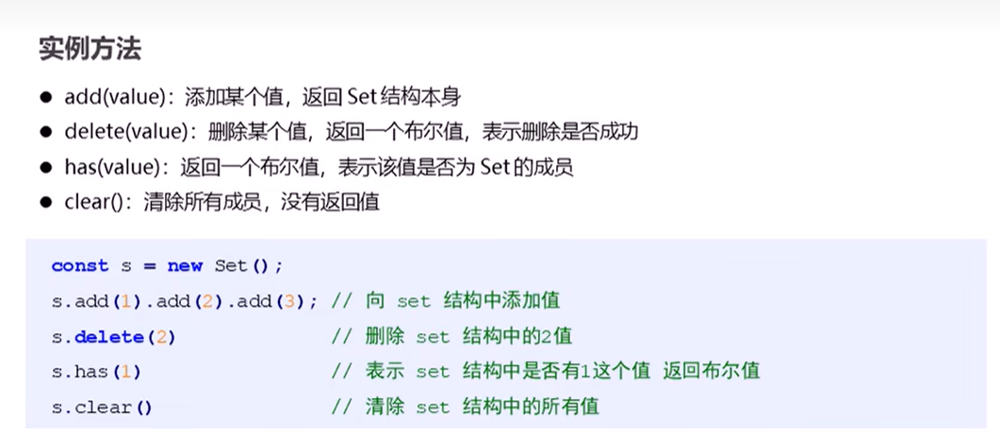

# 1.JavaScript面向对象

## 1.面向对象编程介绍

### 1.1两大编程思想

- 面向过程
- 面向对象

### 1.2面向过程编程POP（Process-oriented programming）

面向过程就是分析出解决问题所需要的步骤，然后用函数把这些步骤一步一步实现，使用的时候再一个一个的依次调用就可以了

例子：

1. 打开冰箱门
2. 大象装进去
3. 关上冰箱门

面向过程，就是按照我们分析好了的步骤，按照步骤解决问题

### 1.3面向对象编程 OOP（Object Oriented Programming）

面向对象是把事务分解成一个个对象，然后由对象之间分工与合作

例子：

先找出对象的功能，并写出这些对象的功能

1. 大象对象
   - 进去
2. 冰箱对象
   - 打开
   - 关闭

面向对象是以对象功能来划分问题。而不是步骤

在面向对象程序开发思想中，每个对象都是功能中心，具有明确分工

面向对象编程具有灵活，代码可复用、容易维护和开发的优点，更适合多人合作的大型软件项目

面向对象的特性：

- 封闭性
- 继承性
- 多态性

### 1.4面向过程和面向对象的对比

面向过程

- 优点：性能比面向对象高，适合跟硬件联系很紧密的东西，例如单片机就采用的面向过程编程
- 缺点：没有面向对象易维护、易复用、易扩展

面向对象

- 优点：易维护、易复用、易扩展，由于面向对象有封装、继承、多态性的特性、可以设计出低耦合的的系统，使系统更加灵活，更加易于维护
- 缺点：性能比面向过程低

用面向过程的方法写出来的程序就像是一份蛋炒饭，而用面向对象写出来的程序就像是一份盖浇饭

## 2.ES6中的类和对象

面向对象

面向对象更贴近我们的实际生活，可以使用面向对象描述现实世界事物，但是事物分为具体的食物和抽象的事物

手机 抽象的（泛指的）

我的红米k50 具体的（特指的）

面向对象的思维特点：

1. 抽取（抽象）对象共用的属性和行为组织（封装）成一个类（模板）
2. 对类进行实例化，获取类的对象

面向对象编程我们考虑的是有哪些对象，按照面向度对象的思维特点，不断创建对象，使用对象，指挥对象做事情

### 2.1对象

现实生活中：万物皆可对象，对象是一个具体的食物，看得见摸得着的事务，例如：一本书。一辆汽车、一个人可以是对象，一个数据库，一张网页，一个于=与远程服务器的连接也可以是对象

在JavaScript中。对象是一组无序的相关属性和方法的集合，所有的事物都是对象，例如字符串、数值、数组函数等

对象是由==属性和方法==组成的：

- 属性：事物的特征，在对象中用属性来表示（常用名词）
- 方法：事物的行为，在对象中用方法来表示（常用动词）

### 2.2类class

在ES6中新增了类的概念，可以使用class关键词声明一个类，之后以这个类来实例化对象

类抽象了对象的公共部分，他泛指某一大类（class）

对象==特指==某一个，通过类实例化一个具体的对象

面向对象的思维特点：

1. 抽取（抽象）对象共用的属性和行为组织（封装）成一个类（模版）
2. 对类进行实例化，获取类的对象

### 2.3创建类

语法：

```js
class name{
//class body
}
```

创建实例：

```js
var xx =new name();
```

注意：类必须使用new实例化对象

### 2.4类constructor构造函数

constructor()方法是类的构造函数（默认方法），用于传递参数，返回实例化对象，通过new命令生成对象实例时，自动调用该方法，如果没有显示定义，类内部会自动给我们创建一个constructor()

1. 通过class关键字创建类，类名我们还是习惯性定义首字母大写
2. 类里面的constructor函数，可以接收传递过来的参数，同时返回实例对象
3. constructor函数，只要new生成实例时，就会自动调用这个函数，如果我们不写这个函数，类也会自动生成这个函数
4. 生成的实例 new 不能省略
5. 最后注意语法规范，创建类 类名后面不要加小括号，生成实例 类名后面加小括号，构造函数不需要加function

### 2.5类添加方法

语法：

```js
class Person {
constructor (name,age){
//constructor 构造器或者构造函数
this.name=name;
this.age=age;
}
say(){
console.log(this.name+'你好')
}
}
```

1. 类里面的所有的函数不需要加function
2. 多个函数方法之间不许呀添加逗号分隔

## 3.类的继承

### 3.1继承

现实中的继承：子承父业，比如我们都继承了父亲的姓

程序中的继承：子类可以继承父类的一些属性和方法

语法：

```js
class Father{
//父类
} 
class Son extends Father{
//子类继承父类
}
```


### 3.2super关键字

super关键字用于访问和调用对象父类上的函数，可以调用父类的构造函数，也可以调用父类的普通函数

继承中的属性或者方法查找原则：就近原则

1. 继承中，如果实例化子类输出一个方法，先看子类有没有这个方法，如果有就先执行子类的
2. 继承中，如果子类里面没有就去查找父类有没有这个方法，如果有，就执行父类这个办法（就近原则）

==注意：super 必须在子类this之前调用（必须先调用父类的构造方法，在使用子类构造方法）==

### 三个注意点：

1. 在ES6中类没有变量提升，所以必须先定义类，才能通过类实例化对象
2. 类里面的共有的属性和方法一定要加this使用
3. 类里面的this指向问题
4. constructor里面的this指向实例对象，方法里面的this指向这个方法的调用者

## 4.面向对象案例

tab栏编辑功能

- 双击选项卡li或者section里面的文字,可以实现修改功能
- 双击事件是:ondblclick
- 如果双击文字,会默认选定文字,此时需要双击禁止选中文字
- window.getSelection?window.getSelection().removeAllRanges():document.selection.empty();
- 核心思路：双击文字的时候在里面生成一个文本框，当时去焦点或者按下回车然后把文本框输入的值给原先的元素即可 

# 2.构造函数和原型

## 1.构造函数和原型

### 1.1概述

在典型的OOP的语言中（如java），都存在类的概念，类就是对象的模板，对象是类的实例，但在ES6之前，JS中并没有引入类的概念

ES6，全称ECMAScript6.0 , 2015 06发版。但是目前一些浏览器的JavaScript是ES5版本，大多数高版本的浏览器也支持ES6，不过只实现了ES6的部分特性和功能

在ES6之前，对象不是基于类创建的，而是用一种称为==构造函数==的特殊函数来定义对象和他们的特征

创建对象可以通过以下三种方式：

1. 对象字面量
2. new Object()
3. 自定义构造函数

### 1.2构造函数

==构造函数==是一种特殊的函数，主要用来初始化对象，即为对象成员变量赋初始值，他与new一起使用。我么可以把对象中一些公共的属性和方法抽取出来，然后封装到这个函数里面

**在JS中，使用构造函数时要注意以下两点：**

1. 构造函数用于创建某一类对象，其首字母要大写
2. 构造函数要和new一起使用才有意义

**new在执行时会做四件事情**

1. 在内存中创建一个空对象
2. 让this指向这个新的对象
3. 执行构造函数里面的代码，给这个新对象添加属性和方法
4. 返回这个新对象（所以构造函数里面不需要return）

JavaScript的构造函数中可以添加一些成员，可以在构造函数本身上添加，也可以在构造函数内部的this上添加。通过这两种方式添加的成员，就分别成为==静态成员和实例成员==

- 静态成员：在构造函数本上添加的成员称为==静态成员，只能由构造函数本身来访问==
- 实例成员：在构造函数内部创建的对象成员称为==实例成员，只能由实例化的对象来访问==

1. 实例成员就是构造函数内部通过this添加的成员，只能通过实例化的对象来访问，不能通过构造函数来访问实例成员
2. 静态成员 在构造函数本身上添加的成员，静态成员只能通过构造函数来访问

### 1.3构造函数的问题

构造函数方法虽然好用，但是存在浪费内存的问题



### 1.4构造函数原型prototype

构造函数通过原型分配的函数是所有对象所共享的

JavaScript规定，==每个构造函数都有一个prototype属性==，指向另一个对象，注意这个prototype就是一个对象，这个对象的所有方法和属性，都会被构造函数所拥有

==我们可以把那些不变的方法，直接定义在prototype对象上，这样所有对象的实例就可以共享这些方法==

prototype是一个对象也叫原型对象，作用是共享方法

一般情况下，公共属性定义到构造函数里面，公共方法我们放到原型对象身上

### 1.5对象原型 _ proto_

对象都会有一个属性_ proto_指向构造函数的prototype原型对象。之所以我们对象可以使用构造函数prototype原型对象的属性和方法，就是因为对象有 _ proto _原型的存在

- _ proto _对象原型和原型对象prototype是等价的
- _ proto _对象原型的意义就在于为对象的查找机制提供一个方向，或者说一个路线，但是他是一个非标准属性，因此在实际开发中，不可以使用这个属性，它只是内部指向原型对象prototype

### 1.6constructor构造函数

对象原型（_ proto _）和构造函数（prototype）原型对象里面都有一个属性constructor属性，constructor我们称为构造函数，因为它指回构造函数本身

constructor主要用于记录该对象引用于哪个构造函数，他可以让原型对象重新指向原来的构造函数

很多情况下，我们需要手动利用constructor这个属性指回原来的构造函数

### 1.7构造函数、实例、原型对象三者之间的关系



### 1.8原型链（下面这张图看懵逼了别怪我哦）



### 1.9JavaScript的成员的查找机制

1. 当访问一个对象的属性(包括方法)时，首先查找这个对象自身有没有该属性
2. 如果没有就查找它的原型(也就是 proto 指的 prototype 原型对象 )
3. 如果还没有就查找原型对象的原型(Object的原型对象)
4. 依此类推一直找到Object为止( null )。 
5. _ proto_对象原型的意义就在于为对象成员查找机制提供一个方向，或者说一条路线

### 1.10原型对象this指向

1. 在构造函数中，里面的this指向的是对象实例
2. 原型对象函数里面的this指向的是

### 1.11扩展内置对象

可以通过原型对象，对原来的内置对象进行扩展自定义的方法。比如给数组增加自定义求偶数和的功能

注意：数组和字符串内置对象不能给原型对象覆盖操作Array.prototype={}，只能是Array.prototype.xxx=function(){}

## 2.继承

ES6之前并没有给我们提供extends继承，我们可以通过==构造函数+原型对象==模拟实现继承，被称为组合继承

### 2.1call()

调用这个函数，并且修改函数运行时的this指向

```js
函数名.call(thisArg,arg1,arg2,...)
```

- thisArg:当前调用函数this的指向对象
- arg1，arg2：传递的其他参数

1. call()可以调用函数

### 2.2借用构造函数继承父类型属性

核心原理：通过call()把父类型的this指向子类型的this，这样就可以实现子类型继承父类型的属性

### 2.3借用原型对象继承父类型方法



## 3.类的本质

1. class本质还是function可以简单的认为 类就是 构造函数的另一种写法
2. 类的所有方法都定义在类的属性上
3. 类的创建的实例，里面也有_ proto_指向类的prototype原型对象
4. 所以ES6的类它的绝大部分功能，ES5都可以做到，新的class写法只是让对象原型的写法更加清晰，更像面向对象编程的语法而已
5. 所以ES6的类其实就是语法糖
6. 语法糖;语法糖就是一种便捷写法，简单理解，有两种方法可以实现同样的功能，但是一种写法更加清晰、方便，那么这个方法就是语法糖

### 3.1ES5新增方法概述

ES5中给我们新增了一些方法，可以很方便的操作数组或者字符串，这些方法包括：

- 数组方法
- 字符串方法
- 对象方法

### 3.2数组方法

迭代（遍历）方法：forEach()、map()、filter()、some()、every()

```JS
array.forEach(function(currentValue,index,arr))
```

- currentValue:数组当前项的值
- index：数组当前项的索引
- arr：数组对象本身

```js
array.filter(function(currentValue,index,arr))
```

- filter()方法创建一个新的数组。新数组中的元素是通过检查指定数组中符合条件的所有元素，主要用于筛选数组
- ==注意他直接返回一个新数组==
- currentValue：数组当前项的值
- index：数组当前项的索引
- arr：数组对象本身

```js
array.some(function(currentValue,index,arr))
```

- some()方法用于检测数组中的元素是否满足指定条件。通俗点 查找数组中是否有满足条件的元素
- ==注意他返回的值是布尔值，如果查找到这个元素，就返回true，如果查找不到就返回false==
- 如果找到第一个满足条件的元素，则终止循环不在继续查找
- currentValue：数组当前项的值
- index：数组当前项的索引
- arr：数组对象本身

  

forEach和some的区别：

- forEach里面return不会终止迭代
- some里面遇到return true就是终止遍历 迭代效率更高

### 3.3字符串方法

trim()方法回从一个字符串的两端删除空白字符

```js
str.trim()
```

trim()方法并不影响字符串本身，它返回的是一个新的字符串

### 3.4对象方法

#### 1.Object.keys()用于获取自身所有的属性‘

```js
Object.keys(obj)
```

- 效果类似for...in
- 返回一个由属性名组成的数组

#### 2.Object.defineProperty()定义对象中的新属性或修改原有的属性

```
Object.defineProperty（obj，prop，descriptor）
```

- obj：必需。目标对象
- prop：必需。需定义或修改的属性的名字
- ==descriptor：必需。目标属性所拥有的特性==

Object.defineProperty（）第三个参数descriptor说明：以对象形式{ }书写

- value：设置属性的值，默认为undefined
- writable：值是否可以重写。true|false默认为false
- enumerable：目标属性是否可以被枚举。true|false默认是false
- configurable：目标属性是否可以被删除或是否可以再次修改特性true|false默认为false

# 3.函数的进阶

## 1.函数的定义和调用

### 1.1函数的定义方式

1. 函数声明方式function关键字（命名函数）
2. 函数表达式（匿名函数）
3. new Function（）

```js
var fn =new Function('参数1','参数2'...,'函数体')
```

- Function里面参数都必须是字符串格式
- 第三种方式执行效率低，也不方便书写，因此较少使用
- 所有函数都是Function的实例（对象）
- 函数也属于对象



### 1.2函数的调用方式

1. 普通函数
2. 对象的方法
3. 构造函数
4. 绑定事件函数
5. 定时器函数
6. 立即执行函数

## 2.this

### 2.1函数内this的指向

这些this的指向，是当我们调用函数的时候确定的。调用方式的不同决定了this的指向不同

一般指向我们的调用者

| 调用方式     | this指向                                   |
| ------------ | ------------------------------------------ |
| 普通函数调用 | window                                     |
| 构造函数调用 | 实例对象，原型对象里面的方法也指向实例对象 |
| 对象方法调用 | 该方法所属对象                             |
| 事件绑定方法 | 绑定事件对象                               |
| 定时器函数   | window                                     |
| 立即执行函数 | window                                     |

### 2.2改变函数内部this的指向

JavaScript为我们提供了一些函数方法来帮助我们更优雅的处理函数内部this的指向问题，常用的有bind()、call()、apply()三种方法

#### 1. call方法

call()方法调用一个对象。简单理解为调用函数的方式，但是他可以改变函数的this的指向

```js
fun.call(thisArg,arg1,arg2,...)
```

#### 2.apply方法

apply（）方法调用一个函数。简单理解为调用函数的方式，但是他可以改变函数的this指向

```js
fun.apply(thisArg,[argArray])
```

- thisArg:在fun函数运行时指定的this值
- argArray：传递的值，必须包含在数组里面，参数必须是数组（伪数组）
- 返回盒子就是函数的返回值，因为他就是调用函数

#### 3.bind方法

bind()方法不会调用函数，但是能改变函数内部this指向

```js
fun.bind(thisArg,arg1,arg2,...)
```

- thisArg:在fun函数运行时指定this值
- arg1,arg2：传递的其它参数
- 返回由指定的this值和初始化参数改造的==原函数拷贝==（相当于新函数）

### 2.3call apply bind 总结

**相同点：**
都可以改变函数内部的this指向
**区别点:**

1. call和apply 会调用函数并且改变函数内部this指向
2. call和apply传递的参数不一样,call传递参数aru1,aru2..形式 apply必须数组形式[arg]
3. bind 不会调用函数可以改变函数内部this指向

**主要应用场景:**

1.  call 经常做继承
2. apply经常跟数组有关系比如借助于数学对象实现数组最大值最小值
3. bind不调用函数但是还想改变this指向.比如改变定时器内部的this指向

## 3.严格模式

### 3.1什么是严格模式

JavaScript除了提供正常模式外，还提供了==严格模式（strict mode）==。ES5的严格模式是采用具有限制性JavaScript变化的一种方式，即在严格的条件下运行JS代码

严格模式在IE10以上版本的浏览器才会被支持，旧版本浏览器中会被忽略

严格模式对正常的JavaScript语义做了一些更改：

1. 消除了JavaScript语法的一些不合理的地方。不严谨之处，减少了一些怪异行为
2. 消除了代码运行的不安全之处，保证代码运行的安全
3. 提高编译器效率，增加运行速度
4. 禁用了在ECMAScript的未来版本中可能会定义的一些语法，为未来版本的JavaScript做好铺垫。比如一些保留字：class，enum，export，extends，import，super不能做变量名

### 3.2开启严格模式

严格模式可以应用到整个脚本或个别函数中。因此在使用时，我们将严格模式分为==为脚本开启严格模式和为函数开启严格模式==两种情况

#### 1.为脚本开启严格模式

为整个脚本开启严格模式，需要==在所有语句之前放一个特定的语句"use strict";（或'use strict';）==

```js
<script>
"use strict";
console.log("这是严格模式。");
</script>
```

有的script基本是严格模式，有的script脚本是正常模式，这样不利于文件合并，所以可以将整个脚本文件放在一个立即执行的匿名函数之中。这样独立创建一个作用域而不影响其他script脚本文件

```js
<script>
(function(){
"use strict";
var num=10;
function fn(){}
})();
</script>
```

### 2.为函数开启严格模式

要给某个函数开启严格模式，需要把“use strict”；（或‘use strict’；）声明放在函数体所有语句之前

### 3.4严格模式中的变化

严格模式对JavaScript的语法和行为，都做了一些改变

#### 1. 变量规定

1. 在正常的模式中，如果一个变量没有声明就赋值，默认是全局变量。严格模式禁止这种写法，变量都必须先var命令声明，然后再使用
2. 严禁删除已经声明变量。例如，delete x;语法是错误的 

#### 2.严格模式下this指向问题

1. 以前在全局作用域函数中的this指向window对象
2. 严格模式下全局作用域中函数中的this是undefined
3. 以前构造函数时不加new也可以调用，当普通函数，this指向全局变量
4. 严格模式下。如果构造函数不加new调用，this会报错
5. new实例化的构造函数会指向创建的对象实例
6. 定时器this还是指向window
7. 事件、对象还是指向调用者

#### 3.函数变化

1. 函数不能有重名的参数
2. 函数必须声明在顶层。新版本的JavaScript会引入“块级作用域”（ES6中已引入）。为了与新版本接轨，不允许在非函数的代码块内声明函数（比如if里不让包代码块for嵌套也不让）

## 4.高阶函数

==高阶函数==是对其他函数进行操作的函数，他接收函数作为参数或将函数作为返回值输出

```js
<script>
function fn(callback){
callback&&callback();
}
fn(function(){
alert('hi')
})
</script>
```

```js
<script>
function fn(){
 return function() {}
}
 fn();
</script>
```

此时fn就是一个高阶函数

函数也是一种数据类型，同样可以作为参数，传递给另外一个参数使用。最典型的就是作为回调函数

## 5.闭包

### 5.1变量作用域

变量根据作用域的不同分为两种：全局变量和局部变量

1. 函数内部可以使用全局变量
2. 函数外部不可以使用局部变量
3. 当函数执行完毕，本作用域内的局部变量会销毁

### 5.2什么是闭包

==闭包（closure）==指有权访问另一个函数作用域中的变量的函数

​			----javascript高级程序设计

简单理解就是，一个作用域可以访问另一个函数内部的局部变量

闭包的主要作用：延伸了变量的作用范围

### 5.3闭包总结

#### 1.闭包是什么？

闭包是一个函数（一个作用域可以访问另外一个函数的局部变量）

#### 2.闭包的作用是什么

眼神变量的作用范围 

## 6.递归

如果一个函数在内部可以调用其本身，那么这个函数就是递归函数

简单理解函数内部自己调用自己，这个函数就是递归函数

递归函数的作用和循环效果一样

由于递归很容易发生“栈溢出”错误（stack overflow），所以必须要加退出条件return

### 6.1浅拷贝和深拷贝

1. 浅拷贝只是拷贝一层，更深层次对象级别的只拷贝引用
2. 深拷贝拷贝多层，每一级别的数据都会拷贝
3. Object.assign(target（拷贝给谁）,..sources（拷贝的对象）) es6新增方法可以浅拷贝

**浅拷贝：**



**深拷贝：**



# 4.正则表达式

## 1.正则表达式概述

### 1.1什么是正则表达式

正则表达式( RegularExpression )是用于匹配字符串中字符组合的模式。在JavaScript中，正则表达式也是对象。

正则表通常被用来检索、替换那些符合某个模式(规则)的文本，例如验证表单:用户名表单只能输入英文字母、数字或者下划线，昵称输入框中可以输入中文(匹配。此外，正则表达式还常用于过滤掉页面内容中的些敏感词(替换)，或从字符串中获取我们想要的特定部分(提取)等

### 1.2正则表达式的特点

1. 灵活性、逻辑性和功能性非常的强
2. 可以迅速地用极简单的方式达到字符串的复杂控制。
3. 对于刚接触的人来说，比较晦涩难懂。比如:w+([-+w+)*@w+([-w+)w+([-小w+)*$
4. 实际开发,一般都是直接复制写好的正则表达式但是要求会使用正则表达式并且根据实际情况修改正则表达式比如用户名: /^[a-z0-9 -]3,161$/

## 2.正则表达式在JavaScript中的使用

### 2.1创建正则表达式

在JavaScript中有两种方式创建一个正则表达式

1. 通过调用RegExp对象的构造函数创建

   ```js
   var 变量名=new RegExp(/表达式/)；
   ```

   

2. 通过字面量创建

   ```js
   var 变量名=/表达式/
   ```

   ### 2.2测试正则表达式 test

   test（）正则对象方法，用于检测字符串是否符合该规则，该对象会返回true或false，其参数是测试字符串

   ```js
   regxObj.test(str)
   ```

   1. regexobj是写的正则表达式
   2. str 我们要测试的文本
   3. 就是检测str文本是否符合我们写的正则表达式规范

## 3.正则表达式的组成

### 3.1正则表达式的组成

一个正则表达式可以由简单的字符构成，比如/abc/，也可以是简单和特殊字符的组合，比如/ab*c/。其中特殊字符也被称为元字符，在正则表达式中是具有特殊意义的专用符号，如^、$、+等

### 3.2边界符

正则表达式的边界符（位置符）用来提示字符所处的位置，主要有两个字符

| 边界符 | 说明                           |
| ------ | ------------------------------ |
| ^      | 表示匹配行首的文本（以谁开始） |
| $      | 表示匹配行尾的文本（以谁结束） |

^和$在一起表示精确匹配

### 3.3字符类

字符类表示有一系列字符可供选择，只要匹配一个就行==所有可供选择的字符都放在方括号内==

【-】方括号内部 范围符 **-**

如果中括号里面有尖括号[^]是取反的意思

```js
/^[^abc]$/.test('a')  //false
```

### 3.4量词符

量词符用来设定某个模式出现的次数

| 量词   | 说明             |
| ------ | ---------------- |
| *      | 重复零次或更多次 |
| +      | 重复一次或更多次 |
| ？     | 重复0次或一次    |
| {n}    | 重复n次          |
| {n，}  | 重复n次或更多次  |
| {n，m} | 重复n到m次       |

### 3.5括号总结

1. 大括号 量词符，里面表示重复次数
2. 中括号 字符集合 匹配方括号中的任意字符
3. 小括号 表示优先级

可以在线测试：http://c.runoob.com

### 3.6预定义类

预定义类指的是==某些常用的模式的简写模式==

| 预定类 | 说明                                                         |
| ------ | ------------------------------------------------------------ |
| \d     | 匹配0-9之间的任意数组，相当于[0-9]                           |
| \D     | 匹配所有的0-9以外的字符，相当于[ ^  0-9 ]                    |
| \w     | 匹配任意的字母、数字和下划线，相当于[A-Za-z0-9_]             |
| \W     | 除所有字母、数字和下划线以外的字符，相当于[ ^  A-Za-z0-9_]   |
| \s     | 匹配空格（包括换行符、制表符、空格符等），相当于[\t\r\n\v\f] |
| \S     | 匹配非空格的字符，相当于[ ^  \t\r\n\v\f]                     |

正则里面的或是一个 **|** 不是两个

## 4.正则表达式中的替换

### 4.1replace替换

replace()方法可以实现替换字符串操作，用来替换的参数可以是一个字符串或是一个正则表达式

```js
stringObiect.replace(regexp/substr,replacement)
```

- 第一个参数：被替换的字符串或者正则表达式

- 第二个参数是要替换为的字符串
- 返回值是一个替换完毕的新字符串

### 4.2正则表达式参数

```js
/表达式/[switch]
```

switch(也成修饰符)按照什么样的模式来匹配，有三种值

- g：全局匹配
- i：忽略大小写
- gi：全局匹配+忽略大小写

# 5.ES6简介

**什么是ES6？**

ES的全称是ECMAScript，它是有ECMA国际标准化组织制定的一项脚本语言的标准化规范


ES6实际上是一个泛指ES2015及后续的版本

**为什么使用ES6？**

每一次标准的诞生都意味着语言的完善，功能的加强。JavaScript语言本身也有一些令人不满意的地方

- 变量提升特性增加了程序运行的不可预测性
- 语法过于松散，实现相同的功能，不同的人可能写出不同的代码

## 1let

### 1.1let

ES6中新增的用于声明变量的关键字

- **let声明的变量只在所处于的块级有效**

```js
if(true){
let a=10;
}
console.log(a)//a is not defined
```

块级作用域一对{}产生的作用域

注意：使用let关键字声明的变量在具有块级作用域，使用var声明的变量不具备块级作用域的特性

- **不存在变量提升**

```js
console.log(a);// a is not defined
let a=20;
```

- **暂时性死区**

```js
var tmp=123;
if(true){
tmp='abc'
let tmp;
}
```

经典面试题



此题关键点在于每次循环都会产生一个块级作用域，每个块级作用域中的变量都是不同的，函数执行时输出的是自己的上一级（循环产生的会计作用域）作用域下的 i 值

### 1.2const

作用：声明变量，常量就是值（内存地址）不能变化的量

- **具有块级作用域**

  ```js
  if(true){
  const a=10;
  }
  console.log(a)//a is not defined
  ```

  

- **声明常量时必须赋值**

```js
const PI;//Missing initializer in const declaration
```

- **常量赋值后，值不能修改**

```js
const PI=3.14;
PI=100;//Assignment to constant variable
```

```js
const ary=[100,200]
ary[0]='a'
ary[1]'b'
console.log(ary);//['a','b'];
ary=['a','b'];//Assignment to constant variable
```

### 1.3let/const/var的区别

1. 使用 var 声明的变量，其作用域为该语句所在的函数内，且存在变量提升现象
2. 使用let 声明的变量，其作用域为该语句所在的代码块内，不存在变量提升
3. 使用 const 声明的是常量，在后面出现的代码中不能再修改该常量的值

| var          | let            | const          |
| ------------ | -------------- | -------------- |
| 函数级作用域 | 块级作用域     | 块级作用域     |
| 变量提升     | 不存在变量提升 | 不存在变量提升 |
| 值可更改     | 值可更改       | 值不可更改     |

### 1.4解构赋值

ES6中允许从数组中提取值，按照对应的位置，对变量赋值，对象也可以实现解构

**数组解构**

```js
let [a,b,c,]=[1,2,3]
console.log(a)
console.log(b)
console.log(c)
```

注意上面代码中的abc是变量不是值

如果解构不成功，变量的值为undefined

```js
let [foo]=[]
let[bar ,foo]=[1]
```


**对象解构**

```js
let person={name:'zs',age:20};
let {name,age}=person;
console.log(name);//';zs'
console.log(age);//20
```

允许我们使用变量的名字匹配对象的属性 匹配成功将对象属性的值赋值给变量

```
let {name:myName,age:myAge}=person;//myName myAge属于别名
console.log(myName);//';zs'
console.log(myAge);//20
```

这样可以把值给别的变量

### 1.5箭头变量

ES6中新增的定义函数的方式

```js
()=>{}
const fn=()=>{}
```

函数体中如果只有一句代码，且代码的执行结果就是返回值，可以省略大括号 

```js
function sum(num1,num2){
return num1+num2;
}
const sum=(num1,num2)=>num1+num2;
```

如果形参只有一个，可以省略小括号

```js
function fn(v){
return v;
}
```

### 1.6箭头函数

箭头函数不绑定this关键字，箭头函数中的this，指向的是函数定义位置的上下文this

```js
const obj={name:'zs'}
function fn(){
console.log(this);
return()=>{
console.log(this)
}
}
const resFn=fn.call(obj);
resFn();
```

### 1.7剩余参数

剩余参数允许我们将一个不定数量的参数表示为一个数组

```js
function sum(first,...args){
console.log(first);//10
console.log(args);//[20,30]
}
sum(10,20,30)
```

**剩余参数和解构配合使用**

```js
let students=['ww','zs','ls'];
let [s1,..s2]=students;
console.log(s1);//'ww';
console.log(s2);//['zs'.ls];
```

## 2.Array的扩展方法

### 2.1扩展运算符（展开语法）

扩展运算符可以将数组或者对象转化为用逗号分隔的参数序列

```js
let ary=[1,2,3];
...ary//1,2,3
console.log(..ary);//1 2 3
console.log(1,2,3)
```

扩展运算符可以用于==合并数组==

```js
//方法1
let ary1=[1,2,3];
let ary2=[3,4,5];
let ary3=[..ary1,..ary2];
//方法2
ary1.push(...ary2);
```

利用扩展运算符将类数组或可遍历对象转换为真正的数组

```js
let oDivs=document.gqtElementsByTagNmae('div');
oDIVs=[...oDivs]
```

### 2.2构造函数方法：Array.form（）

将类数组或可遍历对象转换为真正的数组

```js
let arrayLike={
'0':'a',
'1':'b',
'2':'c',
length:3
};
let arr2=Array.from(arrayLike);//['a','b','c']
```

方法还可以接受第二个参数，作用类似于数组的map方法，用来对每个元素进行处理，将处理后的值放回返回的数组

```js
let arrayLike={
"0":1,
"1":2,
"length":2
} 
let newAry=Array.from(aryLike,item=>item*2)
```

### 2.3实例方法：find()

用于找出第一个符合条件的数组成员，如果没有找到返回

```js
let ary=[{
id:1,
name:'zs'
},{
id:2,
name:'ls'
}];
let target=ary.find((item,index)=>item.id==2);
```

### 2.4实例方法findIndex()

用于找出第一个符合条件的数组成员的位置，如果没有找到返回-1

```js
let ary=[1,5,10,15];
let index=ary.findIndex((value,index)=>value>9);
console.log(index);//2
```

### 2.5实例方法：includes()

表示某个数组是否包含给定的值，返回布尔值。

```js
[1,2,3].includes(2)//true
[1,2,3].includes(4)//false
```

### 2.6模版字符串

ES6新增的创建字符串的方式，使用反引号定义。

```js
let name=`zs`;
```

模板字符串可以解析变量

```js
let name='zs';
let sayHello=`hello,my name is ${name}`;//hello,my name is zs
```

模版字符串可以换行

```js
let result={
name:'zs',
age:20,
sex:'男'
}
let html=`<div>
<span>${result.name}</span>
<span>${result.age}</span>
<span>${result.sex}</span>
</div>`;
```

在模版字符串中可以调用函数

```js
const sayHello=function(){
return '哈哈哈'
};
let greet=`$(sayHello())`
```

实例方法：startWith（）和endsWith()

- startWith():表示参数字符串是否在原字符串的头部，返回布尔值
- endsWith():表示参数字符串是否在原字符串的尾部，返回布尔值

```js
let str='Hello world!';
str.startWith('Hello')//true
str.endsWith('!')//true
```

实例方法;reapet()

repeat方法将原字符串重复n次，返回一个新字符串

```js
'x'.repeat(3)//"xxx"
'hello'.repeat(2)//"hellohelo"
```

### 2.8Set数据结构

ES6提供了新的数据结构Set。他类似于数组，但是成员的值都是唯一的，没有重复的值

Set本身是一个构造函数，用来生成Set数据结构

```js
const s=new Set();
```

Set函数可以接受一个数组作为参数，用来初始化

```js
const set=new Set([1,2,3,4,4]);
```



**遍历**

Set结构的实例与数组一样，也拥有forEach方法，用于对每个成员执行某种操作，没有返回值

```js
s.forEach(value=>console.log(value))
```

