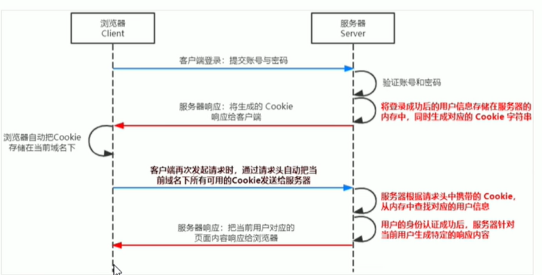

# 1.初识Node.js与内置模块

## 1.初识Node.js

### 1.1回顾与思考

#### 1.已经掌握了哪些技术

- HTML
- CSS
- JavaScript

#### 2.浏览器中的JavaScript的组成部分


#### 3.思考：为什么JavaScript可以在浏览器中被执行

不同的浏览器使用不同的JavaScript解析引擎：

- Chrome 浏览器=》V8
- Firefox 浏览器 =》OdinMonkey（奥丁猴）
- Safri 浏览器=》JSCore
- IE浏览器=》Chakra（查克拉）
- etc...

其中，Chrome浏览器的V8解析引擎性能最好！

#### 4.思考：为什么JavaScript可以操作DOM和BOM

每个浏览器都内置了DOM、BOM这样的API函数，因此，浏览器中的JavaScript才可以调用它们

#### 5.浏览器中的JavaScript运行环境

运行环境是指代码正常运行所必需的必要环境


总结：

1. V8引擎负责解析和执行JavaScript代码
2. 内置API是由运行环境提供的特殊接口，只能在所属的运行环境中被调用

#### 6.思考：JavaScript能否做后端开发

可以但是需要借助node.js的运行环境

### 1.2Node.js简介

### 1.什么是Node.js

Node,js is a JavaScript runtime built on Chrome's V8 JavaScript engine.
Node.js 是一个基于 Chrome V8 引擎的 JavaScript 运行环境。

 Node.js的官网地址：http://nodejs.org/zh-cn/

#### 2.Node.js的JavaScript运行环境


注意：

1. 浏览器是JavaScript的前端运行环境
2. Node.js是JavaScript的后端运行环境
3. Node.js中无法调用DOM和BOM等浏览器内置API

#### 3.Node.js可以做什么

Nodejs 作为一个JavaScript 的运行环境，仅仅提供了基础的功能和 AP1。然而，基于 Node.js 提供的这些基础工能，很多强大的工具和框架如雨后春笋，层出不穷，所以学会了 Node.js，可以让前端程序员胜任更多的工作和岗位

1. 基于Express框架（http://www.expressjs.com.cn/）可以快速构建Web
2. 基于Electron框架（https://electronjs.org/）
3. 基于restify框架（http://restify.com/）可以快速构建API接口项目
4. 读写和操作数据库、创建实用的命令行工具辅助前端开发、etc...

Node.js的学习路径：

JavaScript基础语法+Node.js内置API模块（fs.path.http等）+第三方API模块（express、mysql等）

### 1.3Node.js环境的安装

如果希望通过Node.js来运行JavaScript代码，则必须在计算机上安装Node.js环境才行

http://nodejs.org/en/

#### 1.区分LTS版本和Current版本的不同

- LTS为长期稳定版，对于追求稳定性的企业级项目来说，推荐安装LTS版本的Node.js
- Current 为新特性尝鲜版，对热衷于尝试新特性的用户来说，推荐安装 Current 版本的 Node.js。但是Current 版本中可能存在隐藏的 Bug或安全性漏洞，因此不推荐在企业级项目中使用Current 版本的 Node.js。

#### 2.查看已安装的Node.js的版本号

打开终端，在终端输入命令node -v后。按下回车键，即可查看已安装的Node.js的版本号

#### 3.什么是终端

终端（英文：Terminal）是专门为开发人员设计的，用于实现人机交互的一种方式

作为一名合格的程序员，我们有必要识记一些常用的终端命令，来协助我们更好的操作与使用计算机

### 1.4在Node.js环境下执行JavaScript代码

1. 打开终端
2. 输入node要执行的js文件的路径

#### 1.终端里的快捷键

在Windows的powershell或cmd终端中，我们可以通过如下快捷键，来提高终端的操作效率：

1. 使用上方向键，可以快速定位到上一次执行的命令
2. 使用tab键，能够快速补全路径
3. 使用esc键，能够快速清空当前已输入的命令
4. 输入cls命令，可以清空终端

## 2.fs文件系统模块

### 2.1什么是fs文件系统模块

fs模块是Node.js官方提供的，用来操作文件的模版，他提供了一系列的方法和属性，用来满足用户对文件的操作需求

例如：

- fs.readFile()方法，用来读取指定文件中的内容
- fs.writeFile()方法，用来向指定的文件中写入内容

如果要在JavaScript代码中，使用fs模版来操作文件，则需要使用如下的方式先导入它：

```javascript
const fs =require('fs')
```

### 2.2读取指定文件中的内容

#### 1. fs.readFile（）的语法格式

使用fs.readFile()可以读取指定文件中的内容，语法格式如下：

```js
fs.readFile(path[,options],callback)
```

参数解读：

- 参数1：==必选==参数，字符串、表示文件的路径
- 参数2：可选参数，表示以什么==编码格式==来读取文件
- 参数3：==必选==参数，文件读取完成后，通过回调函数拿到读取的结果

#### 2.fs.readFile()的示例代码

以utf8的编码格式，读取指定文件的内容，并打印err和dataStr的值：

```js
const fs=require('fs')
fs.readFile('./files/11.text','utf8',function(err,dataStr){
console.log(err)
console.log('-----')
console.log('dataStr')
})
```

#### 3.判断文件是否读取成功

可以判断err对象是否为空，从而知晓文件读取结果

### 2.3向指定文件中写入内容

#### 1. fs.writeFile()的语法格式

```js
fs.writeFile(file,data[.options],callback)
```

参数解读：

1. 参数1：==必选==参数，需要指定一个文件路径的字符串，表示文件的存放路径
2. 参数2：==必选==参数，表示要写入的内容
3. 参数3：可选参数，表示以什么格式写入文件内容，默认是utf8
4. 参数4：==必选==参数，文件写入完成后的回调函数

#### 2.fs.writeFile()的示例代码

向指定的文件路径，写入文件内容

```js
const fs=require('fs')
fs.writeFile('./2.txt','Hello Node.js!',function(err){
console.log(err)
})
```

如果文件写入成功，则err的值等于null

如果写入失败，则err的值等于一个 错误对象

#### 3.判断文件是否写入成功

可以判断err对象是否为null，从而知晓文件写入结果

```js
fs.writeFile('./files/3.txt', 'ok123', function(err) {
  // 2.1 如果文件写入成功，则 err 的值等于 null
  // 2.2 如果文件写入失败，则 err 的值等于一个 错误对象
  // console.log(err)

  if (err) {
    return console.log('文件写入失败！' + err.message)
  }
  console.log('文件写入成功！')
})

```

### 2.4fs模块-路径动态拼接的问题

在使用fs模块操作文件时，如果提供的路径是以./或../开头的==相对路径==时，很容易出现路径动态拼接错误的问题

原因：代码在运行的时候，==会以执行node命令时所处的目录==，动态拼接出被操作文件的1完整路径

解决方案：直接提供完整路径 （注意将\改为 \ \ ) 

弊端：移植性非常差，不利于维护

更好的解决方案在相对路径见面去掉.加上__dirname

## 3.path路径模块

### 3.1什么是path路径模块

==path 模块==是Node.js官方提供的，用于==处理路径==的模块，他提供了一系列的方法和属性，用来满足用户对路径的处理需求

例如：

- path.join()方法，用来将==多个路径片段拼接成一个完整的路径字符串==
- path.basename()方法，用于从路径字符串中，将文件名解析出来

如果要在JavaScript代码中，使用path模块来处理路径，则需要使用如下的方式先导入它：

```js
const path =require('path')
```

#### 1. path.join()的语法格式

使用path.join方法可以把多个路径片段拼接为完整的路径字符串，语法格式如下：

```js
path.join([...paths])
```

参数解读：

- ...paths<string>路径片段的序列
- 返回值：<string>

#### 2.path.join()的代码示例

使用path.join()方法，可以把多个路径片段拼接为完整的路径字符串

```js
const pathStr=path.join('/a','/b/c','../','./d','e')
console.log(pathStr)//输出\a\b\d\e
//注意../会抵消一层路径这个路径是离他最近的路径
const pathStr2=path.join(_dirname,'./files/1.txt')
console.log(pathStr2)//输出 当前文件所处的目录\files\1.txt
```

注意：==今后凡是涉及到路径拼接的操作，都要使用path.join()方法进行处理==不要直接使用+进行字符串的拼接

### 3.2获取路径中的文件名

#### 1.path.basename()的语法格式

使用path.basename()方法，可以获取路径中的最后一部分，经常通过这个方法获取路径中的文件名，语法格式如下：

```js
path.basename(path[,ext])
```

参数解读：

- path<string>必选参数，表示一个路径的字符串
- ext<string>可选参数，表示文件扩展名
- 返回：<string>表示路径中的最后一部分

#### 2.path.basename()的代码示例

使用path.basename()方法，可以从一个文件路径中，获取到文件的名称部分

### 3.3获取路径中的文件扩展名

#### 1. path.extname()的语法格式

使用path.extname()方法，可以获取路径中的扩展名部分，语法格式如下：

```js
path.extname(path)
```

参数解读：

- path<string>必选参数，表示一个路径的字符串
- 返回<string>返回得到的扩展名字符串

#### 2.path.extname()的代码示例

使用path.extname()方法可以获取路径中的扩展名部分

```js
const fpath='/a/b/c/index.html'//路径字符串


const fext=path.extname(fpath)
console.log(fext)//输出 .html
```

## 4.http模块


### 4.1什么是http模块


回顾：什么是==客户端==、什么是==服务器==

在网络节点中，负责消费资源的电脑，叫做客户端；==负责对外提供网络资源==的电脑，叫做服务器

==http模块==是Node.js官方提供的，用来==创建web服务器==的模块。通过http模块提供的httpcreatServer()方法，就能方便的把一台普通的电脑，变成一台Web服务器，从而对外提供Web资源服务

如果希望使用http模块创建Web服务器，则需要先导入它：

```js
const http=require('http')
```

### 4.2进一步理解http模块的作用

服务器和普通电脑的==区别==就在于服务器上安装了==web服务器软件==，例如：IIS.Aspache等。通过安装这些服务器软件就能把一台普通的电脑变成一台web服务器

在Node.js中我们不需要使用IIS.Apache等这些第三方软件，因为我们可以口语Node.js提供的Http模块，==通过几行简单的代码，就能轻松手写一个服务器软件===从而对外进行web服务

### 4.3服务器相关概念

#### 1.IP地址

==IP地址==就是互联网上==每个计算机的唯一地址==，因此IP地址具有唯一性。如果把''把个人电脑“比作“一台电话”，那么“IP地址”就相当于“电话号码”，只有在知道对方IP地址的前提下，才能与对应的电脑进行数据通信

IP地址的格式：通常用“==点分十进制==”表示（==a.b.c.d==）的形式，其中a.b.c.d都是0-255之间的十进制整数。例如：用点分十进制表示的IP地址（192.168.1.1）

注意：

1. 互联网中每台Web服务器，都有自己的IP地址，例如：大家大家可以在Windows的终端进行==ping www.baidu. com==命令。即可查看百度服务器的IP地址
2. 在开发期间，自己的电脑既是一台服务器也是一个客户端，为了方便测试，可以在自己的浏览器中输入 127.0.0.1这个ip地址，就能1把自己的电脑当做一台服务器进行访问了

#### 2.域名和域名服务器相关的概念

尽管IP地址能够标记网络上的计算机，但是IP地址是一长串数字，不直观，而且不方便记忆，于是人们又发明了另一套字符型的地址方案即所谓的域名（DomainName）地址

IP地址和域名是——对应的关系，这份对应关系存放在一种叫==域名服务器==（DNS，Domain name server）的电脑中。使用者只需要通过好记得域名进行访问对应的服务器即可，对应的转换工作由域名服务器实现。因此，==域名服务器==就是提供IP地址和域名之间转换的服务器

注意：


1. 单纯使用IP地址，互联网中的电脑也能正常使用，但是有域名的加持，能够让互联网的世界变得更加方便
2. 在开发测试期间，==127.0.0.1==对应的域名是==localhost==，他们都代表我们自己的这台电脑，在使用效果上没有区别

#### 3.端口号

计算机中的端口号，就好像现实生活中的门牌号一样，通过门牌号，外卖小哥可以在整栋大楼里的众多房间把外卖送到你的手里

同样的道理，在一台电脑中，可以运行成百上千个web服务器。每个服务器都对应一个唯一的端口号。客户端发送过来的网络请求，通过端口号，可以准确地交给==对应的web服务器==进行处理

### 4.4创建最基本的web服务器

#### 1.创建web服务器的基本步骤

1. 导入http模块
2. 创建web服务器实例
3. 为服务器实例绑定==request==事件，监听客户端的请求
4. 启动服务器

#### 2.步骤1-导入http模块

如果希望在自己的电脑上创建一个文本服务器，从而对外提供web

服务，则需要导入http模块

```js
const http=require('http')
```

#### 2.步骤2-创建web服务器实例

调用http.createServer()方法，即可快速创建一个web服务器实例：

```js
const server=http.creatServer()
```

#### 2.步骤3-为服务器实例化绑定request事件

为服务器实例绑定request事件，即可监听客户端发送过来的数据请求：

```js
//使用服务器实例化的 .on()方法，为服务器绑定一个request事件
server.on('require',(req,res)=>{
//只要有客户端来请求我们自己的服务器，就会触发request事件，从而调用这个事件处理函数

console.log('Someone visit our web server.')
})
```

#### 2.步骤4-启动服务器

调用服务器实例化的.listen()方法，即可启动当前的web服务器实例：

```js
//调用server.listen(端口号，cb回调)方法，即可启动web服务器
server.listen(80,()=>{
console.log('http server running at http://127.0.0.1')
})
```

#### 3.==req==请求对象

只要服务器接收到了客户端的请求，就会调用通过server.on()为服务器绑定的request事件处理函数

如果想在事件处理函数中，==访问与客户端有关的数据或属性==，可以使用以下方式

```js
server.on('request',(req)=>{
//req是请求对象，它包含了与客户端相关的数据和属性，例如：
//req.url是客户端请求的URL地址
//req.method是客户端的method请求类型
const str=`Your request url is ${req.url},and request method is ${req.method}`
console.log(str)
})
```

#### 4.res响应对象

在服务器的request事件处理函数中如果想访问与服务器相关的数据或属性，可以使用如下的方式：

#### 5.解决中文乱码问题

当调用res.end()方法，向客户端发送中文内容的时候，会出现乱码问题，此时，需要手动设置内容的编码格式：

### 4.5根据不同的url响应不同的html内容

#### 1.核心实现步骤

1. 获取请求的url地址
2. 设置默认的相应内容为404 Not found 
3. 判断用户请求的是否为/或/index.html首页
4. 判断用户请求的是否为/about.html关于页面
5. 设置一下Content-Type响应头，防止中文乱码
6. 使用res.end()把内容响应给客户端

### 4.6案例 - 实现clock时钟的web服务器

#### 1.核心思路

把文件的实际存放路径，作为每个资源的请求url地址


#### 2.实现步骤

1. 导入需要的模块
2. 创建基本的web服务器
3. 将资源请求的url地址映射为文件的存放路径
4. 读取文件的内容并响应给客户端
5. 优化资源的请求路径

#### 3.步骤1-导入需要的模块

```js
//1.1导入http模块
const http=require('http')
//1.2导入fs文件系统模块
const 方式=require('fs')
//1.3导入path路径处理模块
const path=require('path')
```

#### 3.步骤2-创建基本的web服务器

```js
//2.1创建基本的web服务器
const server=http.createServer()

//2.2监听web服务器的request事件
server.on('request',function(req.res){ })

//2.3启动web服务器
server.listen(90,function(){
console.log('server listen at http://127.0.0.1')
})
```

#### 3.步骤3-将资源的请求url地址映射为文件的存放路径

```js
//3.1获取到客户端请求的url地址
const url=req.url
//3.2把请求的url地址，映射为本地文件的存放路径
const fpath=path.join(__dirname,url)
```

  注意req.url返回的路径是/后面的部分

#### 3.步骤4-读取文件内容并响应给客户端


```js
//4.1根据映射过来的文件路径读取文件路径读取文件
fs.readFile(fpath,'utf8',(err,dataStr)=>{
//4.2文件读取失败，向客户端响应固定的错误信息
if(err) return console.log('404 Not Found.')
//4.3文件读取正确后，将读取成功的内容响应给客户端
res.end(datsStr)
})
```

#### 3.步骤5-优化资源的请求路径

```
//***将3.2的实现方式，改为如下代码↓↓↓***
//5.1预定义空白的文件存放路径
let fpath=''
if(url='/'){
//5.2如果请求的路径是否为/则手动指定文件的存放路径
fpath=path.join(__dirname,'./clock/index.html')
}else{
//5.3如果请求的路径不为'/'，则动态拼接文件的存放路径
fpath=path.join(__dirname,'./clock',url)
}
```

# 2.模块化

## 1.模块化的基本概念

### 1.1什么是模块化

模块化是指解决一个复杂问题时，自顶向下逐层把系统分为若干个模块的过程，对于整个系统来说，模块是可组合、分解和更换的单元

#### 编程领域中的模块化，就是遵守固定的规则，把一个大文件拆成独立并互相依赖的多个小模块

把代码进行模块化分析的好处：

1. 提高了代码的复用性
2. 提高了代码的可维护性
3. 可以实现按需加载

### 1.2模块化规范

==模块化规范==就是对代码进行模块化的拆分和组合时，需要遵守的那些规则

例如：

- 使用什么样的语法格式来引用模块
- 在模块中是用什么样的语法格式向外暴露成员

**模块化规范的好处**：大家都遵守同样的模块化规范写代码，降低了沟通成本，极大方便了各个模块之间的相互调用，利人利己

## 2.Node.js中的模块化

### 2.1Node.js中模块的分类

Node.js中根据模块来源的不同，将模块分为3大类，分别是;

- 内置模块（内置模块是由Node.js官方提供的，例如fs、path、http等）
- 自定义模块（用户创建的每个js文件都是自定义模块）
- 第三方模块（由第三方开发出来的模块，并非官方内置模块，也不是用户创建的自定义模块，使用前需先下载）

### 2.2加载模块

使用强大的require()方法，可以加载需要的==内置模块、用户自定义模块、第三方模块==进行使用。

例如：

```js
//1.加载内置的fs模块
const fs=require('fs')

//2.加载用户的自定义模块
const custom=require('./custom.js')

//3.加载第三方模块(关于第三方模块的下载和使用，会在后面的课程中进行专门的讲解)
const moment=require('moment')
```

**注意：**使用require()方法加载其他模块时，会执行被加载模块中的代码

### 2.3Node.js中的模块作用域

#### 1.什么是==模块作用域==

和函数作用域类似，在自定义模块中定义的变量、方法等成员，只能在当前模块内被访问，这种模块级别的访问限制，叫做模块作用域

#### 2.模块作用域的好处

防止全局变量污染的问题 


### 2.4向外共享模块作用域中的成员

#### 1.==module==对象

在每个.js自定义模块中都有一个moudle对象，他里面存储了和当前模块有关的信息，打印如下

####   2.modele.exports对象

咋自定义模块中，可以使用module.exportss对象，将模块内的成员共享出去，供外界使用。

外界使用require方法导入自定义模块时，得到的就是module.reports所指的对象

#### 3.共享成员时的注意点

使用require()方法导入模块时，导入的结果，永远以module.exports指向的对象为准

#### 4.exports对象

由于module.exports单词写起来比较复杂，为了简化向外共享成员的代码，Node提供了==exports==对象，默认的情况下，exports和module.exports指向同一个对象。最终共享的结果，还是以module.exports指向的对象为准

#### 5.exports和module.exports的使用误区

时刻谨记，require()模块时，得到的永远是module.exports指向的对象：


注意：为了防止混乱，建议大家不要在同一个模块中同时使用exports和module.exports

### 2.5Node.js中的模块化规范

Node.js遵循了CommonJS模块化规范，CommonJS规定了模块的特性和各模块之间如何互相依赖

CommonJS规定：

1. 每个模块内部，module变量代表当前模块
2. module变量是一个对象，它的exports属性（即module.exports）是对外的接口
3. 加载某个模块，其实是加载该模块的module.exports属性。require()方法用于加载模块

## 3.npm与包

### 3.1包

#### 1.什么是包

Node.js中的第三方模块又叫做包

就像电脑和计算机指的是相同的东西一样，第三方模块和包指的是同一个概念，只不过是叫法不同

#### 2.包的来源

不同于Node.js中的内置模块与自定义模块，包是由第三方团队或个人开发出来的，免费提供给所有人使用

**==注意：==**Node.js中的包都是免费且开源的，不需要付费即可免费加载使用

#### 3.为什么需要包

由于Node.js的内置模块仅提供了一些底层的API，导致在基于内置模块开发时，效率很低

==包是基于内置模块封装出来的==，提供了更高级、更方便的API，==极大地提高了开发效率==

包和内置模块之间的关系，类似于jQuery和浏览器内置API之间的关系

#### 4.从哪里下载包

国外有一家IT公司，叫做npm，lnc这家公司旗下有一个非常著名的网站：http://www.npmjs.com/，它是全球最大的包共享平台，你可以从这个网站上搜索你需要的包，只要你有足够的耐心

到目前为止，全球月1100多万的开发平台，通过这个包共享平台，开发并共享了超过120多万个包供我们使用

npm,lnc公司提供一个地址为http://registry.npmjs.org/的服务器，来对外共享所有的包，我们可以从这个服务器上下载自己所需要的包

**==注意：==**

- 从httpL//www.npmjs.com/网站上搜索自己所需要的包
- 从http://registry.npmjs.org/服务器上下载自己所需要的包

#### 5.如何下载包

npm，lnc公司提供了一个包管理工具，我们可以使用包管理工具，从http://registy.npmjs.org/服务器把需要的包下载到本地使用

这个包管理工具的名字叫做Node Package Manger（简称npm包管理工具，这个包管理工具随着Node.js的安装包一起被安装到用户的电脑上）

可以在终端中执行 npm -v命令，来查看自己电脑上所安装的npm包管理工具的版本号

### 3.2npm初体验

#### 1.格式化时间的传统做法

1. 创建格式化时间的自定义模块
2. 定义格式化时间的方法 
3. 创建补零函数
4. 从自定义模块中导出格式化时间的函数
5. 导入格式化时间的自定义模块
6. 调用格式化时间的函数

#### 2.格式化时间的高级做法

1. 使用npm包管理工具，在项目中安装格式化时间的包moment
2. 使用requiore()导入格式化时间的包
3. 参考moment的官方API文档对时间进行格式化

```js
//1.导入moment包
const moment=require('moment')

//2.参考moment官方API文档，调用format()方法，按照指定的格式进行时间的格式化
//2.1调用moment()方法，得到当前时间
//2.2针对当前时间，调用formation()方法，按照指定格式进行时间的格式化
const  dt=moment().format('yyyy-ww-dd HH:mm:ss')
console.log(dt);
```

### 3.在项目中安装包的命令

如果想在项目中安装指定名称的包，需要运行如下的命令：

```js
npm install 包的完整名称
```

上述的装包命令，可以简写：

```js
npm i 完整的包名称
```

####  4.初次装包后多了哪些文件

初次装包完成后，在项目文件夹下多了一个叫做node_modules的文件夹和package-lock.json的配置文件

其中：

node_modules文件夹用来存放所有已安装到项目中的包。require()导入第三方包时，就是从这个目录中查找并加载包 

package-lock.json配置文件用来node_modules目录下的每一个包的下载信息，例如包的名字、版本号、下载地址等

注意：程序员不要手动修改node_modules或pack-lock.json文件中的任何代码，npm包管理工具会自动维护他们

#### 5.安装制定版本的包

默认情况下，使用npm intall命令安装包的时候会自动安装最新版本的包。如果需要安装指定版本的包，可以在包名后，通过@符号制定具体的版本，例如：

```js
npm i moment@2.22.2
```

#### 6.包的语义化版本规范

包的版本号规范是以“点分十进制”形式进行定义的，总共有三位数字，例如2.24.0

其中每位数字所代表的含义如下：

- 第一位数字：==大版本==
- 第二位数字：==功能版本==
- 第三位数字：Bug修复版本

版本号的提升规则：只要前面的版本号增长了，则后面的版本号归零

### 3.3包管理配置文件

npm规定，在==项目根目录==中，**==必须==**提供一个叫做==package.json==的包管理配置文件。用来记录与项目有关的一些配置信息。例如：

- 项目的名称、版本号、描述等
- 项目中都用到了那些包
- 哪些包只在==开发期间==会用到
- 哪些包在开发和部署时都需要用到

#### 1.多人协作的问题

遇到的问题：==第三方包的体积过大==，不方便团队成员之间共享项目源代码

解决方案：==共享时剔除node_modules==

#### 2.如何记录项目中安装了哪些包

在项目根路径中，创建一个叫做 package.json的配置文件，即可用来记录项目中安装了哪些包，从而方便剔除node_modules目录之后，在团队成员之间共享项目的源代码

**==注意：==**今后在项目开发中，一定要把node_modules文件夹，添加到.gitgnore忽略文件

#### 3.快速创建package.json

npm包管理工具提供了一个快捷命令，可以在执行命令时所处的目录中，快速创建package.json这个包管理工具配置文件：

```js
//作用：在执行命令所处的目录中，快速新建package.json文件
npm init -y
```

注意：

1. 上述文件夹==只能在英文的目录下成功运行==，所以，项目文件夹的名称一定要使用英文命名，不要使用中文，不能出现空格
2. 运行 npm in身体上来了命令安装包的时候，npm包管理工具会自动把包的名称和版本号记录到package.json

#### 4.==dependencies==节点

package.json文件中，有一个dependencies节点，专门用来记录npm  install命令安装了哪些包

#### 5.一次性安装所有的包

当我们拿到一个剔除了node_modules的项目之后，需要先把所有的包下载到项目中，才能把包运行起来

否则会报类似与下面的错误

```js
//由于项目依赖于moment这个包，如果没有提起那安装这个包，就会报如下的错误
Error:Cannot find module 'moment'
```

  可以运行 ==npm install==命令或者npm i 一次性安装所有的依赖包

#### 6.卸载包

可以运行==npm uninstall==命令，来卸载指定的包

```js
//使用npm uninstall 具体的包名 来卸载包
npm uninstall moment
```

注意：当使用npmuninstall命令执行成功后，会把卸载的包，自动从package.json的dependencies中移除掉

#### 7.==devDependencies==节点

如果某些包只在项目开发阶段会用到，在项目上线之后不会用到，则建议把这些包记录到devDependencies节点中

与之对应的，如果某些包在开发和项目上线之后都需要用到，则建议把这些记录到dependencies节点中

可以执行如下的命令，酱爆记录到devDependencies节点中

```js
//安装指定的包并记录到devDependencies节点中
npm i 包名 -D
//注意：上述命令是简写形式，等价于下面完整的写法：
npm install 包名 --save-dev
```


### 3.4解决下包速度慢的问题

#### 1.为什么下包速度慢

在使用npm下包的时候，默认从国外的http://registry.npmjs.org/服务器进行下载，此时，网络数据的传输需要经过漫长的海底光缆，因此下包速度回很慢

扩展阅读-海底光缆

- http://baike.baidu,com/item/%E6%B5%B7%E5%BA%95%E5%85%89%E7%BC%86/4107830
- https://baike.badu.com/item/%E4%B8%AD%E7%BE%8E%E6%B5%B7%E5%BA%95%E5%85%89%E7%BC%86/10520363
- https://baike.baidu.com/item/APG/23647721?fr=aladdin

#### 2.淘宝NPM镜像服务器

淘宝在国内搭建了一个服务器，专门把国外官方服务器上的包==同步==到国内的服务器，然后在国内提供下包的服务。从而极大地提高了下包的速度


扩展：

==镜像==（Mirroring）是一种文件存储形式，一个磁盘上的数据在另一个磁盘上存在一个完全相同的副本即为镜像

#### 3.==切换==npm的下包镜像源

下包的镜像源，指的就是下包的服务器地址

```js
# 查看当前的下包镜像源
npm config get registry
# 将下包的镜像源切换为淘宝镜像源
npm config set registry=http://registry.npm.taobao.org/
#检查镜像源是否下载成功
npm config get registry
```

#### 4.nrm

为了能够更方便的切换下包的镜像源，我们可以安装nrm这个小工具，利用nrm提供的终端命令，可以快速查看和切换下包的镜像源

```js
# 通过npm包管理器，将nrm安装为全局可用的工具
npm i  nrm -g
#查看所有的镜像源
nrm ls
#将下包的镜像源切换为taobao镜像
nrm use taobao
```

### 3.5包的分类

使用npm包管理工具下载的包，共分为两大类，分别是：

- 项目包
- 全局包

#### 1.项目包

那些被安装到项目的node_mudules目录中的包，都是都是项目包

项目包又分为两类，分别是：

- 开发依赖包（被记录到devDependencies节点中的包，只在开发期间会用到）
- 核心依赖包（被记录到dependencies节点中的包，在开发期间和项目上线之后都会用到）

```js
npm i 包名 -D开发依赖包
npm i包名 核心依赖包
```

#### 2.全局包

在执行npm install 命令时，如果提供了-g参数，则会把包安装为全局包

全局包会被安装在C:\User\用户目录\AppData\Roaming\npm\node_modules目录下

```js
npm i 包名 -g #安装全局包
npm uninstall 包名 -g #卸载全局安装的包
```

注意：

1. 只有==工具性质的包==，才有全局安装的必要性，因为他们提供了好用的终端命令
2. 判断某个包是否需要全局安装后才能使用，可以参考官方提供的使用说明即可

#### 3.i5ting_toc

i5ting_toc是一个可以把md文档转为html页面的小工具，使用步骤如下：

```js
# 将i5ting_toc安装为全局包
npm install -g i5ting_toc
# 调用i5ting_toc，轻松实现md转为html的功能
i5ting_toc -f要转换md文件的路径 -o
```

### 3.6规范的包结构

在清楚了包的概念，以及如何下载和和使用包之后，接下来，我们深入了解一下包的内部结构

一个规范的包他的组成结构必须满足一下3点要求：

- 包必须以单独的目录而存在
- 包的顶级目录下要必须包含package.json这个包管理配置文件
- package.json中必须包含那么。version，main这三个属性，分别代表包的名字、版本号、包的入口

注意这三点要求是一个规范的包结构必须遵守的格式，关于更多约束，可以参考如下网址

https://yarnpkg.com/zh-Hans/docs/package-json

### 3.7开发属于自己的包

#### 1.需要实现的功能

1. 格式化日期
2. 转义HTML中的特殊字符
3. 还原HTML中的特殊字符

```js
//1.导入自己的包
const qrkk=require('qrkk');


//功能1- 格式化日期
const dt=qrkk.dateFormat(new Date())
//输出 2020-01-20 10:09:45
console.log(dt)
```

```js
//导包后
//功能2：转义HTML中的特殊字符
const htmlStr='<h1 style="color:red">你看</h1>';
cosnt str=qrkk.htmlEscape(htmlStr);
console.log(str)
```

```js
//导包后
//功能3：还原HTML中的特殊字符
const rawHTML=qrkk.htmlUnEscape(str);
console。log(rawHTML)
```

### 2.初始化包的基本结构

1. 新建qrkk-tools文件夹作为包的根目录
2. 在qrkk-tools文件夹中，新建如下三个文件
   	- package.json（包管理配置文件）
   	- index.js（包的入口文件）
   	- README.md（包的说明文档 ）

#### 3.初始化package.json

```js
{
"name":"qrkk-tools",
"version":"1.0.0",
"main":"index.js",
"description":"提供了格式化时间，HTMLEscape的功能",
"keywords":["itheima","dataFormat","escape"],
"lisense":"ISC"
}
```

#### 4.将不同的功能进行模块化拆分

1. 将格式化时间的功能，拆分到src->dateFormat.js中
2. 将处理HTML字符串的功能，拆分到src->htmlEscape.js
3. 在index.js中导入两个模块，得到需要向外共享的方法
4. 在index.js中使用modules.exports把对应的方法共享出去

#### 5.编写包的说明文档

包根目录中的README.md，是包的说明文档。通过它，我们可以事先把包的使用说明，以markdown的格式写出来，方便用户参考

DEADME文档中具体写什么内容，只要能够清晰地把包的作用，用法、。注意事项等描述清楚即可

我们所创建README文档中会包含一下六项内容

- 安装方式
- 导入方式
- 格式化时间
- 转义HTML中的特殊字符
- 还原HTML中的特殊字符
- 开源协议

### 3.8发布包

#### 1. 注册npm账号

1. 访问 https://www.npmjs.com/ 网站，点击 sign up 按钮，进入注册用户界面
2. 填写账号相关的信息: Full Name、Public Email、Username、Password
3. 点击 Create an Account 按钮，注册账号
4. 登录邮箱，点击验证链接，进行账号的验证
5. 

#### 2.登录npm账号（不是在网页端登录，是在终端里面登录）

npm账号注册完成后，可以在终端中执行 npm login命令，依次出入用户名，密码，邮箱，即可登录成功

#### 3.把包发布到npm上

将终端切换到包的根目录之后，运行npm publish命令，即可把包发布到npm上（注意：包名不能雷同）

#### 4.删除已发布的包

运行npm unpublish包名 --force命令，即可从npm删除已发布的包

注意：

1. 这个命令只能删除72小时以内发布的包
2. 这个命令删除的包，在24小时内不允许重复发布
3. 发布包要慎重，尽量不要往npm上发布没有意义的包

## 4.模块加载机制

### 4.1优先从缓存中加载

模块在第一次加载后会被缓存，这也意味着多次调用require()不会导致模块的代码被执行多次

**注意：**不论是内置模块、用户自定义模块还是第三方模块，他们都优先从缓存中加载出来，从而==提高模块的加载效率==

### 4.2==内置模块==的加载机制

内置模块是由Node.ks官方提供的模块，==内置模块的加载优先级最高==

例如，require('fs')始终返回内置的fs模块，即使在node_modules目录下有名字相同的包也叫fs

### 4.3==自定义模块==的加载机制

使用require()加载自定义模块时，必须指定./或../开头的路径标识符，在加载自定义模块时，如果没有指定./或./这样的路径标识符，则node会把他当做内置模块或第三方模块进行加载

同时，在使用require()导入自定义模块时，如果省略了文件的扩展名，则Node.js会==按顺序==分别进行尝试加载以下文件

1. 按照确切的文件名进行加载
2. 补全.js扩展名进行加载
3. 补全.json扩展名进行加载
4. 补全.node扩展名进行加载
5. 加载失败终端报错

### 4.4==第三方模块==的加载机制

如果传递给require()的标识符不是一个内置模块，也没有以./或../开头，则Node.js会从当前模块的父目录开始，尝试从/node_modules文件夹中加载第三方模块

==如果没有找到对应的第三方模块，则会移动到上一层的父目录中进行加载，知道文件系统的根目录==

### 4.5==目录==作为模块

当把目录作为模块标识符，传递给require()进行加载时候，有三种加载方式：

1. 在被加载的目录下查找一个叫做package.json的文件，并寻找main属性，作为require()加载的入口
2. 如果目录中没有package.json文件。或者main入口不存在或无法解析，则Node.js将会试图加载目录下的index.js文件
3. 如果以上两步都失败了，则Node.js则会在终端中打印错误消息，报告模块的缺失：Error：Cannot find module‘xxx’ 

# 3.Express

## 1.初识Express

### 1.1Express简介

#### 1.什么是Express

官方概念：Express是基于Node.js平台，快速开发极简的Web开发框架

通俗理解：Expres的作用个Node.js内置的http模块类似，是用来专门创建Web服务器的

==Express的本质：==就是一个npm上的一个第三方包，提供了快速创建Web服务器的便捷方法

Express的中文官网：http://www.expressjs.com.cn/

#### 2.进一步理解Express

思考：不使用Express能否创建Web服务器

答案：能，使用Node.Js提供的原生http模块即可

问：有内置http模块为什么还要用Express

答：http内置模块用起来比较复杂，开发效率低Express是基于内置的http模块进一步封装出来的，能够极大地提高开发效率

问:两者有什么关系

答：类似于浏览器中Web API和jQuery的关系，后者是基于前者的基础进一步封装出来的

#### 3.Express能做什么

对于前端程序员来说最常见的两种服务器分别是：

- Web网站服务器：专门对外提供Web网页资源的服务器
- API接口服务器：专门对外提供API接口的服务器

使用Express，我们可以更方便、快速的创建Web网站服务器或API接口服务器

### 1.2Express的基本使用

#### 1.安装

在项目所处的目录中，运行如下的终端命令，即可把express安装到项目中使用：

```js
npm i express@4.17.1
```

#### 2.创建一个基本的Web服务器

```js
//1.导入express
const express=require('express')
//2.创建Web服务器
const app=express()

//3.调用app.listen(端口号。启动成功后的回调函数)，启动服务器
app.listen(80.()=>{
console.log('express server running at http://127.0.0.1')
})
```

#### 3.监听GET请求

通过app.get()方法，可以监听客户端的GET请求，具体的语法如下：

```js
//参数1；客户端请求的URL地址
//参数2：请求的处理函数
// req：请求对象(包含了请求相关属性的与方法)
// res：响应对象（包含了与响应相关的属性与方法）
app.get('请求URL',function(req,res){
/*处理函数*/
})
```

#### 4.监听post请求

通过app.post()fangfa，可以监听客户端的POST请求，具体的语法格式如下：

```js
// 参数1: 客户端请求的 URL 地址
// 参数2: 请求对应的处理函数
//req: 请求对象(包含了与请求相关的属性与方法)
//res: 响应对象(包含了与响应相关的属性与方法)
app.post('请求URL',function(req,res){ 
/*处理函数*/
})
```

#### 5.把内容响应给客户端

通过res.send()方法，可以把处理好的内容，发送给客户端

```js
app.get('/user',(req,res)=>{
//向客户端发送JSON请求
res.send({name:'zs',age:20,gender:'男'})
})

app.post('/user',(req,res)={
//向客户端发送文本内容
res.send('请求成功')
})
```

#### 6.获取URL中携带的查询参数

通过req.query对象，可以访问到客户端通过查询字符串的形式，发送到服务器的参数：

```js
app.get('/',(req,res)=>{
//req.query默认是一个空对象
//客户端使用？name=zs&age=20这种查询字符串形式，发送到服务器的参数
//可以通过req.query对象访问到，例如：
//req.query.name req.query.age
console.log(req.query)
})
```

#### 7.获取URL中的动态参数

通过req.params对象，可以访问到UEL中，通过==：==匹配到的动态参数：

```js
//url地址中，可以通过:参数名的形式，匹配动态参数值
app.get('/user:id',(req,res)=>{
//req.params默认是一个空对象
//里面存放着通过：动态匹配到的参数盒子
console.log(req.params)
})
```

### 1.3托管静态资源

#### 1.express,static()

express提供了一个非常好用的函数，叫做express.static()，通过他，我们可以非常方便地创建一个静态资源服务器，例如，通过如下代码就可以将public目录下的图片CSS文件Javascript文件对外开放访问了：

```js
app.use(experss.static('public'))
```

现在，就可以访问public目录中的所有文件了

**==注意：==**Express在指定的静态目录中查找文件，并对外提供资源访问路径，因此，存放静态文件的目录名不会出现在URL中

#### 2.托管多个静态资源的目录

如果我们要托管多个静态资源的目录，就多次调用express.static()函数

访问静态资源文件时，express.static()函数会根据目录的添加顺序查找所需的文件

#### 3.挂载路径前缀

如果希望在托管的静态资源访问路径之前，挂载路径前缀，则可以使用如下方式

```js
app.use('/public',express.static('public'))
```

### 1.4nodemon

#### 1.为什么要使用nodemon

在编写调试Node.js项目的时候，如果修改了项目的代码，则需要频繁的手动close掉，然后在重新启动，非常繁琐

现在，我们可以使用nodemon（https://www.npmjs.com/package、nodemon）这个工具它能够==监听项目文件的变动==，当代码被修改后，nodemon会自动帮我们重启项目，极大的方便了开发和测试

#### 2.安装nodemon

在终端运行如下命令，即可将nodemon安装为全局可使用的工具

```js
npm install -g nodemon
```

#### 3.使用nodemon

当基于Node.js编写了一个网站应用的时候，传统的方式，是运行node app.js命令，来启动项目。当然这样做的坏处是代码被修改之后，需要手动重启项目

现在，我们可以将node命令替换为nodemon命令，使用nodemon app.js来启动项目。这样做的好处是：代码被修改之后，会被nodemon监听到，从而实现自动启动项目的效果

## 2.Express路由

### 2.1路由的概念

#### 2.现实生活中的路由


在这里，路由是==按键==与==服务==之间的映射关系

#### 3.Express中的路由

在Express中，路由是指客户端的请求与服务器处理函数之间的映射关系

Express中路由分3部分组成，分别是请求的类型，请求的URL地址，处理函数，格式如下

```js
app.METHOD(PATH,HANDLER)
```

#### 4.Express中的路由的例子

```
//匹配GET请求，且请求URL为/
app.get('/',function(req,res){
res.send('HELLO,WORLD!')
})

//匹配POST请求，且请求URL为/
app.post('/',function(req,res){
res.send('Get a POST request')
})
```

#### 5.路由匹配过程

每当一个请求到达服务器之后，需要先经过路由的匹配，只有匹配成功之后，才会调用对应的处理函数

在匹配时，会按照路由的顺序进行匹配，如果请求类型与请求的URL同时匹配成功，则Express会将这次请求，转交给对应的function函数惊醒处理


路由匹配的注意点：

1. 按照定义的先后顺序进行匹配
2. ==请求类型和请求地址==同时匹配成功才会调用对应的处理函数

### 2.2路由的使用

#### 1.最简单的用法

在Express中使用路由最简单的方式，就把路由挂载到app上，示例代码如下：

```js
const express=require('express')
//创建Web服务器。命名为app
const app=express()

//挂载路由
app.get('/',(req,res)=>{res.send('Hello World.')})
app.post('/'(req,res)=>{res.send(Post Request.)})

//启动Web服务器
app.listen(80,()=>{console.log('server running at http://127.0.0.1')})
```

#### 2.模块化路由

为了方便对路由进行模块化的管理，Express不建议将路由直接挂载到app上，而是推荐将路由抽离为单独的模块

将路由抽离为单独的模块的步骤如下：

1. 创建路由模块对应的js文件
2. 调用express.Router()函数创建路由对象
3. 向路由对象上挂载具体的路由
4. 使用module.exports向外共享路由对象
5. 使用app.use()函数注册路由模块

#### 3.创建路由模块

```js
var experss =requess('express') //1.导入express
var router=express.Rounter() //2.创建路由对象

router.get('/user/list',function(req,res){
//2.挂载获取用户列表的路由
res.send('Get user list.')
})

rounter.post('/user/add',function(req,res){
res.send('Add new user.')
})

module.exports=router //5.向外导出路由对象
```

#### 4.注册路由模块

```js
//1.导入路由模块
const userRouter=require('./router/user.js')
//2.使用app.use()注册路由模块
app.use(userRouter)   
```

 

注意：app.use()函数的作用就是用来注册全局中间件

#### 5.为路由模块添加前缀

类似于托管静态资源时，为静态资源统一花在访问前缀一样，路由模块添加前缀方式也非常简单：

```js
//1.导入路由模块
const userRouter=require('./router。user.js')

//2.使用app.use()注册路由模块，并添加统一的访问前缀 /api
app.use('/api',userRouter)
```

## 3.Express中间件

### 3.1中间件的概念

#### 1.什么是中间件

中间件（Middleware），特指==业务流程==的==中间处理环节==

#### 2.现实生活中的例子

在处理污水的时候一般都样经过三个环节，从而保证处理过后的废水，达到排放标准

#### 3.Express中间件的==调用流程==

当一个客户端的请求到达Express的服务器之后，可以连续调用多个中间件，从而对这次请求进行预处理


#### 4.Express中间件的格式

Express的中间件，本质上就是一个function处理函数，Express中间件的格式如下


#### 5.next函数的作用

next函数是实现多个中间件连续调用的关键，他表示把流转关系转交给下一个中间件或路由

### 3.2Express中间件的初体验

#### 1.定义中间件函数

可以通过如下方式，定义一个最简单的中间件函数：

```js
//常量mw所指向的，就是一个中间件函数
const mw=function(req,res,next){
console.log('这是一个最简单的中间件函数')
//注意：在当前中间件的业务处理完毕后，必须调用next()函数
//表示把流转关系转件给下一个中间件或路由
next()
}
```

#### 2.全局生效的中间件

客户端发起的任何请求，到达服务器之后，都会触发的中间件，叫做全局生效的中间件

通过app.use(中间件函数)，即可定义一个全局生效的中间件，示例代码如下：

```js
//常量mw所指向的，就是一个中间件函数
const mw=function(req,res,next){
console.log('这是一个最简单的中间件函数')
next()
}

//全局生效的中间件
app.use(mw)
```

#### 3.定义全局中间件的简化形式

```js
//全局生效的中间件
app.use(function(req,res,next){
console.log('这是一个最简单的中间件函数')
next()
})
```

#### 4.中间件的作用

多个中间件之间，共享同一份req和res，基于这样的特性，我们可以在上游的中间件中统一为req或res对象添加自定义属性或方法，供下游的中间件或路由进行使用  

#### 5.定义多个全局中间件

可以使用app.use()连续定义多个全局中间件，客户端请求到达服务器之后，会按照中间件==定义的先后顺序==依次进行调用，示例代码如下：

```js
app.use(function(req,res,next){
console.log('定义了第一个中间件')
next()
})
app.use(function(req,res,next){
console.log('定义了第二个中间件')
next()
})
app.get('/',(req,res)=>{
    res.send('HOME PAGE')
})
```

#### 6.局部生效的中间件

不使用app.use()定义的中间件，叫做局部生效的中间件，示例代码如下：

```js
//定义中间件函数nw1
const nw1=function(req,res,next){
console.log('这是中间件函数')
next()
}

//nw1这个中间件只在当前路由中生效，这种用法属于“局部生效的中间件”
app.get('/',nw1,function(req,res){
res.send('Home Page.')
})
//nw1这个中间件不会影响下面这个路由↓↓↓
app.get('/user',function(req,res){

res.send('User page')
})
```

#### 7.定义多个局部中间件

可以在路由中通过两种等价的方式，使用多个局部中间件：

```js
app,get('/',nw1,nw2,(req,res)=>{res.send('Home Page')})
app.get('/',[nw1,nw2],(req,res)=>{res.send('Home Page')})
//这两种方式是完全等价的，想用哪个用哪个
```

#### 8.了解中间件的5个使用注意事项

- 一定要在路由之前注册中间件（因为路由都是从上到下进行匹配的放到后面的话会找不到）
- 客户端发送过来的请求，可以连续调用多个中间件进行处理
- 执行完中间件的业务代码，不要忘记加next()函数（否则请求会发不出去）
- 为了防止代码逻辑混乱，调用next()函数后不要再写额外的代码
- 连续调用多个中间件时，多个中间件之间，共享req，res对象

### 3.3中间件的分类

为了方便记忆和理解中间件的使用，Express官方把常见的中间件用法，分为5大类，分别是：

1. 应用级别的中间件
2. 路由级别的中间件
3. 错误级别的中间件
4. Express的内部中间件
5. 第三方中间件

#### 1.应用级别的中间件

通过app.use()或app.get()或app.post()，绑定到app实例上的中间件,叫做应用级别的中间件代码示例如下：

```js
//应用级别中间件（全局中间件）
app.use('/',(req,res,next)=>{
next()
})
//局部中间件
app.get('/',nw1,(req,res)=>{
res.send('Home Page')
})
```

#### 2.路由级别的中间件

绑定到express.Router实例上的中间件，它的用法和应用级别中间件没有任何区别，==只不过==，应用级别中间件是绑定到app实例上，路由级别的中间件绑定到router实例上，代码示例如下

```js
var app=express()
var router=express.Router()

//路由级别的中间件
router.user(function(req,res,next){
console.log('Time',Date.now())
next()
}
)
app.use('/',router)
```

#### 3.错误级别的中间件


错误级别中间件的作用：专门用来捕获整个项目中发生的异常错误，从而防止项目异常崩溃的问题

**==格式：==**错误级别中间件的function处理函数中，必须有4个形参，形参顺序从前往后，分别是（err，req，res，next）

```js
app.get('/',function(req,res){
//1.路由
throw new Error('服务器内部发生了错误！')
//1.1抛出一个自定义的错误
res.send('Home Page.')
})
app.use(function(err,req,res,next){
//2.错误级别的中间件
console.log('发生了错误'+err.message)
//2.1在服务器打印错误消息
res.send('Eorror!'+err.message)
//2.2向客户端响应错误相关的内容
})
```

**==注意：==**错误级别中间件必须注册在所有路由之后（否则会捕获不到报错信息）

#### 4.Express内置的中间件

自Express4.16.0版本开始后，Express内置了3个常用的中间件，极大的提高了Exoress项目的开发效率和体验：

1. express.static快速托管静态资源的内置中间件，例如HTML文件、图片、CSS样式等（无兼容性）
2. express.json解析JSON格式的请求体数据（有兼容性，仅在4.16.0版本中可用）
3. express.urlencoded解析URL-encoded格式的请求体数据（有兼容性，仅在4.16.0+版本中可用）

```js
//配置解析application/json格式化数据的内置中间件
app.use(express.json())
//配置解析application/x-www-form-urlencoded格式数据的内置中间件
app.use(express.urlencoded)({extended:false})
```

==注意除了错误中间件，其他中间件都要在路由之前配置== 

#### 5.==第三方==的中间件

非Express官方内置的，而是由第三方开发出来的中间件，叫做第三方中间件，在项目中，大家可以按需下载并配置第三方中间件从而提高项目开发效率

例如：在express@4.16.0之前的版本中，经常使用body-parser这个第三方中间件，来解析请求体数据，使用步骤如下：

1. 运行npm install body-parser安装中间件
2. 使用require导入中间件
3. 调用app.use()注册注册并使用中间件

 ==默认情况下如果不配置解析表单数据的中间件，则req.body默认等于underfined==

==**注意：**==Express内置的express.urlencoded中间件，就是基于body-parser这个第三方中间件进一步封装出来的

### 3.4自定义中间件

#### 1.需求描述与实现步骤

自己手动模拟一个类似于express.urlencoded这样的中间件，来解析POST提交到服务器的表单数据

实现步骤：

1. 定义中间件
2. 监听req的data事件
3. 监听req.end事件
4. 使用querystring模块解析请求体数据
5. 将解析出来的数据对象挂载为req.body
6. 将自定义的中间件封装为模块

#### 2.定义中间件

使用app.use来定义全局生效的中间件，代码如下

```js
app.use(function(req,res)={
//中间件的业务逻辑代码
})
```

#### 3.监听req的data事件

在中间件中，需要监听req的data事件，来获取客户端发送到服务器的数据

如果客户端要发送的数据量比较大，无法一次性发送完毕，则客户端会把数据分割后，分批发送到服务器，所以data事件可能会触发多次，每一次触发data事件，获取到数据只是完整数据的一部分，需要手动对接收到的数据进行拼接

```js
//定义变量用来存储客户端发送来的数据
let str=''
//箭筒req对象的data事件
req.on('data',function(chunk){
//拼接请求体数据，隐式转换为字符串
str+=chunk;
})
```

####  4.监听req的end事件

当请求体数据接收完毕时候，会自动触发req的end事件

因此我们可以在req的end事件中，按到并处理完整的请求体数据，示例代码如下：

```js 
//监听req的end事件
req.on('end',()=>{
//打印完整的请求体数据
console.log(str)
//TODO:把字符串格式的请求体数据解析为对象格式
})
```

#### 5.使用querystring模块解析请求体数据

Node.js内置了一个querystring模块，专门用来处理查询字符串。通过这个模块提供的parse()函数，可以轻松地把查询字符串1解析成对象的格式。示例代码如下：

```js
//导入处理querstring的Node.js内置模块
const qs=require('querystring')

//调用qs.parsr()fangfa，把查询字符串解析为对象
const body=qs.parse(str)
```

#### 6.将解析出来的数据对象挂载为req.body

上游的中间件和下游的中间件及路由之间共享同一份req和res。因此我们可以将解析出来的数据，挂载为req的自定义属性，命名为req.body供下游使用，示例代码如下：

```
req.on('end',()=>{
const body=qs.parse(str)
//调用qs.parse()方法把查询字符串解析为对象
req.body=body
//将解析出来的请求体对象，挂载为req.body属性
next()//最后，一定要调用next()属性，执行后续的业务逻辑
})
```

#### 7.将自定义中间件封装为模块

为了优化代码结构，我们可以将自定义中间件函数。封装为独立的模块，示例代码如下：

## 4.使用Express写接口

### 4.1创建基本的服务器

```js
//导入expressmokuai
const express=require('express')
//创建express的服务器实例
const app=express()

//write your code here...

//调用app.listen方法，指定端口并启动服务器
app.listen(80，function(){
    console.log('Express sercer running at http://127.0.0.1')
})
```

### 4.2创建API路由模块

```js
//apiRouter.js【路由模块】
const express=require('express')
const apiRouter=express.Router()

//bind your router here

module.exports=apiRouter

//---------------

//app.js【导入并注册路由模块】
const apiRouter=require('./apiRouter.js')
app.use('/api',apiRouter)
```

###  4.3编写GET接口

```js
apiRouter.get('/get',(req,res)=>{
//1.获取到客户端通过查询字符串，发送到服务器的数据
const query=req.query
//2.调用res.send()方法，把数据响应给客户端
res.send({
status:0, //状态0表示成功；1表示失败
msg:'GET请求成功',  //状态描述
data:query //需要响应给客户端的具体数据
})
})
```

### 4.4编写POST接口

```js
apiRouter.post('/post',(req,res)=>{
//1.获取客户端通过请求体，发送到服务器的URL-encoded数据
const body=req.body
//2.调用res.send()方法，把数据响应给哭护短
res.send({
status:0,//o表示成功1表示失败
msg:'POST请求成功',//状态描述
data:body//需要响应给客户端的数据

})
})
```

**==注意：==**如果要获取URL-encoded格式的请求体数据，必须配置中间件app.use(express.urlencoded({extend:false }))

### 4.5CORS跨域资源共享

#### 1.接口的跨域问题

刚才编写的GET和POST接口，存在一个很严重的问题：不支持跨域请求

解决跨域的问题主要有两种

1. CORS（主流的解决方案，推荐使用）
2. JSONP（有缺陷的解决方案，只支持GET请求）

#### 2.使用cors中间件解决跨域问题

cors是Express的一个第三方中间件，通过安装个配置cors中间件，可以很方便地解决跨域问题

使用步骤分我如下3步：

1. 运行npm install cors安装中间件
2. 使用const cors=requires('cors')导入中间件
3. 在路由之前调用app.use(cors())配置中间件

#### 3.什么是CORS

CORS（Cross-Origin Resource Sharing，跨域资源共享）由一系列HTTP响应头组成，这些HTTP响应头决定浏览器是否阻止前端JS代码跨域获取资源

浏览器的同源安全策略默认会阻止网页“跨域”获取资源，但如果接口服务器配置了CORS相关的HTTP响应头，就可以解除浏览器端的跨域访问限制


#### 4.CORS的注意事项

1. CORS主要在服务器端进行配置，客户端无须做任何额外的配置，即可请求开启CORS的接口
2. CORS在浏览器中有兼容性，只有支持XMLHttpRequest Level2的浏览器，才能正常访问开启了CORS的服务端接口（例如IE10+，Chrome4+、FireFox3.5+）

#### 5.CORS响应头部-Access-Control-Allow-Origin

在响应头中可以携带一个Access-Control-Allow-Origin：<origin> |*

其中，orign参数的值指定了允许访问该资源的外域URL

例如，orign参数的值指定了==允许访问该资源的外域URL==

例如，下面的字段值将只允许http://itcast.cn的请求：

```js
res.setHeader('Access-Control-Allow-Orign','http://itcast.cn')
```

如果指定了Access-Control-Allow-Orign字段的值为==通配符 *==，表示允许任何域的请求，示例代码如下：

```js
res.setHeader('Access-Control-Allow-Origin','*')
```

#### 6.CORS响应头部-Access-Control-Allow-Headers

默认情况下，CORS仅支持客户端向服务器发送如下9个请求头：

Accept、Accept-Language、Content-Language、DPR、Downlink、Save-Data、Viewport-Width、Width、Content-Type（值仅限于text/plain、multipart/form-data、application/x-www-form-urlencoded三者之一）

如果客户端向客户端发送额外的请求头信息，则需要在服务器端，通过Access-Control-Allow-Headers对额外的请求头进行声明，否则这次请求会失败

```js
//允许客户端额外向服务器发送Content-Type请求头和X-Custom-Header请求头
//注意：多个请求头之间使用英文的逗号进行分割
res.setHeader('Access-Control-Allow-Headers','Content-Type,x-Custom-Header')
```

#### 7.CORS响应头部-Access-Control-Allow-Methods

默认情况下，CORS仅支持客户端发送GET、POST、HEAD请求

如果客户端希望通过PUT、DELETE等方式请求服务器的资源，则需要在服务器端，通过Access-Control-Alow-Methods来==指明实际请求所允许使用的HTTP方法==

示例代码如下：

```js
//只允许POST、GET、DELETE、HEAD请求方法
res.setHeader('Access-Control-Allow-Methods','POST,GET,DELETE,HEAD')
//允许所有的HTTP请求方法
res.setHeader('Access-Control-Allow-Methods','*')
```

#### 8.CORS请求的分类

客户端在请求CORS接口时，根据请求方式和请求头的不同，可以将CORS的请求分为两大类，分别是：

1. 简单请求
2. 预检请求

#### 9.==简单请求==

同时满足一下两大条件的请求，就属于简单请求：

- 请求方式：GET、POST、HEAD三者之一
- HTTP头部信息不超过以下几种字段：无自定义头部字段、Accept、Accept-Language、Content-Language、DPR、Downlink、Save-Data、Viewport-Width、Width、Content-Type（值仅限于text/plain、multipart/form-data、application/x-www-form-urlencoded三者之一）

#### 10.==预检请求==

 只要符合以下任何一个条件的请求，都需要进行预检请求：

1. 请求方式为GET,POST,HEAD之外的请求Method类型
2. 请求头中包含自定义头部字段
3. 向服务器发送了application/json格式的数据

**定义：**在浏览器与服务器正式通信之前，浏览器会发送OPTION请求进行预检，以获知服务器是否允许该实际请求，所以这一次的OPTION请求称为“预检请求“后，才会发送真正的请求，并且携带真实数据

#### 11.简单请求与预检请求的区别

简单请求的特点：客户端与服务器之间只会发生一次请求

预检请求的特点：客户端与服务器之间会发生两次请求，OPTION预检请求成功之后，才会发起真正的请求

### 4.6JSONP接口

#### 1.回顾JSONP的概念与特点

==概念：==浏览器通过<script>标签的src属性，请求服务器上的数据，同时服务器返回一个函数的调用，这种请求数据的方式JSONP

特点：

- JSONP不属于真正的Ajax请求，因为它没有使用XMLHttpRequest这个对象
- JSONP仅支持GET请求不支持POST、PUT、DELETE等请求

#### 2.创建JSONP接口的注意事项

如果项目中已经配置了CORS跨域资源共享，==为了放置冲突，必须在配置CORS中间件之前声明JSOPN的接口==。否则JSONP接口会被处理成开启了CORS的接口，示例代码如下：

```js
//优先创建JSONP接口【这个接口不会被处理成CORS接口】
app.get('api/jsonp',(req,res)=>{

})
//再配置CORS中间件【后续的所有接口，都会被处理成CORS接口
】
app.use(cors())
//这是一个开启了CORS的接口
app.get('/api/get',(req,res)=>{})
```

####   3.实现JSONP接口的步骤

1. 获取客户端发送过来的回调函数的名字
2. 得到要通过JSONP形式发送给客户端的数据
3. 根据前两部拼接出一个函数调用的字符串
4. 把上一步拼接的得到的字符串，响应给客户端的<script>标签进行解析执行

#### 4.实现JSONP接口的具体代码

```js
app.get('/api/jsonp',(req,res)=>{
//1.获取客户端发送过来的回调函数的名字
const funcName=req.query.callback
//2.得到要通过JSONP形式发送给客户端的数据
const data-{name:'zs',age:22}
//3.根据前两部得到的数据，拼接触一个函数调用的字符串
const scriptStr='${function}{JSON.stringify(data)}'
//4.把上一步拼接得到的字符串，响应给客户端的<script>标签进行解析执行
res.send(scriptStr)
})
```


#### 5.在网页中使用jQuery发起JSONP请求

调用$.ajax()函数，提供JSONP的配置选项，从而发起JSONP请求，示例代码如下：

```js
app.get('/api/jsonp', (req, res) => {
    //TODO:定义JSONP接口具体实现过程
    // 1.得到函数的名称
    const funcName = req.query.callback
    // 2.定义要发送到客户端的数据
    const data = { name: 'zs', age: 22 }
    // 3.拼接出一个函数的调用
    const scriptStr = `${funcName}(${JSON.stringify(data)})`
    // 4.把拼接的字符串响应给客户端
    res.send(scriptStr)
})
```

# 4.数据库与身份认证

## 1.数据库的基本概念

### 1.1什么是数据库

数据库(database)是用来组织，存储和管理数据的仓库

当今世界是一个充满着数据的互联网世界，充斥着大量的数据。数据的来源有很多，比如出行记录，消费记录、浏览的网页、发送的消息等等。除了文本类型的数据，图像，音乐，声音都是数据

为了方便管理互联网中的数据，就有了数据库管理系统的概念（简称：数据库）。用户可以对数据库中的数据进行==新增、查询、更新、删除等操作==

### 1.2常见的数据库及其分类

市面上的数据库有很多种，最常见的数据库有如下几个：

- ==MySQL数据库==(目前使用最广泛，流行度最高的开源免费数据库；Community+Enterprise)
- Oracle数据库(收费)
- SQL Server数据库(收费)
- Mingodb数据库(Community+Enterprise)

其中，MySQL、Oracle、SQL Server属于==传统型数据库==(又叫做：关系型数据库或SQL数据库)，这三者的设计理念相同，用法比较类似

而mongodb属于==新型数据库==（又叫做：非关系型数据库或NoSQL数据库），他在一定程度上弥补了传统型数据库的缺陷

### 1.3传统型数据库的数据组织结构

数据的组织结构：指的就是数据以什么类型的结构进行存储

传统型数据库的组织结构。与Excel中数据的组织结构比较类似

因此我们可以对比着Excel来了解和学习传统数据库的数据组织结构

#### 1.Excel的数据组织结构

每个Excel中，数据的组织结构分为==工作薄、工作表、数据行、列==这4大部分组成

#### 2.传统型数据库的数据组织结构

在传统型数据库中，数据的组织结构分为==数据库（database）、数据表（table）、数据行（row）、字段（file）==这4大部分组成

1. 数据库类似于Excel的工作薄
2. 数据表类似于Excel的工作表（像user、books）
3. 数据行类似于Excel的每一行数据
4. 字段就类似于Excel的列
5. 每个字段都要有对应的数据类型


#### 3.实际开发中库、表、行、字段的关系

1. 在实际项目开发中，一般情况下，每个项目都对应==独立的数据库==
2. 不同的数据，要存储到数据库的不同表中，例如：用户数据存储到users表中，图书数据存储到books表中
3. 每个表中具体存储哪些信息，由字段来决定，例如：我们可以为users表设计id、username、password这三个字段
4. 表中的行代表每一条具体的数据

## 2.安装配置MySQL相关的软件

### 2.1了解需要安装哪些MySQL相关的软件

对于开发人员来说，只需要安装MySQL Server和MySQL Workbench这两个软件，就能满足开发的需要了

- MySQL Server：==专门用来提供数据存储和服务的软件==
- MySQL Worjbench：==可视化的MySQL管理工具==，通过它，可以方便的操作存储在MySQL Server中的数据

### 2.2MySQL在Mac环境下的安装

在Mac环境下安装Mysql的过程比Windows环境下的步骤简单很多

1. 先运行==mysql-8.0.19-macos10.15-x86_64.dmg==这个安装包，将MySQL Server安装到Mac系统
2. 再运行 mysql-workbench-community-8.0.19-macos-x86 64.dmg 这个安装包，将可视化的 MySQL Workbench 工具安装到 Mac 系统

### 2.3MySQL在Windows环境下的安装

在Windows环境下安装MySQL，只需要运行mysql-installer-community-8.0.19.0.msl这个安装包，就能一次性将MySQL Server和MySQL Workbench安装到自己的电脑上

## 3.MySQL的基本使用

### 3.1使用MySQL Workbench管理数据库

#### 1.==连接==数据库


#### 2.了解主界面的组成部分


#### 3.创建数据库


#### 4.创建一个表


DataType数据类型：

- int 整数
- varchar（len）字符串
- TINYINT（1）布尔值

字段的特殊标识：

1. PK（Primary Key）主键，唯一标识
2. NN（Not Null）值不允许为空
3. UQ（Unique）值唯一
4. AI（Auto Increment）值自动增长

 

#### 5.向表中==写入数据==


### 3.2使用SQL管理数据库

#### 1.什么是SQL

SQL(英文名称：Structured Query Language)是==结构化查询语言==，专门用来访问和处理数据库的编程语言，能够让我们以编程的形式，操作数据库里面的数据

3个关键点：

1. SQL是一门数据库编程语言
2. 使用SQL语言编写出来的代码，叫做==SQL语句==
3. SQL语言智能在关系型数据库中使用（例如MySQL、Oracle、SQL Server）非关系型数据库（例如Mongodb）不支持SQL语言

#### 2.SQL能做什么

1. 从数据库中查询数据
2. 向数据库中插入新的数据
3. 更新数据库中的数据
4. 从数据库==删除数据==
5. 可以创建新数据库
6. 可在数据库中创建新表
7. 可在数据库中创建存储过程、视图
8. etc...

#### 3.SQL的学习目标

重点掌握如何使用SQL从数据表中：查询数据（select）、插入数据（insert into）、更新数据（update）、删除数据（delete）

额外需要掌握的4种SQL语法：

==where条件、and和or运算符、order by排序、count（*）函数==

### 3.3SQL的SELECT语句

#### 1.语法

SELECT语句用于从表中查询数据。执行的结果被储存在一个==结果表==中（称为==结果集==）语法格式如下：

```sql
--这是注释
--从FROM指定的【表中】，查询出【所有的】数据。*表示【所有列】
SELECT*FROM表名称

--从FROM指定的【表中】，查询出指定 列名称(字段)的数据
SELECT 列名称ROM表名称
```

注意：SQL语句中的==关键字==对==大小写不敏感==，SELECT等效于select，FEOM等效于from

#### 2.SELECT*示例

我们希望从users表中选取所有的列，可以使用符号*取代列的名称，示例如下：

 ```sql
 --注意：星号*是选取所有列的快捷方式
 SELECT*FROM users
 ```

#### 3.SELECT列名称示例

如需获取名为“username”和“password”的列的内容（从名为“user”的数据库表），请使用下面的SELECT语句：

```sql
-- 注意：多个列之间，使用英文逗号进行分隔
SELECT username,password FROM users
```

### 3.4SQL的INSERT INTO语句

#### 1.语法

INSERT INTO语句用于向数据表中插入新的数据行，语法格式如下：

```sql
-- 语法解读：向指定的表中，插入如下几列数据，列的值通过values ——指定
-- 注意：列和值要一一对应，多个列和多个值之间，使用英文的逗号分隔
INSERT INTO table_name(列1，列2，...)VALUES(值1，值2，...)
```

#### 2.INSERT INTO示例

向users表中，插入一条username为tong stark，password为098123的用户数据，示例如下

```sql
-- 向users表中插入新数据，username的值为tony stark password的值098123
insert users (username,password)values('tony stark','098123')
```

### 3.5SQL的UPDATE 语句

#### 1.语法

==Update==语句用于修改表中的数据，语法格式如下：

```sql
-- 语法解读
-- 1.用update指定要更新那个表中的数据
-- 2.用SET指定列对应的新值
-- 3.用WHERE指定要更新的条件
UPDATE 表名称SET列名称=新值WHERE列名称=某值
```

#### 2.UPDATE示例-==更新某一行中的一个列==

把user表中id为7的用户密码，更新为888888。示例如下：

```sql
UPDATE users SET passsword='888888' WHERE id='7'
```

#### 3.UPDATE示例-更新某一行中的若干列

把users表中id为2的用户密码和用户状态，分别更新为admin123和1，实力如下：

```sql
-- 多个数更新的列之间，使用英文的逗号进行分隔
-- WHERE 后面跟着的是更新的条件
-- 注意：初学者不要忘记提供更新的where条件
-- 忘记的话会导致整张表的数据都被更新！！！ 
UPDATE users SET password='admin123',status=1 WHERE id=2
```

### 3.6SQL的DELETE语句

#### 1.语法

DELETE语句用于删除表中的行。语法格式如下：

```sql
-- 语法解读
-- 从指定的表中、根据where条件，删除对应的数据行
DELETE FROM 表名称 WHERE 列名称=值
```

#### 2.DELETE示例

从users表中，删除id为4的用户，示例如下

```sql
DELETE FROM users WHERE id=4
```

### 3.7SQL的WHERE子句

#### 1.语法

WHERE子句用于限定选择的标准。在SELECT、UPDATE、DALETE语句中，皆可用where子句来限定选择的标准

```sql
-- 查询语句中的WHERE条件
SELECT 列名称 FROM 表名称 WHERE 列 运算符 值
-- 更新语句中的WHERE条件
UPDATE 表名称SET 列=新值 WHERE列 运算符 值
-- 删除语句中的WHERE条件
DELETE FROM 表名称 WHERE列 运算符 值
```

#### 2.可在WHERE子句中使用的运算符

下面的运算符可在WHERE子句中使用，用来限定选择的标准

| 操作符  | 描述         |
| ------- | ------------ |
| =       | 等于         |
| <>      | 不等于       |
| >       | 大于         |
| <       | 小于         |
| >=      | 大于等于     |
| <=      | 小于等于     |
| BETWEEN | 在某个范围内 |
| LIKE    | 搜索某种方式 |

==**注意**==：在某些版本中SQL中，操作符<>可以写为!=

#### 3.WHERE子句示例

可以通过WHERE子句来限定SELECT的查询条件：

```sql
-- 查询status为1的所有用户
SELECT*FROM users WHERE status=1
-- 查询id大于2的所有用户
SELECT * FROM users WHERE id>2
-- 查询username不等于admin的所有用户
SELECT *FROM user WHERE username<>'admin'
```

### 3.8SQL的AND和OR运算符

#### 1.语法

AND 和 OR可在WHERE子语句中哪两个或多个条件结合起来

AND表示必须同时满足多个条件，相当于JavaScript中的&&运算符，例如if（a！\==10&&a！==20）

OR表示只要满足任意一个条件即可，相当于JavaScript中的||运算符。例如if（a！\==10||a！==20）

#### 2.AND运算符示例

使用AND来显示所有status为0，并且id小于3的用户:

```sql
SELECT * FROM users WHERE status=0 AND id<3
```

#### 2.2.2OR运算符示例

使用OR来显示所有status为1，或者username为zs的用户

```sql
SELECT *FROM users WHERE status=1||username='zs'
```


### 3.9SQL的OEDER BY子句

#### 1.语法

ORDER BY语句用于根据指定的列对结果进行排序

ORDER BY语句默认按照==升序==对记录进行排序

如果您希望按照==降序==对记录进行排序，可以使用DESC关键字

#### 2.ORDER BY子句-==升序排序==


对users表中的数据，按照status字段进行升序排序，示例如下：

```sql
-- 注意：如下两条SQL语句是等价的
--  因为ORDER BY默认进行升序排序
--  其中，ASC关键字代表升序排序
SELECT * FROM users ORDER BY status;
SELECT * FROM users ORDER BY status ASC;
```

#### 3.ORDER BY子句-==降序排序==

对users表中的数据，按照id字段进行降序排序，示例代码如下：

```sql
-- 注意DESC为降序默认的是ASC升序
SELECT * FROM users ORDER BY id DESC
```

#### 4.ORDER BY 子句-==多重排序==

对users表中的数据，先进行status字段进行降序排序，在按照usename的字母顺序，进行升序排序，示例代码如下：

```sql
-- 注意DESC为降序排列
SELECT * FROM users ORDER BY status DESC,username ASC
```

### 3.10SQL的COUNT（*）函数

#### 1.语法

COUNT(*)函数用于返回查询结果的总数据条款，语法格式如下：

```sql
SELECT COUNT(*) FROM 表名称
```

#### 2.COUNT(*)示例

查询users表中status为0的总数据条数：

```sql
SELECT COUNT(*) FROM users WHERE status=0
```

#### 3.使用AS为列==设置别名==

如果希望给查询出来的列明设置别名，可以使用AS关键字，示例如下：

```sql
-- 使用AS关键字给列起别名
SELECT count(*) AS total FROM users WHERE status=0
select username AS name,status AS tai from users
```

## 4.在项目中操作MySQL

### 4.1在项目中操作数据库的步骤

1. 安装操作MySQL数据库的第三方插件（==mysql==）
2. 通过mysql模块==连接到MySQL数据库==
3. 通过mysql模块==执行SQL代码==


### 4.2安装与配置mysql模块

#### 1.安装mysql模块

mysql模块是托管于npm上的第三方模块，他提供了在Node.js项目中==连接==和==操作==MySQL数据库的能力

想要在项目中使用它，需要先运行如下命令，将mysql安装为项目的依赖包：

```js
npm install mysql
```

#### 2.==配置==mysql模块

在使用mysql模块操作MySQL数据库之前，==必须先对mysql模块进行必要的配置==，主要的配置如下：

```js
//1.导入mysql模块
const mysql=require('mysql')
//2.建立与MySQL数据库的连接
const db=mysql.creatPool({
host:'127.0.0.2',   //数据库的IP地址
user:'root',   //登录数据库的账号
passsword:'admin123',  //登录数据库的密码
database:'my_db_01'  //制定要操作哪个数据库
})
```

#### 3.测试mysql模块能否正常工作

调用db.query()函数，指定要执行的SQL语句，通过回调函数拿到执行的结果:

```js
//检测mysql模块能否正常工作
db.query('SELECT 1',(ERR,RESULT)=>{
if(err)return console.log(err.message)
//只要能打印出[RowDayaPacket{'1':1}]的结果，就证明数据库连接正常
console.log(results)
})
```

### 4.3使用mysql模块操作MySQL数据库

#### 1.查询数据

查询users表中的所有数据

```js
//查询users表中的所有用户数据
db.query('SELECT * FROM suers',(err,result)=>{
//查询失败
if(err)console.log(err.message)
//查询成功
console.log(result)
})

```

 

**==注意==**：如果执行的是select查询语句则执行的结果是==数组==

#### 2.插入数据

向users表中新增数据，其中username为Spider-Man，password为pcc321.示例代码如下：

```js
//1.要插入到users表中的数据对象
const user={
username:'Spider-Man',
password:'pcc321'
}
//2.待执行的SQL语句，其中英文的？表示占位符
const sqlStr ='INSERT INTO USERS(username,password)VALUE(?,?)'
//3.使用数据的形式，依次为？占位符指定的具体的值
db.query(sqlStr,[user.username,user.password],(err,result)=>{
if(err) return console.log(err.message)//失败
if(results.affectedRows===1)//这个的意思是这次操作影响的行数
{
console.log('插入数据成功')
}//成功
})
```

#### 3.插入数据的==便捷方式==

向表中新增数据时，如果数据对象的每个属性和数据表的字段一一对应，则可以通过如下方式快速插入数据：

```js 
//1.要插入到users表中的数据对象
const user={
username:'Spider-Man2',
password:'pcc321'
}
//2.待执行的SQL语句，其中英文的?表示占位符
const sqlStr='INSERT INTO users SET ?'
//3.直接将数据对象当做占位符的值
db.query(sqlStr,user,(err,results)=>{
if(err) return consolr.log(err.message)//失败
if(result.affectedRows === 1){ console.log('插入数据成功')}//成功
})
```

#### 4.更新数据

可以通过如下方式，更新表中数据：

```js
//1.要更新的数据对象
const user={ id=7,username:'aaa',password:'000'}
//2.要执行的SQL语句
const sqlStr='UPDATE users SET username=?,password=? WHERE id=?'
//3.调用db.query()执行SQL语句的同时，使用数组一次为占位符制定具体的值
db.query(sqlStr,[user.username,user.password,user.id],(err,result)=>{
if(err) return consolr.log(err.message)//失败
if(result.affectedRows === 1){ console.log('插入数据成功')}//成功
})
```

#### 5.更新数据的便捷方式

更新表数据时，如果数据对象的每个属性和数据表的字段一一对应，则可以通过如下方式快速更新表数据:

```js
//1.要更新的数据对象
const user={id:9,username:'aaaa',password:'0000'}
//2.要执行的sql语句
const sqlStr='UODATE users SET ? WHERE id=?'
//3.调用db.query()执行SQL语句的同时，只用数组依次为占位符注定具体的值
db.query(sqlStr,[user,user.id],(err,result)=>{
if(err) return consolr.log(err.message)//失败
if(result.affectedRows === 1){ console.log('更新数据成功')}//成功
})
```

#### 6.删除数据

在删除数据时，推荐根据id这样的唯一标识，来删除对应的数据。示例如下:

```js
//1.要执行的SQL语句
const sqlStr='DELETE FROM users WHERE id=?'
//2.调用db.query()执行SQL语句的同时，为占位符制定具体的值
//注意：如果SQL语句中有多个占位符，则必须使用数组为每个占位符指定具体的值
// 如果SQL语句只有一个占位符，则可以省略数组
db.query(sqlStr,5 ,(err,result)=>{
if(err) return consolg.log(err.message)//失败
if(result.affectedRows === 1){ console.log('更新数据成功')}//成功
})
```

#### 7.==标记删除==

使用DELETE语句，会把真正的把数据从表中删除掉，为了保险起见，推荐使用标记删除的形式，来模拟删除的动作

所谓的标记删除，就是在表中设置类似于status这样的状态字段，来标记当前这条数据是否被删除

当用户执行了删除的动作时，我们并没有执行DELETE语句把数据删除掉，而是执行了UPDATE语句，将这条数据对应的status字段标记为删除即可

```js
//标记删除:使用UPDATE语句替代DELETE语句，只更新数据的状态，并没有真正的删除
db.query('UPDATE users SET status=1 WHERE id=?',6,(err,results)=>{
if(err) console.log(err.message)//k失败
if(result.affectedRows===1)console.log('删除数据成功！')//成功
})
```

## 5.前后端的身份认证

### 5.1Web开发模式

目前比较主流的Web开发模式有两种，分别是：

1. 基于==服务端渲染==的传统Web开发模式
2. 基于==前后端分离==的新型Web开发模式

#### 1.==服务端渲染==的Web开发模式

服务端渲染的概念：服务器发送给客户端的HTML页面，是==在服务器通过字符串的拼接，动态生成的==。因此，客户端不需要使用Ajax这样的技术额外请求页面的数据，代码示例如下：

```js
app.get('/index.heml',(req,res)=>{
//1.要渲染的数据
const user={ name:'zs,age:20'}
//2.服务器端通过字符串的拼接，动态生成HTML内容
const html=`<h1>姓名:${user.name},年龄:${user.age}</h1>`
//3.把生成好的页面内容响应给客户端，因此客户端拿到的是带有真实数据的HTML压面
res.send(html)
})
```

#### 2.服务器端渲染方式的优缺点

优点：

1. 前端耗时少。因为服务器端负责动态生成HTML内容，浏览器只需要直接渲染页面即可。尤其是移动端，更省电
2. 有利于SEO，因为服务器响应的是完整的HTML页面内容，所以爬虫更容易爬取信息，更有利于SEO

缺点：

1. 占用服务器资源。即服务器端完成HTML页面内容的拼接，如果请求多的话，会对服务器造成一定的访问压力
2. 不利于前后端分离，开发效率低，使用服务器端渲染，则无法进行分工合作，尤其对于前端复杂度高的项目，不利于项目的高效开发

#### 3.==前后端分离==的Web开发模式

前后端分离的概念：前后端分离的开发模式，依赖于Ajax技术的广泛应用，简而言之，前后端分离的Web开发模式，就是==后端只负责提供API接口，前端用Ajax调用接口==的开发模式

#### 4.前后端分离的优缺点

优点：

1. 开发体验比较好。前端专注于UI页面的开发，后端专注于api的开发，且前端有更多的选择性
2. 用户体验好。Ajax技术的广泛应用，极大地提高了用户的体验，可以轻松实现页面的局部刷新
3. 减轻了服务器端的压力，因为页面最终在每个用户的浏览器中生成的

缺点：

1. 不利于SEO。因为完整的HTML页面需要在用户端动态拼接完成，所以爬虫对无法爬取页面的有效信息。（解决方案：利用Vue、React等前端框架的SSR（server side render）技术能够很好的解决SEO问题！）

#### 5.如何选择Web开发模式

**==不谈业务场景而盲目选择使用何种开发模式都是耍流氓==**

- 比如企业级网站，主要功能是展示而没有复杂的交互，并且需要良好的SEO，则这时我们就需要使用服务器端渲染
- 而类似于后台管理项目，交互性比较强，不需要考虑SEO，那么就可以使用前后端分离的开发模式

另外，具体使用何种开发模式并不是绝对的，为了==同时兼顾==了==首页渲染的速度==和==前后端分离的开发效率==，一些网站采用了首屏服务器渲染+其他页面前后端分离的开发模式

### 5.2身份认证

#### 1.什么是==身份认证==

身份认证（Authentication）又称为“身份验证”、"鉴权"，是指==通过一定的手段，完成对用户身份的确认==

- 日常生活中的身份认证随处可见。例如：高铁的验票乘车，手机的密码或指纹解锁、支付宝或微信的支付密码
- 在Web开发中，也涉及到用户身份的认证，例如：各大网站的手机验证码登录，邮箱密码登录，二维码登录等

#### 2.为什么需要身份认证

身份认证的目的，是为了确认当前所声称为某种身份的用户，确实是所声称的用户。例如取快递，跟你要取件码确认快递是你的

在互联网项目开发中，如何对用户的身份进行认证，是一个值得深入探讨的问题，例如，如何才能保证网站不会错误的将“马云的存款数额”显示到“马化腾的账户”上

#### 3.不同开发模式下的身份认证

对于服务器端渲染和前后端分离这两种开发模式来说，分别有着不同的身份认证方案：

1. 服务器端渲染推荐使用==Session认证机制==
2. 前后端分离的推荐使用==JWT认证机制==

### 5.3Session认证机制

#### 1.HTTP协议的==无状态性==

了解HTTP协议的无状态性是进一步学习Session认证机制的必要前提

HTTP协议的无状态性，指的是客户端的每次HTTP请求都是独立的，连续多个请求之间没有直接的关系，服务器不会主动保留每次HTTP请求的状态

#### 2.如何突破HTTP无状态的限制

对于超市来说，为了方便收银员在进行结算的时候给VIP用户打折，超市可以为每个VIP客户发放会员卡

然后通过出示会员卡的方式辨别会员身份

注意：现实生活中的==会员卡认证方式==，在Web开发中的专业术语叫做==Cookie==

#### 3.什么是Cookie

Cookie是==存储在用户浏览器中的一段不超过4kb的字符串==，它是由一个名称（Name）、一个值（Value）和其他几个用于控制Cookie有效期、安全性、使用范围的可选属性组成

不同于名下的Cookie各自独立，每当客户端发送请求时，会自动把当前域名下所有未过期的Cookie一同发送到服务器

Cookie的几大特性：

1. 自动发送
2. 域名独立
3. 过期时限
4. 4kb限制

#### 4.Cookie在身份认证中的作用

客户端每一次请求服务器的时候，服务器通过响应头的形式，向客户端发送一个身份认证的Cookie，客户端会自动将Cookie保存在浏览器中

随后，当客户端浏览器每次请求服务器的时候，浏览器会自动将身份认证相关的Cookie；通过请求头的形式发送到服务器，服务器即可严明客户端身份


#### 5.Cookie不具有安全性

由于Cookie是存储在浏览器中的，而且浏览器也提供了读写Cookie的API，因此Cookie很容易被伪造，不具有安全性，因此不建议服务器将重要的隐私数据，通过Cookie的形式发送给浏览器

==**注意：**==千万不要使用Cookie存储重要且隐私的数据！比如用户的身份信息、密码等

#### 6.提高身份认证的安全性

为了防止客户伪造会员卡，收银员在拿到客户出示的会员卡之后，可以在收银机上进行刷卡认证，只有收银机确认存在的会员卡，才能被正常使用

这种会员卡+刷卡认证的设计理念，就是Session认证机制的精髓

#### 7.Session的工作原理



### 5.4在Express中使用Session认证

#### 1.==安装==express-session中间件

在Express项目中，只需要安装express-session中间件，即可在项目中使用Session认证:

```js
npm install express-session
```

#### 2.配置express-session中间件

express-session中间件安装成功后，需要通过app.use()来注册session中间件，示例代码如下:

```js
//1.导入session中间件
var session=require('express-session')

//2.配置Session中间件
app.use(session({
secret:'keyboard cat',//secret属性的值可以为任意字符串
resave:false,//固定写法
saveUninitialized:true//固定写法
}))
```

#### 3.向session中存数据

当express-session中间件配置完毕后，即可通过req.session来访问和使用session对象，从而存储用户的关键信息

```js
app.post('/api/login',(req,res)=>{
//判断用户提交的登录信息是否正确
if(req.body.username!=='admin'||req.body.password!=='000000'){
return res.send({status:1,msg:'登录失败'})
}
req.session。user=req.body//将用户的信息，存储到Session中
req.session。islogin=true//将用户的登录状态，存储到Session中
res.send({status:0,msg:'登录成功'})
})
```

#### 4.从session中取数据

可以直接从req.sesssion对象上获取之前储存的数据，示例代码如下：

```js
//获取用户姓名的接口
app.get('/api/username',(req,res)=>{
//判断用户是否登录
if(!req.session.islogin){
return res.send({status:1,msg:'fail'})
}
res.send({status:0,msg:'success',username:req.session.user.username})
})
```

#### 5.清空session

调用req.session.destroy()函数，即可清空服务器保存的session信息

```js
//退出登录的接口
app.post('/api/logout',(req,res)=>{
//清空当前客户端对应的session信息
req.session.destroy()
res.send({
status:0,
msg:'退出登录成功'
})
})
```

### 5.5JWT认证机制

#### 1.了解Session认证的局限性

Session认证机制需要配合Cookie才能实现，由于Cookie默认不支持跨域访问，所以，当涉及到前端跨域请求后端接口的时候，需要做很多额外的配置，才能实现跨域Session认证

注意：

- 当前端请求后端接口不存在跨越问题的时候，推荐使用Session身份认证机制
- 当前端需要跨域请求后端接口的时候，不推荐使用Session身份认证机制，推荐使用JWT认证机制

#### 2.什么是JWT

JWT（英文全称：JSON Web Token）是目前最流行的跨域认证解决方案

#### 3.JWT的工作原理


总结：用户的信息通过Token字符串的形式，保存在客户端浏览器中，服务器通过还原字符串的形式来认证用户的身份

#### 4.JWT的组成部分

JWT通常由三部分组成，分别是Header（头部）、Payload（有效荷载）、Signature（签名）。三者之间使用英文的“、”分隔，格式如下：

```js
Header.Payload.Signature
```


#### 5.JWT的三个部分各自代表的含义

JWT的三个组成部分，从前到后分别是Header、Payload、Signature

其中：

- Payload部分才是真正的用户信息，它是用户信息经过加密后生成的字符串
- Header和Signature是安全性相关的部分，只是为了保证Token的安全性


#### 6.JWT的使用方式

客户端收到服务器返回的JWT之后，通常会将它存储在localStorage或sessionStorage中

此后，客户端每次与服务器通信，都要带上这个JWT的字符串，从而进行身份认证，推荐的做法是把JWT放在HTTP请求头的Authorization字段中，格式如下：

```js
Authorization:Bearer<token>
```

### 5.6在Express中使用JWT

#### 1.安装JWT相关的包

运行如下的命令，安装如下两个JWT相关的包：

```js
npm install jsonwebtoken express-jwt
```

其中：

- jsonwebtoken用于生成jwt字符串
- express-jwt用于将jwt字符串解析还原成json对象

#### 2.导入JWT相关的包

使用require()函数，分别导入JWT相关的两个包：

```js
//1.导入用于生成JWT字符串的包
const jwt=require('jsonwebtoken')
//2.导入用于将客户端发送过来的jwt字符串、解析还原成JSON对象的包
const expressJWT=require('express-jwt')
```

