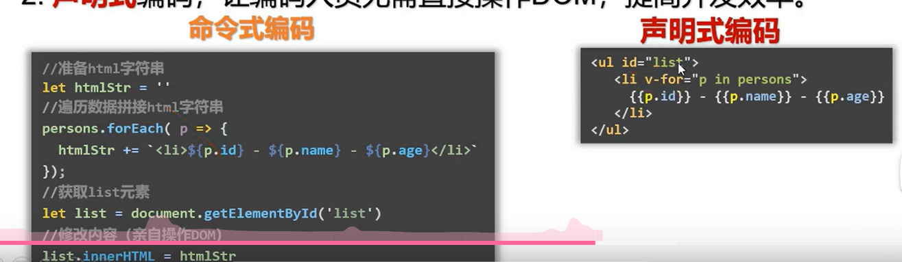

#  1. Vue2基础

## 1 . Vue简介

### 1.Vue是什么

一套用于构建用户界面的渐进式JavaScript框架

### 2.谁开发的

尤雨溪


### 3. Vue的特点

1. 采用==组件化==模式，提高代码复用率、且让代码更好维护
2. ==声明式==编码，让编码人员无需直接操作DOM，提高开发小效率



3. 使用==虚拟DOM+优秀的Diff算法==，尽量复用DOM节点

## 2.初识Vue

1. 想让Vue工作，就必须先创建一个Vue实例，且要传入一个配置对象

   ```js
   const vm=new Vue()
   ```

2. 容器里的代码依然符合html规范，只不过要混入一些特殊的Vue语法
   ```html
   <h1>Hello {{name}}</h1>
   ```

3. 容器里的代码被称为【Vue模版】

==**Vue实例和容器是一一对应的**==

真实开发中只有一个Vue实例，并且会配合一些组件一起使用，{{xxx}}中的xxx要写js表达式，且xxx可以自动读取到data中的所有属性，一旦data中的数据发生改变，那么模板(其实影响的是页面)中用到该数据的地方也会自动更新

注意区分：js表达式和js代码（语句）

1. 表达式：一个表达式会产生一个值，可以放在任何一个需要值的地方
   - a
   - a+b
   - demo（1）
2. js代码（语句）
   - if（ ）{ }
   - for（ ）{ }

## 3.Vue模板语法

 Vue模版语法有2大类：

### 1. 插值语法

功能：用于解析标签体内容

写法：{{xxx}}，xxx是js表达式，且可以直接读取到data中的所有属性

### 2.指令语法

功能：用于解析标签（包括：标签属性、标签体内容、绑定事件...）

举例：v-bind：herf=“xxx”或简写为：href=“xxx”，xxx同样要写js表达式且可以直接读取到data中的所有属性

备注：Vue中有很多指令，且形式都是v-???，此处的主要就是为了举例

## 4.数据绑定

Vue中有两种数据绑定的方式

1.  单项数据绑定(v-bind):数据只能从data流向页面
2. 双向绑定（v-model）:数据不仅仅能从data流向页面，还可以从页面流向data
    - **==注意：==**
      1. 双向绑定一般都应用在表单类元素上（如;input,select）
      2. v-model:value 可以简写为v-model因为v-model默认收集的就是value值

## 5.补充el与data的两种写法

data与el的2种写法

1. e1有2种写法
   1. .new Vue时候配置el属性。
   2. .先创建Vue实例，随后再通过vm.$mount('#root')指定el的值
2. data有2种写法
   1. (1).对象式
   2. (2).函数式
      如何选择: 目前哪种写法都可以，以后学习到组件时，data必须使用函数式，否则会报错.
3. 一个重要的原则:
   ==由Vue管理的函数，一定不要写箭头函数，一旦写了箭头函数，this就不再是Vue实例了。==

## 6.MVVM模型

MVVM模型：

1. M：模型（Model）：data中的数据
2. V：视图（View）：模板代码
3. VM：视图模型（ViewModel）：Vue实例

观察发现：

1. data中的所有的属性，最后都出现在VM身上
2. vm身上所有的属性以及Vue原型上的所有的属性在Vue模版中都可以直接使用

## 7.数据代理

1. Vue中的数据代理
   	通过对象来处理data对象中属性的操作（读/写）

2. Vue中的数据代理的好处
   更加方便的操作data中的数据

3. 基本原理：

   ​	通过Object.defineProperty()把data对象中所有属性添加到vm上，为每一个添加到vm上的属性，都指定一个getter/setter，在getter/setter内部去操作（读/写）data中对应的属性


## 8.事件处理

事件的基本使用:

1. 使用v-on:xxx 或 @xxx 绑定事件，其中xxx是事件名;
2. 事件的回调需要配置在methods对象中，最终会在vm上;
3. methods中配置的函数，不要用箭头函数!否则this就不是vm了;
4. methods中配置的函数，都是被Vue所管理的函数，this的指向是vm 或 组件实例对象;
5.  @click="demo”和 @click="demo($event)” 效果一致，但后者可以传参;

### 8.1Vue中的事件修饰符

1. prevent:阻止默认事件（常用）
2. stop：阻止事件冒泡（常用）
3. once：事件只能触发一次（常用）
4. capture：使用事件的捕获模式
5. self：只有event.target是当前操作的元素是才触发事件
6. passive：事件的默认行为立即执行，无需等待事件回调执行完毕 （移动端用的可能多一点   ）

### 8.2Vue中常用的按键别名

- 回车=》enter
- 删除=》delete（捕获删除和退格键）
- 退出=》esc
- 空格=》space
- 换行=》tab（特殊需要配合事件keydown使用）
- 上=》up
- 下=》down
- 左=》left
- 右=》right

1. Vue未提供别名的按键。可以使用按键原始的key值去绑定，但要注意转为kebab-case（短横线命名）
2. 系统修饰符（用法特殊）：ctrl，alt，shift，meta（徽标键）
   - 配合keyup使用：按下修饰键的同时，再按下其他键，随后释放其他键，事件才被触发
   - 配合keydown使用：正常触发事件
3. 也可以使用keyCode去指定具体的按键（不推荐最新标准已经废除可能以后不让用）
4. Vue.configkjeyCodes.自定义键名=键码可以定制按键别名 

## 9.计算属性 

1. 定义：要用的属性不存在，要通过已有属性计算得来
2. 原理：底层借助了Object.defineproperty方法提供的getter和setter
3. get函数什么时候执行：
   - 初次读取的时候会执行一次
   - 当依赖的数据发生改变时会再次被调用
4. 优势：与methods实现相比，内部有缓存机制（复用），效率更高，调试方便
5. 注意：
   - 计算属性最终会出现在vm上，直接读取使用即可
   - 如果计算属性要被修改，那必须写set函数去响应修改，且set中要引起计算时依赖的数据发生改变 
   - 只读取（get）不修改（set）可以简写直接写成函数的形式==但是并不是函数==

## 10.监视属性 （watch）

1. 当被监视的属性变化时，回调函数自动调用，进行相关操作
2. 监视的属性必须存在，才能进行监视！！
3. 监视的两种写法：
   - new Vue时传入watch配置
   - 通过vm.$watch监视

### 10.1深度监视

1.  Vue中的watch默认不可监测对象内部的值改变（一层）

2. 配置deep：true可以监测对象内部的值的改变（多层）

   注意：

   - Vue自身可以监测对象内部值的改变，但是Vue提供的watch默认不可以
   - 使用watch时根据数据的具体结构，决定是否采用深度监视

###  10.2computed和watch之间的区别

1. computed能完成的功能，watch都可以完成
2. watch能完成的功能，computed不一定能完成
   - 例如：watch可以进行异步操作

**两个重要的原则**

1. 所有被Vue管理的函数，最好写成普通函数，这样this的指向才是vm或 组件实例对象
2. 所有不被Vue所管理的函数（定时器的回调函数，ajax的回调函数等），最好写成箭头函数，这样this的指向才是vm或组件实例对象

## 11.绑定样式

### 11.1class样式

写法：class="xxx" xxx可以是字符串、对象、数组

- 字符串写法适用于：类名不确定、要动态获取
- 对象写法适用于：要绑定多个样式，个数不确定。名字也不确定
- 数组写法使用与要绑定多个样式，个数确定，名字也确定，但不确定用不用

### 11.2style样式

- ：style="{fontSize:xxx}"其中xxx是动态值
- ：style="[a,b]"其中a、b是样式对象 

## 12.条件渲染

### 12.1 v-if

写法：

1. v-if=“表达式”

2. v-else-if=“表达式”

3. v-else=“表达式”
   适用于：切换频率较低的场景

   特点：不展示的DOM元素直接被移除
   ==**注意：**==v-if和v-else-if、v-else一起使用，但是要求结构不能被打断

### 12.2 v-show

写法：v-show=“表达式”

适用于：切换频率较高的场景

特点：不展示的DOM元素未被移除，仅仅是使用样式隐藏掉

==**注意：**==使用v-if时，元素可能无法获取到，而使用v-show一定可以获取到

**小细节想要同时一个条件控制多个可以用template控制但是要用v-if**

## 13.列表渲染

### 13.1基本列表

**v-for指令**

1. 用于展示列表数据
2. 语法：v-for=“（item，index）in xxx ：key=“yyy”
3. 可遍历：数组、对象、字符串（用的较少）、指定次数（用的较少）

 

### 13.2key的原理


效率和稳定性对比

react、vue中的key有什么作用？（key的内部原理）

1. 虚拟DOM中key的作用：
   key是虚拟DOM对象的标识，当数据发生变化时，Vue会根据【新数据】生成【新的虚拟DOM】，随后Vue进行【新虚拟DOM】与【旧虚拟DOM】的差异比较，比较规则如下

2. 对比规则：

   1. 就虚拟DOM中找到了与新虚拟DOM相同的key：
      - 若虚拟DOM中内容没变，直接使用之前的真实DOM
      - 若虚拟DOM中内容变了，则生成新的真实DOM，随后替换页面中之前的真是DOM

3. 旧虚拟DOM中为找到与新虚拟DOM相同的key

   ​	创建新的真实DOM，随后渲染到页面

   1. 用index作为key可能引发的问题：
      1. 若对数据进行：逆序天剑、逆序删除等破坏顺序操作：会产生没有必要的真是DOM更新===》界面效果没问题，但效率低
      2. 如果结构中还包含输入类的DOM：会产生错误的更新===》界面有问题

4. 开发中如何选择key？

   1. ​	最好使用每条数据的唯一标识作为key，比如id、手机号、身份证号、学号等唯一值
   2. 如果不存在对数据进行逆序添加、逆序删除等破坏顺序的操作，仅用于渲染列表用于展示，使用index作为key是没有问题的

### 13.3数据监测的原理

Vue监视数据的原理：

1. vue会监视data中所有层次的数据。

2. 如何监测对象中的数据？
      通过setter实现监视，且要在new Vue时就传入要监测的数据。
      
      (1).对象中后追加的属性，Vue默认不做响应式处理
            
       (2).如需给后添加的属性做响应式，请使用如下API
            
       - Vue.set(target，propertyName/index，value)       
       -  vm.$set(target，propertyName/index，value)
      
        3. 如何监测数组中的数据？
           通过包裹数组更新元素的方法实现，本质就是做了两件事：
      
           1. 调用原生对应的方法对数组进行更新。
           2. 重新解析模板，进而更新页面。
      
        4. 在Vue修改数组中的某个元素一定要用如下方法：
      
           1. 使用这些API:push()、pop()、shift()、unshift()、splice()、sort()、reverse()
      
           2. Vue.set() 或 vm.$set()

​      

   ==**特别注意：**==Vue.set() 和 vm.$set() 不能给vm 或 vm的根数据对象 添加属性！！！

## 14.收集表单数据

若：<input type="text"/>,则v-model收集的是value值，用户输入的就是value值

若：<input type="radio"/>,则v-model收集的是value值，且要给标签配置value值

若：<input type="checkbox"/>

1. 没有配置input的value属性，那么收集的就是checked（勾选or未勾选）

2. 没有配置input的value属性：

   1. v-model的初始值是非数组，那么收集的就是checked（勾选or未勾选）
   2. v-model的初始值是数组，那么收集的就是value组成的数组

   备注：v-model的三个修饰符：

   - lazy：失去焦点再收集数据
   - number：输入字符串转为有效数字
   - trim：输入首尾空格过滤

##  15.过滤器

定义：对要显示的数据进行特定格式化后再显示（适用于一些简单逻辑的处理）

语法：

1. 注册过滤器：Vue.filter(name,callback)或new Vue{filters:{ }}
2. 使用过滤器：{{xxx| 过滤器名}}或v-bind：属性=“xxx|过滤器名”

备注：

1. 过滤器也可以接受额外参数，多个过滤器也可以串联
2. 并没有改变原本的数据，是产生新的对应的数据

## 16.内置指令

 V-bind:单向绑定解析表达式，可简写为 :xxx

  v-model : 双向数据绑定

  v-for：遍历数组/对象/字符串

  V-on：绑定事件监听，可简写为@

  V-if：条件渲染(动态控制节点是否存存在)

  V-else:条件渲染（动态控制节点是否存存在）

  V-show :条件渲染(动态控制节点是否展示)

### 16.1 v-text指令

1. 作用：向其所在的节点中渲染文本内容
2. 与插值语法的区别：v-text会替换掉节点中的内容{{xxx}}则不会 

### 16.2v-html指令

1. 作用：向指定节点中渲染包含html结构的内容
2. 与插值语法的区别：
   1. v-html会替换掉节点中的所有内容，{{xx}}则不会
   2. v-html可以识别html结构
3. ==**注意：**==v-html有安全性问题
   1. 在网站上动态渲染任何HTML是非常危险的，容易导致XSS攻击
   2. 一定要在可信的内容上使用v-html，永不要在用户提交的内容上 

### 16.3v-cloak

v-cloak指令（没有值）：

​            1.本质是一个特殊属性，Vue实例创建完毕并接管容器后，会删掉v-cloak属性。

​            2.使用css配合v-cloak可以解决网速慢时页面展示出{{xxx}}的问题。

### 16.4 v-once

1. v-once所在节点在初次动态渲染，就视为静态内容
2. 以后数据的改变不会引起v-once所在结构的更新，可以用于优化性能

### 16.5v-pre指令

1. 跳过所在节点的编译过程
2. 可利用它跳过，没有使用指令语法。没用使用差值语法的节点，会加快编译

## 17.自定义指令

1. 定义语法：

   1. 局部指令

      - new Vue（{								

        directives：{指令名：配置对象}	
        }）

      - new Vue（{

        directives{指令名：回调函数}
        }）

   2. 全局指令：

      - Vue.directive（指令名，配置对象）
      - Vue.directives(指令名，回调函数)

2. 配置对象中常见的3个回调：

   1. bind：指令与元素成功绑定时调用
   2. inserted：指令所在模版结构被重新解析时调用
   3. update：指令所在模版结构被重新解析时调用

3. ==注意：==

   1. 指令定义时不加v-，但使用时要加
   2. 指令名如果是多个单词，要使用kebab-case（例子：user-name）命名方式，不用使用camelCase（例子：userName）命名

## 18.生命周期

生命周期：

1. 又名：生命周期回调函数、生命周期函数、生命周期钩子
2. 是什么：Vue在关键时刻帮我们调用的一些特殊名称的函数
3. 生命周期函数的名字不可更改，但函数的具体内容是程序员根据需求编写的
4. 生命周期函数中的this指向是vm或组件实例化对象


张三的一生（张三的生命周期）:

- 将要出生
- ==（重要）==呱呱坠地===》检查身体各项指标
- 学会说话
- ·······
- ······
- ==（重要）==将要永别===》交代后事
- 已经永别

vm的一生（vm的生命周期）：

- 将要创建===》调用beforeCreate函数
- 创建完毕===》调用created函数
- 将要挂载===》调用beforeMount函数
- ==（重要）==挂载完毕== = 》调用mounted函数====》[重要的钩子]
- 将要更新===》调用beforeUpdate函数
- 更新完毕===》调用updated函数
- ==（重要）==将要销毁== =》调用beforeDestroy函数。 ====>[重要的钩子]
- 销毁完毕===》调用destroyed函数

常用的生命周期钩子：

1. mounted：发送ajax请求、启动定时器、绑定自定义事件、订阅消息等【初始化操作】
2. beforeDestroy：清除定时器、解绑自定义事件、取消订阅消息等【收尾工作】

关于销毁Vue实例

1. 销毁后借助Vue开发者工具看不到任何消息
2. 销毁后自定义事件会失效，但原生DOM仍然有效
3. 一般不会再beforeDestroy操作数据，因为即使操作，也不会触发更新


# 2.Vue组件化编程

## 1.模块与组件、模块化与组件化

**传统方式编写应用：**


**使用组件方式编写应用**


组件的定义——实现应用中局部功能代码和资源的集合

### 1.模块

理解：向外提供特定功能的js程序，一般就是一个js文件

为什么：js文件很多很复杂

作用：复用js简化js的编写，提高js的运行效率

### 2.组件

理解：用来实现局部（特定）功能效果的代码集合

为什么：一个界面的功能很复杂

作用：复用编码，简化项目编码，提高运行效率

### 模块化

当应用中的js都以模块来编写，那这个应用就是一个模块化应用

### 组件化

当应用中的功能都是以多组件的方式来编写的，那这个应用就是一个组件化应用

 

## 2.非单文件组件

Vue中组件使用的三大步骤

1. 定义组件（创建组件）
2. 注册组件
3. 使用组件

**如何定义组件？**

使用Vue.extend（option）创建，其中options和new Vue（options）时传入的那个options几乎一样，但是也有点区别

区别如下：

1. el不要写，为什么——最终所有的组件都要经过一个vm的管理，由vm中的el决定服务那个容器

2. data必须写成函数，为什么——避免组件被复用时数据存在引用关系

   备注：使用template可以配置组件结构

**如何定义组件？**

1. 局部注册：靠new Vue的时候传入components选项
2. 全局注册：靠Vue.component（'组件名'，组件）

**编写组件标签**

<组件名></组件名>

### 注意点

1. 关于组件名：

   一个单词组成：

   - 第一种写法（首字母小写）：school
   - 第二种写法（首字母大写）：School

   多个单词组成：

   - 第一种写法（kebab-case命名）：my-school
   - 第二种写法（CamelCase命名）:MySchool(需要Vue脚手架支持)

   备注：

   - 组件名尽可能回避HTML中已有的元素名称，例如：h2，H2都不行
   - 可以使用name配置项指定组件在开发者工具中呈现的名字

2. 关于组件标签

   - 第一种写法：<school></school>
   - 第二种写法：<school/>
   - 备注：不用使用脚手架时，<school/>会导致后续组件不能渲染

3. 一个简写方式：

   const school=Vue.extend(options)可简写为const school=options

### 关于VueComponent

1. school组件本质是一个名为VueComponent的构造函数，且不是程序员定义的，是Vue.extend生成的。

2. 我们只需要写<school/>或<school></school>，Vue解析时会帮我们创建school组件的实例对象，
   即Vue帮我们执行的：new VueComponent(options)。

3. 特别注意：每次调用Vue.extend，返回的都是一个全新的VueComponent！！！！

4. 关于this指向：

   (1).组件配置中：

    data函数、methods中的函数、watch中的函数、computed中的函数 它们的this均是【VueComponent实例对象】

    (2).new Vue(options)配置中：
    data函数、methods中的函数、watch中的函数、computed中的函数 它们的this均是【Vue实例对象】。

5. VueComponent的实例对象，以后简称vc（也可称之为：组件实例对象）。

​              Vue的实例对象，以后简称vm。


# 3.使用Vue脚手架

## 3.1初始化脚手架

### 1.说明

1. Vue脚手架是Vue官方提供的标准化开发工具（开发平台）
2. 最新的版本是4.x
3. 文档：https://cil.vuejs.org/zh/ 

### 2.关于不同版本的Vue

1. vue.js于vue.runtime.xxx.js的区别
   1. vue.js是完整的Vue包含核心功能+模板解析器
   2. vue.runtime.xxx.js是运行版的Vue，只包含：核心功能：没有模板解析器。
2. 因为Vue。runtime.xxx.js没有模板解析器，所以不能使用template配置项，需要使用render函数接受到creatElement函数去指定具体内容

## 3.2.ref和props属性

### 1.ref属性

1. 被用来给元素或子组件注册引用信息（id的替代者）
2. 应用在html标签上获取的是真实DOM元素，应用在组件标签上是实例对象（vc）
3. 使用方式：
   - 打标识：<h1 ref="xxx">......</h1>或<School ref="xxx"></School>
   - 获取;this.$refs.xxx

###  2.配置项props

功能：让组件接受外部传来的数据

1. 传递数据：
   <Demo name="xxx"/>

2. 接受数据：

   - 第一种方式（只接受）：

     props:['name']

   - 第二种方式（限制类型）

     props：{

     name:Number

     }

   - 第三种方式（限制类型，限制必要性，指定默认值）：

     props:{

     name:{

     type:String,//类型

     required:true,//必要性

     default:'老王'//默认值

     }

3. ==注意==：props是只读的，Vue底层会监测你对props的修改，如果进行了修改会发出警告。
   如果业务确实需要修改，那么请复制props的内容到data中一份，然后修改data中的数据

## 3.3mixin（混入）

功能：可以把多个组件公用的配置，提取成一个混入对象

使用方式：

1. 第一步定义混合，例如：{

   

   data（）{。。。},

   methods:{。。。}

   }

2. 第二步使用混入，例如：

   1. 全局混入：Vue。mixin（xxx）
   2. 局部混入：mixins：['xxx']

## 3.4插件

功能：用于增强Vue

本质：包含install方法的一个对象，install的第一个参数是Vue，第二个参数以后得参数是使用者传递的数据

定义插件：

​	对象.install=function（Vue，options）{

//1.添加全局过滤器

Vue.filter(...)

//2.添加全局指令

Vue.directive(...)

}

### ==scoped样式==

作用：让样式在局部生效，防止冲突

写法：<style scoped>

## 3.5Todo-list案例

**组件化编码流程（通用）**

1. 实现静态组件：抽取组件，使用组件实现静态页面效果
2. 展示动态数据：
   - 数据的类型、名称是什么
   - 数据保存在哪个组件
3. 交互——从绑定事件监听开始

### 1.总结ToDoList案例

1. 组件化编程流程：
   1. 拆分静态组件：组件要按照功能点拆分，命名不要与html元素冲突
   2. 要实现动态组件：考虑好数据存放位置，数据是一个组件在用还是一下组件在用：
      1. 一个组件在用：放在组件自身即可
      2. 一些组件在用：放在他们共同的父组件上即可<span style="color:red">状态提升</span>
   3. 实现交互：从绑定事件开始

2. props适用于：
   1. 父组件==》子组件 通信
   2. 子组件==》父组件 通信（要求父先给子一个函数）

3. 使用v-model时要切记：v-model绑定的值不能是props传来的值，因为props是不可以修改的
4. props传过来的若是对象类型的值，修改对象中的属性时Vue不会报错，但是不推荐这样写

### 2.0webStorage

1. 存储内容大小一般支持5MB左右（不同浏览器可能还不一样）

2. 浏览器端通过Window.sessionStorage和Window.localStorage属性来实现本地存储机制

3. 相关API

   1. ```js
      xxxxxStorage.setItem('key','value');
      ```

      该方法接受一个键和值作为参数，会把键值对添加到存储中，如果键名存在，则更新其对应的值

   2. ```js
      xxxxStorage.getItem('person');
      ```

      该方法接受一个键名作为参数，返回键名对应的值

   3. ```js
      xxxxStorage.removeItem('key');
      ```

      该方法接受一个键名作为参数，并将该键名从存储中删除

   4. ```js
      xxxxStorage.clear()
      ```

      该方法会清空存储中的所有数据

4. 备注：

   1. SessionStorage存储的内容会随着浏览窗口关闭而消失

   2. LocalStorage存储的内容，需要手动清除才会消失

   3. ```js
      xxxxStorage.getItem(xxx)
      ```

      如果xxx对应的value获取不到，那么getItem的返回值为null

   4. ```js
      JSON.parse(null)
      ```

      的结果仍然是null

   

## 3.6组件的自定义事件

1. 一种组件间通信的方式，适用于：<span style="color:red">子组件===>父组件</span>

2. 使用场景：A是父组件，B是子组件，B想给A传数据，那么就要在A中给B绑定自定义事件（<span style="color:red">事件的回调在A中</span>）

3. 绑定自定义事件：

   1. 第一种方式，在父组件中： 

      ```js
      <Demo @qr="test"/>
      ```

      或

      ```js
      <Demo v-on:qr="test"/>
      ```

   2. 第二种方式，在父组件中

      ```js
      <Demo ref="demo"/>
      ...
      mounted(){
      this.$refs.xxx.$on('qr',this.test)
      }
      ```

   3. 若想让自定义事件只能触发一次，可以使用once修饰符，或$once方法

4. 触发自定义事件：this.$emit('qr',数据)

5. 解绑自定义事件this.$off('qr')

6. 组件上也可以绑定原生DOM事件，需要使用native修饰符

7. 注意：通过this.$refs.xxx.$on('qr',回调)绑定自定义事件时，回调要么配置在methods中，要么用箭头函数，否则this的指向会出现问题

## 3.7全局事件总线：任意组件间通信


全局事件总线（GlobalEventBus）

1. 一种组件间通信的方式，使用于==任意组件间通信==

2. 安装事件总线：
   ```vue
   nueVue({
   ....
   beforeCreate(){
   Vue.prototype.$bus=this//安装事件总线，￥bus就是当前应用的vm
   },
   ....
   })
   ```

   

3. 使用事件总线：

   1. 接受数据：A组件想接受数据，则在A组件中给$bus绑定自定义事件，事件的回调留在A组件本身

      ```vue
      methods(){
      demo(data){....}
      }
      .....
      mouted(){
      this.$bus.$on('xxxx',this.demo)
      }
      ```

   2. 提供数据：this.$bus.$emit('xxx',数据)

4. 最好在beforeDestroy钩子中，用$off去解绑==当前组件所用到的==事件

## 3.8消息订阅与发布（pubsub）

1. 一种组件间通信的方式，适用于任意组件间通信

2. 使用步骤：

   1. 安装pubsub：npm i pubsub-js

   2. 映入：import pubsub from ‘pubsub-js’

   3. 接受数据：A组件想接受数据，则在A组件中订阅消息，订阅的回调留在A组件自身

      ```vue
      methods(){
      demo(data){......}
      }
      ...
      mouted(){
      this.pid=pubsub,subscribe('xxx',this.demo)//订阅消息
      }
      ```

   4. 提供数据：pubsub.publish（‘xxx’,数据）

   5. 最好在beforeDestroy钩子中用Pubsub.unsubscribe(pid)==取消订阅==

### nextTick

1. 语法this.$nextTick(回调函数)
2. 作用：在下一次Dom更新结束后执行其指定的回调
3. 什么时候用：当改变数据后，要基于更新后的新DOM进行某些操作时，要在nextTick所指定的回调函数中执行

## 3.9过度与动画

### Vue封装的过度与动画

1. 作用在插入、更新或移除DOM元素时，在合适的时候给元素添加样式类名

2. 图示

   

3. 写法：

   1. 准备好样式

      - 元素进入的样式：
        1. v-enter：进入的起点
        2. v-enter-active：进入过程中
        3. v-enter-to：进入的终点
      - 元素离开的的样式
        1. v-leave：离开的起点
        2. v-leave-active：离开过程中
        3. v-leave-to：离开的终点

   2. 使用<transition>包裹要过度的元素，并配置name属性

      ````vue
      <transition name='hello'>
      	<h1 v-show="isShow">你好啊</h1>
      </transition>
      ````

   3. 备注如果有多个元素需要过度，则使用：<transition-group>,且每个元素要指定key值

# 4.Vue中的Ajax

## 4.1解决开发环境中的Ajax跨域问题（Vue脚手架配置代理）

**方法一**

在vue.config.js中添加如下配置

```vue
desServer:{
proxy:"http://local:5000"
}
```

说明：

1. 优点：配置简单，请求资源时直接发给前端（8080）即可
2. 缺点：不能配置多个代理，不能灵活的控制请求是否走代理
3. 工作方式：若按照上述配置代理，当请求了前端不存在的资源时，那么该请求会转发给服务器（优先匹配前端资源）

**方法二**

编写vue.config.js配置具体代理规则：

````js
module.exports={
    devServer:{
        proxy:{
            'api1':{
            //匹配所有以'/api'开头的请求路径
            target:'http://localhost:5000',//代理目标的基础路径
            changeOrigin:true,
            pathRewrite:{'^api1':''}
            },
            'api2':{
            //匹配所有以'/api'开头的请求路径
            target:'http://localhost:5001',//代理目标的基础路径
            changeOrigin:true,
            pathRewrite:{'^api2':''}
            }
        }
    }
}
/*
changeOrigin设置为true时，服务器收到的请求头中的host为: localhost:5000
changeOrigin设置为false时，服务器收到的请求头中的host为:localhost:8080
changeOrigin默认值为true
*/
````

说明：

1. 优点：可以配置多个代理，且可以灵活的控制是否走代理
2. 缺点：配置略微繁琐，请求资源时必须加前缀

## 4.2github用户搜索案例

 

## 4.3vue项目中常用的两个Ajax库

### 4.3.1 axios（2024暂时推荐）

通用的Ajax请求库，官方推荐，使用广泛

### 4.3.2 vue-resource

vue插件库，vue1.x使用广泛，==官方已经不在维护==

## 4.4slot插槽

### 4.4.1效果

效果一（不使用插槽）：


效果二（默认插槽）:


效果三（作用域插槽）：


### 4.4.2插槽

1. 作用：让父组件可以向子组件指定位置插入html结构，也是一种组件间通信的方式，使用与父组件===>子组件

2. 分类：默认插槽，具名插槽，作用域插槽

3. 使用方式：

   1. 默认插槽：
      ````vue
      父组件中：
      <Category>
      <div>html结构</div>
      </Category>
      子组件中：
      <template>
      <div>
      //定义插槽
      <slot>插槽默认内容...</slot>
      </div>
      </template>
      ````

   2. 具名插槽：
      ```vue
      父组件中：
      <Category>
      <template slot="center"> 
      <div>html结构</div>
      </template>
      <template v-slot:footer>
      <div>html结构</div>
      </template>
      </Category>
      子组件中：
      <template>
      <div>
      //定义插槽
          <slot name="center">插槽默认内容...</slot>
          <slot name="footer">插槽默认内容...</slot>
      </div>    
      </template>
      ```

   3. 作用域插槽

      1. 理解：数字在组件自身，但根据数据生成的结构需要组件的使用者来决定（games数据在Category组件中使用，但使用数据所遍历出来的结构由App组件决定）

      2. 具体编码：
         ````vue
         父组件：
         <MyCategory title="游戏" >
                 <template slot-scope="qr">
                   <ul>
                     <li v-for="(g, index) in qr.games" :key="index">{{ g }}</li>
                 </ul>
                 </template>
             </MyCategory>
             <MyCategory title="游戏" >
                 <template slot-scope="{ games }">
                       <ol>
                         <li v-for="(g, index) in games" :key="index">{{ g }}</li>
                     </ol>
                 </template>
             </MyCategory>
         子组件：
         <template>
           <div class="category">
             <h3>{{title}}分类</h3>
             <!-- 定义个插槽（挖个坑，等着组件的使用者进行填充） -->
           <slot :games="games"> 我是默认内容</slot>
           </div>
         </template>
         <script>
         export default {
         name:'MyCategory',
         props:['title'],
             data() {
                 return {
                     games: ['红色警戒', 'CF', '蛋仔派对', '元梦之星'],
                 }
             },
         }
         </script>
         ````

# 5.vuex

## 5.1理解vuex

### 5.1.1vuex是什么

1. 概念:专门在Vue中实现集中式状态(数据)管理的一个Vue插件，对vue应用中多个组件的共享状态进行集中式的管理(读/写)，也是一种组件间通信的方式，且适用于任意组件间通信。
2. Github地址：https://github.com/vuejs/vuex

### 5.1.2什么时候使用Vuex

1. 多个组件依赖于同一状态
2. 来自不同组件的行为需要变更同一状态
3. 多个组件需要共享数据时

### 5.1.3Vuex工作室原理图


### 5.1.4搭建vuex环境

1. 创建文件：src/store/index.js
   ````vue
   //该文件用于创建Vuex中最为核心的store
   import Vue from 'vue'
   //引入Vuex
   import Vuex from 'vuex'
   // 应用vuex插件
   Vue.use(Vuex)
   //准备actions——用于响应组件里面的动作
   const actions = {}
   //准备mutations——用于操作数据（state）
   const mutations = {}
   //准备state——用于存储数据
   const state = {}
   
   // 创建并暴露stroe
   export default new Vuex.Store({
       actions,
       mutations,
       state,
   
   })
   
   ````

2. 在main.js中创建vm时传入store配置项
   ```vue
   ...
   //引入store
   import store from './store'
   ...
   //创建vm
   new Vue({
       el: '#app',
       render: h => h(App),
       store,
       beforeCreate() {
           Vue.prototype.$bus = this
       }
   })
   ```

   

### 5.1.5四个map方法的使用

1. mapState方法：用于帮助我们映射state中的数据为计算属性
   ````vue
   computed:{
    //借助mapState生成计算属性，从state中读取数据（对象写法）
   ...mapState({sum:'sum',school:'school',subject:'subject'})
   //借助mapState生成计算属性，从state中读取数据（数组写法）
   ...mapState(['sum','school','subject']),
   }
   ````

2. mapGetters方法：用于帮助我们映射getters中的数据为计算属性
   ```vue
   computed:{
   //借助mapGetters生成计算属性，从getters中读取数据（对象写法）
   // ...mapGetters({bigSum:'bigSun'}),
   //借助mapGetters生成计算属性，从getters中读取数据（数组写法）
   ...mapGetters(['bigSum'])
   }
   ```

3. mapActions:用于帮助我们生成与actions对话的方法，即：包含$store.dispatch(xxx)的函数
   ```vue
   methods:{
     //借助mapMutations生成对应的方法，方法中会调用commit去联系
           ...mapMutations({increment:'JIA',decrement:'JIAN'}),
    //借助mapMutations生成对应的方法，方法中会调用commit去联系
   //   ...mapMutations([ 'JIA','JIAN' ]),
   }
   ```

4. mapMutation方法：用于帮助我们生成与mutations对话的方法，即：包含$store.commit(xxx)的函数

   ````vue
   methods:{
    //借助mapActions生成对应的方法，方法中会调用dispath去联系actions(对象写法)
           // ...mapActions({incrementOdd:'jiaOdd',incrementWait:'jiaWait'})
           //借助mapActions生成对应的方法，方法中会调用dispath去联系actions(数组写法)
   }
   ````

**备注：mapActions与mapMutations使用时，若需要传递参数需要：在模版中绑定事件时传递好参数，否则参数是事件对象**

### 5.1.6模块化+命名空间

1. 目的：让代码更好维护，让多种数据分类更加明确

2. 修改store.js
   ````vue
   const countAbout ={
       namespaced: true,
       actions: {
           jiaOdd(context, value) {
               if (context.state.sum % 2) {
                   context.commit('JIA', value)
               }
   
           },
           jiaWait(context, value) {
               setTimeout(() => {
                   context.commit('JIA', value)
               }, 500)
           }
       },
       mutations: {
           JIA(state, value) {
               state.sum += value
           },
           JIAN(state, value) {
               state.sum -= value
           },
       },
       state: {
           sum: 0,
           school: 'sias',
           subject: '前端',
       },
       getters: {
           bigSum(state) {
               return state.sum * 10
           }
       }
   }
   const personAbout ={
       namespaced: true,
       actions: {
           addPersonWang(context, value) {
               if (value.name.indexOf('王') === 0) {
                   context.commit('ADD_PERSON', value)
               } else {
                   alert('添加的人必须姓王')
               }
           },
           addPersonServer(context) {
               axios.get('https://api.uixsj.cn/hitokoto/get?type=social').then(
                   response => {
                       context.commit('ADD_PERSON', { id: nanoid(), name: response.data })
                   },
                   error => {
                       alert(error.message)
                   }
               )
           }
       },
       mutations: {
           ADD_PERSON(state, value) {
               state.personList.unshift(value)
           }
       },
       state: {
           personList: [{
               id: '001', name: 'kk'
           }]
       },
       getters: {
           firstPersonName(state) {
               return state.personList[0].name
           }
       }
   }
   const store= new Vuex.Store({
       modules: {
           countAbout: countOptions,
           personAbout: personOptions
       }
   })
   ````

3. 开启命名空间，组件中读取state数据
   ```vue
   //方式一，自己直接读取
   this.$store.getters['personAbout']
   //方法二，借助mapState读取
   ...mapState('countAbout',['sum','school','subject'])
   ```

4. 开启命名空间后，组件中读取getters数据：
   ```vue
   //方式一，自己直接读取
   this.$store.getters['personAbout/firtsPersonName']
   //方式二，借助mapGetters读取
     ...mapGetters('countAbout',['bigSum'])
   ```

5. 开启命名空间后，组件中调用dispatch
   ```vue
   //方式一，自己直接dispatch
   this.$store.dispatch('personAbout/addPersonServer')
   //方式二，借助mapAction
    ...mapActions('countAbout',{incrementOdd:'jiaOdd',incrementWait:'jiaWait'})
   ```

6. 开启命名空间后，组件中调用commit

   ```vue
   //方式一，自己直接commit
   this.$store.commit('personAbout/ADD_PERSON',personObj)
   //方式二，借助mapMutations
   ...mapMutations('countAbout',{increment:'JIA',decrement:'JIAN'}),
   ```

# 6.Vue中的路由


## 6.1相关理解

### 6.1.1vue-router的理解

vue的一个插件库，专门用来实现SPA应用

### 6.1.2对SPA应用的理解

1. 单页Web应用报告（single page web application ，SPA）
2. 整个应用只有==一个完整的页面==
3. 点击页面中导航链接==不会刷新==页面，只会做页面的==局部更新==
4. 数据需要ajax请求获取

### 6.1.3路由的理解

**1.什么是路由？**

1. 一个路由就是一组映射关系（key-value）
2. key为路径，value可能是function或component

**2.路由分类**

1. 后端路由：
   1. 理解：value是function，用于客户端提交的请求
   2. 工作过程：服务器接受到一个请求时，根据**请求路径**找到匹配的**函数**来处理请求，返回响应数据
2. 前端路由
   1. 理解：value就是component，用于展示页面内容
   2. 工作过程，当浏览器的路径改变时，对应的组件就会显示

## 6.2基本路由

### 6.2.1效果


### 6.2.2路由的基本使用

1. 安装vue-router，命令：npm i vue-router

2. 应用插件：Vue.use(VueRouter)

3. 编写router配置项

   ```vue
   //引入VueRouterimport VueRouter from "vue-router";
   //引入组件
   import MyAbout from '../components/MyAbout'
   import MyHome from '../components/MyHome'
   //创建并暴露一个路由器
   export default new VueRouter({
       routes: [
           {
               path: '/about',
               component: MyAbout
           },
           {
               path: '/home',
               component: MyHome
           }
       ]
   })
   
   ```

4. 实现切换(active-class可配置高亮样式)

   ````vue
   <router-link class="list-group-item " active-class="active" to="/about">About</router-link> 
   ````

5. 指定展示位置
   ```vue
   <!-- 指定组件的呈现位置 -->
   <router-view></router-view>
   ```

### 6.2.3几个注意点

1. 路由组件通常存放在pages文件夹，一般组件通常存放在components文件夹
2. 通过切换，“隐藏”了的路由组件，默认是被销毁掉的，需要的时候再去挂载。
3. 每个组件都有自己的$route属性，里面存储着自己的路由信息
4. 整个应用只有一个router，可以通过组件的$router 属性获取到

## 6.3嵌套（多级）路由

1. 配置路由规则，使用children配置项：
   ````js
    routes: [
           {
               path: '/about',
               component: MyAbout
           },
           {
               path: '/home',
               component: MyHome,
               children: [{
                   path: 'message',
                   component: MyMessage
               },
               {
                   path: 'news',
                   component: MyNews
               },]
           },
   
       ]
   ````

2. 跳转（要写完整路径）

   ```vue
    <router-link class="list-group-item " active-class="active" to="/home/message">Message</router-link>
   ```

## 6.4路由传参

1. 传递参数
   ```vue
   <!-- 跳转路由并携带query参数，to的字符串写法 -->
                   <!-- <router-link :to="`/home/message/detail?id=${m.id}&title=${m.title}`">{{ m.title }}</router-link>&nbsp;&nbsp; -->
                   
                   <!-- 跳转路由并携带参数，to的对象写法 -->
                   <router-link :to="{
                       path:'/home/message/detail',
                       query:{
                           id:m.id,
                           title:m.title
                       }
                   }">
                       {{ m.title }}
                   </router-link>&nbsp;&nbsp;
   ```

   

2. 接受参数

   ```vue
   $route.query.id
   $route.query.title
   ```

   

## 6.5命名路由

1. 作用：可以简化路由的跳转

2. 如何使用

   1. 给路由命名
      ```vue
      routes: [
              {
                  name: 'dage',
                  path: '/about',
                  component: MyAbout
              },
              {
                  path: '/home',
                  component: MyHome,
                  children: [{
                      path: 'message',
                      component: MyMessage,
                      children: [{
                          name: 'sandi',
                          path: 'detail',
                          component: MyDetail,
                      }]
                  },
                  {
      
                      path: 'news',
                      component: MyNews
                  },]
              },
      
          ]
      
      ```

   2. 简化跳转

      ```vue
      <!--简化前需要写完整的路径-->
       <router-link  to="/about">About</router-link> 
       <!--简化后直接通过名字跳转-->
        <router-link  to="{name:hello}">About</router-link> 
      ```

      

## 6.6路由的params参数

1. 配置路由，声明接受params参数
   ```vue
      routes: [
           {
               name: 'dage',
               path: '/about',
               component: MyAbout
           },
           {
               path: '/home',
               component: MyHome,
               children: [{
                   path: 'message',
                   component: MyMessage,
                   children: [{
                       name: 'sandi',
                       path: 'detail/:id/:title',
                       component: MyDetail,
                   }]
               },
               {
   
                   path: 'news',
                   component: MyNews
               },]
           },
   
       ]
   ```

2. 传递参数
   ```vue
        <!-- 跳转路由并携带params参数，to的字符串写法  -->
               <!-- <router-link :to="`/home/message/detail/${m.id}/${m.title}`">{{ m.title }}</router-link>&nbsp;&nbsp;  -->
                   <!-- 跳转路由并携带参数，to的对象写法 -->
                   <router-link :to="{
                         name: 'sandi',
                       params:{
                         
                           id:m.id,
                           title:m.title
                       }
                   }">
                       {{ m.title }}
                   </router-link>&nbsp;&nbsp;
   ```

   ==特别注意：==路由携带params携带参数时若使用to的对象写法，则不能使用path配置项，必须使用name配置

3. 接受参数

   ```js
   $route.params.id
   $route.params.title
   ```

## 6.7路由的props配置

作用：让路由组件更方便的接收到参数

```vue
{
 name: 'sandi',
                    path: 'detail/:id/:title',
                    component: MyDetail,
                    //props的第一种写法，值为对象，该对象所有key-value都会以props的形式传给Detail组件
                    // props: {
                    //     a: 1,
                    //     b: 2
                    // }
                    //props的第二种写法，值为布尔值，若布尔值为真，就会把该路由收到的所有params参数，传给Detail组件
                    // props: true
                    //props的第三种写法，值为函数,该函数对象中每一组key-value都会以props的形式传给Detail组件
                    props($route) {
                        return {
                            id: $route.params.id,
                            title: $route.params.title
                        }
                    }
}
```

## 6.8<router-link>的replace属性

1. 作用：控制路由跳转时操作浏览器历史记录的模式
2. 浏览器的历史记录有两种方式：分别为push和replace，push是追加历史记录，replace是替换当前记录。路由跳转时候默认是push
   （push原理是以栈的形式追加历史记录因为先进后出的特点实现的）
3. 如何开启replace模式：<router-link replace ....>News</router-link>

## 6.9编程式路由导航

1. 作用：不借助<router-link>实现路由跳转，让路由跳转更加灵活

2. 具体编码：
   ```vue
    pushShow(m){
           this.$router.push({
                   name: 'sandi',
                   params: {
   
                       id: m.id,
                       title: m.title
                   }
           })
       },
       replaceShow(m){
               this.$router.replace({
                   name: 'sandi',
                   params: {
   
                       id: m.id,
                       title: m.title
                   }
               })
   
       }
   this.$router.back()//前进
   this.$router.forward()//后退
   this.$router.go(此处数字)//可前进也可后退
   ```

   

## 6.10缓存路由组件

1. 作用：让不展示的路由组件由组件保持挂载，不被销毁

2. 具体编码：
   ````vue
   <keep-alive include="MyNews">
          <router-view></router-view>
   </keep-alive>
   ````

   ==注：include中写的是组件名，多个就是：include加数组==

## 6.11两个新的生命周期钩子

1. 作用：路由组件所独有的两个钩子，用于捕获路由组件的激活状态
2. 具体名字：
   1. activated路由组件被激活时触发
   2. deactivated路由组件失活时触发

## 6.12路由守卫

1. 作用：对路由进行权限控制

2. 分类：全局守卫、独享守卫、组件内守卫

3. 全局守卫：
   ```vue
   //全局前置路由守卫————初始化的时候被调用、每次路由切换之前被调用
   router.beforeEach((to, from, next) => {
       if (to.meta.isAuth) {//判断是否需要鉴权
           if (localStorage.getItem('school') === 'qr') {
               next()
           } else {
               alert('学校名有误，没有访问权限')
           }
       } else {
           next()
       }
   })
   //全局前置路由守卫————初始化的时候被调用、每次路由切换之后被调用
   router.afterEach((to, from) => {
       document.title = to.meta.title
       console.log('后置路由守卫，', to, from);
   })
   ```

4. 独享路由守卫：
   ```vue
   beforeEnter: (to, from, next) => {
                       if (to.meta.isAuth) {//判断是否需要鉴权
                           if (localStorage.getItem('school') === 'qr') {
                               next()
                           } else {
                               alert('学校名有误，没有访问权限')
                           }
                       } else {
                           next()
                       }
                   }
   ```

5. 组件内守卫
   ```vue
   //通过路由规则进入该组件时被调用
   beforeRouteEnter(to,from,next){
           if (to.meta.isAuth) {//判断是否需要鉴权
               if (localStorage.getItem('school') === 'qr') {
                   next()
               } else {
                   alert('学校名有误，没有访问权限')
               }
           } else {
               next()
           }
   },
     //通过路由规则离开该组件时被调用
   beforeRouteLeave(to, from, next){
   next()
   }
   ```

   

## 6.13路由器的两种工作模式

1. 对于一个url来说，什么是hash值? - #及其后面的内容就是hash值
2. hash值不会包含在 HTTP 请求中，即: hash值不会带给服务器。
3. hash模式:
   1. 地址中永远带着#号，不美观
   2. 若以后将地址通过第三方手机app分享，若app校验严格，则地址会被标记为不合法。
   3. 兼容性较好
4. history模式:
   1. 地址干净，美观
   2. 兼容性和hash模式相比略差
   3. 应用部署上线时需要后端人员支持，解决刷新页面服务端404的问题。

# 7.Vue UI组件库

## 7.1移动端常用UI组件库

1. Vant http://youzan.githun.io/vant
2. Cube UI http://didi.github.io/cube-ui
3. Mint UI http://mint-ui.github.io

## 7.2PC端常用UI组件库

1. Element UI http://element.eleme.cn
2. IView UI http://www.iviewui.com
