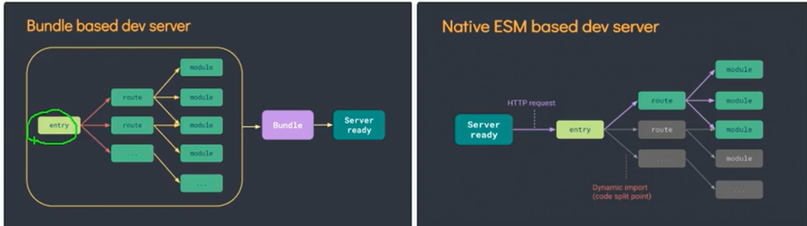
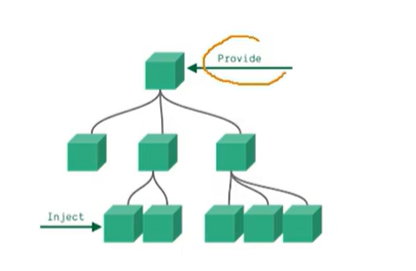

# 1. Vue3快速上手

## 1.Vue3简介

- 2020年9月18日，Vue.js发布3.0版本，代号：One Piece（海贼王）
- 耗时2年多、[2600+次提交](https://github.com/vuejs/vue-next/graphs/commit-activity)、[30+个RFC](https://github.com/vuejs/rfcs/tree/master/active-rfcs)、[600+次PR](https://github.com/vuejs/vue-next/pulls?q=is%3Apr+is%3Amerged+-author%3Aapp%2Fdependabot-preview+)、[99位贡献者](https://github.com/vuejs/vue-next/graphs/contributors) 
- github上的tags地址：https://github.com/vuejs/vue-next/releases/tag/v3.0.0

## 2.Vue3带来了什么

### 1.性能的提升

- 打包大小减少41%

- 初次渲染快55%, 更新渲染快133%

- 内存减少54%

  ......

### 2.源码的升级

- 使用Proxy代替defineProperty实现响应式

- 重写虚拟DOM的实现和Tree-Shaking

  ......

### 3.拥抱TypeScript

- Vue3可以更好的支持TypeScript

### 4.新的特性

1. Composition API（组合API）

   - setup配置
   - ref与reactive
   - watch与watchEffect
   - provide与inject
   - ......
2. 新的内置组件
   - Fragment 
   - Teleport
   - Suspense
3. 其他改变

   - 新的生命周期钩子
   - data 选项应始终被声明为一个函数
   - 移除keyCode支持作为 v-on 的修饰符
   - ......

# 一.创建Vue3.0工程

## 1.使用vue-cli创建

官方文档：http://cli.vuejs.org/zh/gulde/creating-a-project.html#vue-creat

```bash
## 查看@vue/cli版本，确保@vue/cli版本在4.5.0以上
vue --version
## 安装或升级你的@bvue/cli
npm install -g@vue/cli
## 创建
vue create vue_test
##启动
cd vue_test
npm run server
```

## 2.使用bite创建

官方文档：http://v3.cn.vuejs.org/gulde/installation.html#vite

vite官网：http://vitejs.cn

- 什么是vite？——新一代前端构建工具
- 优势如下
  - 开发环境下，无需打包操作可快速冷启动
  - 轻量快速的热重载(HMR)
  - 真正的按需编译，不在等待整个应用编译完成
- 传统构建与vite构建对比图



```bash
## 创建工程
npm init vute-app<project-name>
##进入工程目录
cd<project-name>
##安装依赖
npm install
## npm run dev
```

2023年11月25日，vite已经来到了V5版本，本视频的安装方式已经被废弃，最新命令为：npm create vite@latest

# 二.常用的Composition API

官方文档：http://v3.cn.vuejs.org/gulde/composition-api-instroduction.html

## 1.拉开序幕的setup

1. 理解:Vue3.0中一个新的配置项，值为一个函数。

2. setup是所有Composition API (组合API)“表演的舞台”

3. 组件中所用到的:数据、方法等等，均要配置在setup中。

4. setup函数的两种返回值:

   1. 若返回一个对象，则对象中的属性、方法,在模板中均可以直接使用。(重点关注!)

   2. 若返回一个渲染函数: 则可以自定义染内容。 (了解)

5. 注意点:

   1. 尽量不要与Vue2.x配置混用
      - Vue2.x配置(datamethos、computed...) 中可以访问到setup中的属性、方法
      - 但在setup中不能访问到Vue2.x配置 (data、methos、computed...)。
      - 如果有重名,setup优先
   2. setup不能是一个async函数，因为返回值不再是return的对象,而是promise,模板看不到return对象中的属性。(后期也可以返回一个Promise实例，但需要Suspense和异步组件的配合)

## 2.ref函数

- 作用：定义一个响应式数据

- 语法：const xxx=ref(initValue)

  -  创建一个包含响应式数据的==引用对象（reference对象简称ref对象）==

  - JS中操作数据 xxx.value

  - 模板中读取数据：不需要.value直接写就行

- 备注
  - 接受的数据可以是基本类型，也可以是对象类型
  - 基本数据类型的数据：响应式依然是依靠Object.defineProerty()的get与set完成的
  - 对象类型的数据：内部“求助”了Vue3.0中的一个新函数——reactive函数

## 3.reactive函数

- 作用：定义一个==对象类型==的响应式数据（基本类型别用它，用ref函数）
- 语法：const 代理对象=reactive(被代理对象)接受一个对象（或数组），返回一个==代理器对象（proxy对象）==
- reactive定义的响应式数据是"深层次的"
- 内部基于ES6的Proxy实现，通过代理对象操作源对象内部数据都是响应式的

## 4.Vue3.0中的响应式原理

**vue2.x的响应式**

- 实现原理

  - 对象类型：通过Object.defineProperty()对属性的读取，修改进行拦截（数据劫持）

  - 数组类型：通过重写更新数组的一系列方法来实现拦截（对数组的变更方法进行了包裹）
    ```js
    Object.defineProperty(data,'count',{
    get () {},
    set () {}
    })
    ```

- 存在问题

  - 新增属性、删除属性、界面不会更新
  - 直接通过下标修改数组，界面不会自动更新

**Vue3.0的响应式**

- 实现原理:
  - 通过Proxy(代理)：拦截对象中任意属性的变化，包括：属性值的读写，属性的添加，属性的删除等
  - 通过Reflct(反射)：对被代理对象的属性进行操作
  - MDN文档中描述的Proxy与Reflect

## 5.reactive对比ref

- 从定义数据角度对比
  - ref用于定义：基本数据类型
  - reactive用来定义：对象（或数组）类型数据
  - 备注：ref也可以用来定义对象（或数组）类型数据，它内部会自动通过reactive转化为代理对象
- 从原理角度对比
  - ref通过Object.defineProperty()的get与set来实现响应式（数据劫持）
  - reactive通过使用Proxy来实现响应式（数据劫持），并通过Reflect操作源对象内部的数据
- 从使用角度对比
  - ref定义的数据：操作数据需要.value，读取数据时模版中直接读取不需要.value
  - reactive定义的数据，操作与读取数据，混不需要.value

## 6.setup的两个注意点

- setup执行的时机
  - 在beforeCreat之前执行一次，this是undefined
- setup的参数
  - props：值为对象，包含：组件外部传递过来，且组件内部声明接收了的属性
  - context：上下文对象
    - attrs：值为对象，包含：组件外部传递过来，但没有在props配置中声明的属性，相当于this.$attrs
    - slots:收到的插槽内容，相当于this.$slots
    - emit:分发自定义事件的函数，相当于this.$emit

## 7.计算属性与监视

### 1.computed函数

- 与Vue2.X中computed配置功能一直

- 写法
  ````js
  import(computed)from 'vue'
  set up(){
  ...
  //计算属性——简写
  let fullName=computed(()=>{
  return person.firstName+'-'+person.lastName
  })
  //计算属性——完整
  let fullName=computed({
  get(){
  return person.firstName+'-'+person.lastName
  },
  set(value){
  const nameArr=value.spile('-'
  person.firstName=nameArr[0]
  person.lastName=nameArr[1]
  )
  }
  })
  }
  ````

### 2.watch函数

- 与Vue2.x中watch配置功能一致

- 两个小坑

  - 监视reactive定义的响应式数据时，oldValue无法正常获取，强制开启了深度监视（deep配置失败）

  - 监视reactive定义的响应式数据中某个属性时，deep配置有效

    ````vue
        //    情况一：监视ref所定义一个的响应式数据
        //    watch(sum, (newValue, OldValue) => {
        //         console.log('sum发生了改变' + newValue + OldValue);
        //     },{
        //         immediate:true
        //     })
        // 情况二：监视ref所定义的多个响应式数据
        //    watch([sum,msg], (newValue, OldValue) => {
        //             console.log('sum或msg发生了改变' + newValue + OldValue);
        //         },{immediate:true})
        //情况三 监视reactive所定义的一个响应式数据,
        // 1.此处无法正确的获得OldValue
        //2.强制开启了深度监视（deep配置无效）
        //     watch(person,(newValue, OldValue )=>{
        // console.log('person变化了',newValue,OldValue);
        //     },{deep:false})//此处的deep配置无效
        //情况四：监视reactive所定义的一个响应式数据中的某个属性
        // watch(()=>person.age,(newValue,OldValue)=>{
        //     console.log("person的age变化了",newValue,OldValue);
        // })
        //情况五：监视reactive所定义的一个响应式数据中的某些属性
        // watch([()=>person.age,()=>person.name],(newValue,OldValue)=>{
        //             console.log("person的age或name变化了", newValue, OldValue);
        // })
        //特殊情况
        // watch(()=>person.job,(newValue,OldValue)=>{
        //     console.log("person的job变化了",newValue,OldValue);
        // },{
        //     deep:true
        // })//此处由于监视的是reactive所定义的对象中的某个属性，所以deep配置有效
    ````

    

### 3.watchEffect函数

- watch的套路是：既要指明监视的属性，也要指明监视的回调
- watchEffect的套路是不用指明监视哪个属性，监视的回调中用到哪个属性，那就监视哪个属性
- watchEffect有点像computed：
  - 但computed注重的是计算出来的值（回调函数的返回值），所以必须写返回值
  - 而watchEffect更注重的是过程（回调函数的函数体），所以不用写返回值

```js
//watchEffect所指定的回调中用的的数据只要发生改变，则直接重新执行回调
watchEffect(()=>{
const x1=sum.value
const x2=person.age
console.log('watchEffect配置的回调执行了')
})
```

## 8.生命周期


- Vue3.0中可以继续使用Vue2.x中的生命周期钩子，但是有两个被更名
  - beforeDestroy改名为beforeUnmount
  - destroyed改名为unmounted
- Vue3.0也提供了Composition API形式的生命周期钩子，与Vue2.x中的钩子对应关系如下
   - `beforeCreate`===>`setup()`
   - `created`====>`setup()`
   - `beforeMount` ===>`onBeforeMount`
   - `mounted`====>`onMounted`
   - `beforeUpdate`===>`onBeforeUpdate`
   - `updated` ====>`onUpdated`
   - `beforeUnmount` ==>`onBeforeUnmount`
   - `unmounted`====>`onUnmounted`

## 9.自定义hook函数

- 什么是hook？——本质是一个函数，把setup函数中使用的CompositiosAPI进行了封装
- 类似于vue2.x中的mixin
- 自定义hook的优势：复用代码，让setup中的逻辑更清楚易懂

## 10.toRef

- 作用：创建一个red对象其value值指向另一个对象中的某个属性值
- 语法：count name=toRef（person，'name'）
- 应用要在响应式对象中某个属性单独提供给外部使用时
- 扩展：toRefs与toRef功能一致，但可以批量创建多个ref对象，语法：toRefs(person)

# 三.其他Composition API

## 1. shallowReactive与shallowRef

- shallowRezctive：只处理对象最外层属性的响应式（浅响应式）
- shallweRef：只处理基本数据类型的响应式，不进行对象的响应式处理
- 什么时候使用？
  - 如果有一个对象数据，结构比较深，但是变化时只是外层属性变化===》shallowReactive
  - 如果有一个对象数据，后续功能不会修改该对象中的属性，而是生新的对象来替换==》shallowRef

## 2.readonly与shallowReadonly

- readonly：让一个响应式的数据变为只读的（深只读）
- shallowReadonly：让一个响应式数据变为只读的（浅只读）
- 应用场景：不希望数据被修改时

## 3.toRae与markRaw

- toRaw：
  - 作用将一个由==reactive==生成的响应式对象转为普通对象
  - 使用场景：用于读取响应式对象对应的普通对象，对这个普通对象的所有操作不会引起页面更新
- markRaw
  - 作用：标记一个对象，使其永远不会变为响应式对象
  - 应用场景：
    1. 有的值不应该设置为响应式的，例如复杂的第三方库
    2. 当渲染具有不可变数据源的大列表时，跳过响应式转换可以提高性能

## 4.customRef

- 作用：创建一个自定义的ref，并对其依赖项跟踪和更新触发进行显式控制
- 实现防抖效果
  ```vue
  <template>
  	<input type="text" v-model="keyword">
  	<h3>{{keyword}}</h3>
  </template>
  
  <script>
  	import {ref,customRef} from 'vue'
  	export default {
  		name:'Demo',
  		setup(){
  			// let keyword = ref('hello') //使用Vue准备好的内置ref
  			//自定义一个myRef
  			function myRef(value,delay){
  				let timer
  				//通过customRef去实现自定义
  				return customRef((track,trigger)=>{
  					return{
  						get(){
  							track() //告诉Vue这个value值是需要被“追踪”的
  							return value
  						},
  						set(newValue){
  							clearTimeout(timer)
  							timer = setTimeout(()=>{
  								value = newValue
  								trigger() //告诉Vue去更新界面
  							},delay)
  						}
  					}
  				})
  			}
  			let keyword = myRef('hello',500) //使用程序员自定义的ref
  			return {
  				keyword
  			}
  		}
  	}
  </script>
  ```

  

## 5.provide与inject

- 实现==祖孙组件间通信==

- 套路：父组件有一个provide选项来提供数据，子组件有一个inject选项来开始使用这些数据

- 具体写法：

  1. 祖组件中：

     ```js
     setup(){
     .....
     let car=reactive({name:'奔驰',price:'40万'})
     provide('car',car)
     ...
     }
     ```

  2. 孙组件中：

     ```js
     setup(props,context){
     .....
     const car=inject('car')
     return{}
     ....
     }
     ```

     



## 6.响应式数据的判断

- isRef:检查一个值是否是一个ref对象
- isReactive：检查一个对象是否是由reactive创建的响应式代理
- isReadonly：检查一个对象是否由readonly创建的只读代理
- isProxy：检查一个对象是否是由reactive或者readonly方法创建的代理

# 四.Composition API的优势

## 1.Option API存在的问题

使用创痛OptionsAPI中，新增或者修改一个需求，就需要分别在dara，methods，coputed里修改

<div style="width:600px;height:370px;overflow:hidden;float:left">
    
</div>
<div style="width:300px;height:370px;overflow:hidden;float:left">
     
</div>


## 2.Composition API 的优势

我们可以更加优雅的组织我们的代码，函数。让相关功能的代码更加有序的组织在一起。

<div style="width:500px;height:340px;overflow:hidden;float:left">
    
</div>
<div style="width:430px;height:340px;overflow:hidden;float:left">
    
</div>


# 五.新的组件

## 1.Fragment

- 在Vue2中：组件必须有一个根标签
- 在Vue3中：组件可以没有根标签，内部会将多个标签包含在一个Fragment虚拟元素中
- 好处：减少标签层级，减小内存占用

## 2.Teleport

- 什么是Teleport？——Teleport是一种能够将我们的组件html结构移动到指定位置的技术

  ````vue
  <teleport to="移动位置">
      <div v-if="isShow" class="mask">
          <div class="dialog">
              <h3>我是一个弹窗</h3>
              <buntton @click="isShow=false">关闭弹窗</buntton>
          </div>
      </div>
  </teleport>
  ````

  

## 3.Suspense

- 等待异步组件时渲染一些额外内容，让应用有更好的用户体验

- 使用步骤

  - 异步引入组件
    ```js
    import{defineAsyncComponent}from 'vue'
    const Child=defineAsyncComponent(()=>import('./components/Child.vue'))
    ```

  - 使用Suspense包裹组件，并配置好default与fallback

    ````vue
    <template>
        <div class="app">
            <h3>我是App组件</h3>
            <Suspense>
                <template v-slot:default>						<child/>
    			</template>
    			<template v-slot:fallback>					<h3>
        				加载中...
                    </h3>
    			</template>
        </Suspense>
        </div>
    </template>
    ````

    

# 六.其他

- ## 1.全局API的转移

  - Vue 2.x 有许多全局 API 和配置。
  
    - 例如：注册全局组件、注册全局指令等。
  
      ```js
      //注册全局组件
      Vue.component('MyButton', {
        data: () => ({
          count: 0
        }),
        template: '<button @click="count++">Clicked {{ count }} times.</button>'
      })
      
      //注册全局指令
      Vue.directive('focus', {
        inserted: el => el.focus()
      }
      ```
  
  - Vue3.0中对这些API做出了调整：
  
    - 将全局的API，即：```Vue.xxx```调整到应用实例（```app```）上
  
      | 2.x 全局 API（```Vue```） | 3.x 实例 API (`app`)                        |
      | ------------------------- | ------------------------------------------- |
      | Vue.config.xxxx           | app.config.xxxx                             |
      | Vue.config.productionTip  | <strong style="color:#DD5145">移除</strong> |
      | Vue.component             | app.component                               |
      | Vue.directive             | app.directive                               |
      | Vue.mixin                 | app.mixin                                   |
      | Vue.use                   | app.use                                     |
      | Vue.prototype             | app.config.globalProperties                 |
  
  ## 2.其他改变
  
  - data选项应始终被声明为一个函数。
  
  - 过度类名的更改：
  
    - Vue2.x写法
  
      ```css
      .v-enter,
      .v-leave-to {
        opacity: 0;
      }
      .v-leave,
      .v-enter-to {
        opacity: 1;
      }
      ```
  
    - Vue3.x写法
  
      ```css
      .v-enter-from,
      .v-leave-to {
        opacity: 0;
      }
      
      .v-leave-from,
      .v-enter-to {
        opacity: 1;
      }
      ```
  
  - <strong style="color:#DD5145">移除</strong>keyCode作为 v-on 的修饰符，同时也不再支持```config.keyCodes```
  
  - <strong style="color:#DD5145">移除</strong>```v-on.native```修饰符
  
    - 父组件中绑定事件
  
      ```vue
      <my-component
        v-on:close="handleComponentEvent"
        v-on:click="handleNativeClickEvent"
      />
      ```
  
    - 子组件中声明自定义事件
  
      ```vue
      <script>
        export default {
          emits: ['close']
        }
      </script>
      ```
  
  - <strong style="color:#DD5145">移除</strong>过滤器（filter）
  
    > 过滤器虽然这看起来很方便，但它需要一个自定义语法，打破大括号内表达式是 “只是 JavaScript” 的假设，这不仅有学习成本，而且有实现成本！建议用方法调用或计算属性去替换过滤器。
  
  - ......