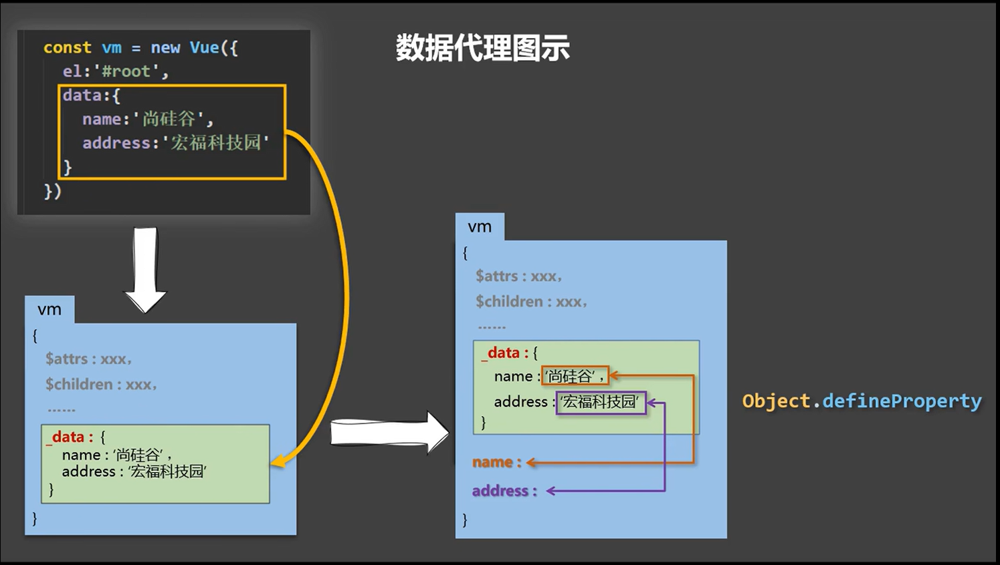

# 1. Vue基础

## 1 . Vue简介

### 1.Vue是什么

一套用于构建用户界面的渐进式JavaScript框架

### 2.谁开发的

尤雨溪


### 3. Vue的特点

1. 采用==组件化==模式，提高代码复用率、且让代码更好维护
2. ==声明式==编码，让编码人员无需直接操作DOM，提高开发小效率


3. 使用==虚拟DOM+优秀的Diff算法==，尽量复用DOM节点

## 2.初识Vue

1. 想让Vue工作，就必须先创建一个Vue实例，且要传入一个配置对象

   ```js
   const vm=new Vue()
   ```

2. 容器里的代码依然符合html规范，只不过要混入一些特殊的Vue语法
   ```html
   <h1>Hello {{name}}</h1>
   ```

3. 容器里的代码被称为【Vue模版】

==**Vue实例和容器是一一对应的**==

真实开发中只有一个Vue实例，并且会配合一些组件一起使用，{{xxx}}中的xxx要写js表达式，且xxx可以自动读取到data中的所有属性，一旦data中的数据发生改变，那么模板(其实影响的是页面)中用到该数据的地方也会自动更新

注意区分：js表达式和js代码（语句）

1. 表达式：一个表达式会产生一个值，可以放在任何一个需要值的地方
   - a
   - a+b
   - demo（1）
2. js代码（语句）
   - if（ ）{ }
   - for（ ）{ }

## 3.Vue模板语法

 Vue模版语法有2大类：

### 1. 插值语法

功能：用于解析标签体内容

写法：{{xxx}}，xxx是js表达式，且可以直接读取到data中的所有属性

### 2.指令语法

功能：用于解析标签（包括：标签属性、标签体内容、绑定事件...）

举例：v-bind：herf=“xxx”或简写为：href=“xxx”，xxx同样要写js表达式且可以直接读取到data中的所有属性

备注：Vue中有很多指令，且形式都是v-???，此处的主要就是为了举例

## 4.数据绑定

Vue中有两种数据绑定的方式

1.  单项数据绑定(v-bind):数据只能从data流向页面
2. 双向绑定（v-model）:数据不仅仅能从data流向页面，还可以从页面流向data
    - **==注意：==**
      1. 双向绑定一般都应用在表单类元素上（如;input,select）
      2. v-model:value 可以简写为v-model因为v-model默认收集的就是value值

## 5.补充el与data的两种写法

data与el的2种写法

1. e1有2种写法
   1. .new Vue时候配置el属性。
   2. .先创建Vue实例，随后再通过vm.$mount('#root')指定el的值
2. data有2种写法
   1. (1).对象式
   2. (2).函数式
      如何选择: 目前哪种写法都可以，以后学习到组件时，data必须使用函数式，否则会报错.
3. 一个重要的原则:
   ==由Vue管理的函数，一定不要写箭头函数，一旦写了箭头函数，this就不再是Vue实例了。==

## 6.MVVM模型

MVVM模型：

1. M：模型（Model）：data中的数据
2. V：视图（View）：模板代码
3. VM：视图模型（ViewModel）：Vue实例

观察发现：

1. data中的所有的属性，最后都出现在VM身上
2. vm身上所有的属性以及Vue原型上的所有的属性在Vue模版中都可以直接使用

## 7.数据代理

1. Vue中的数据代理
   	通过对象来处理data对象中属性的操作（读/写）

2. Vue中的数据代理的好处
   更加方便的操作data中的数据

3. 基本原理：

   ​	通过Object.defineProperty()把data对象中所有属性添加到vm上，为每一个添加到vm上的属性，都指定一个getter/setter，在getter/setter内部去操作（读/写）data中对应的属性



## 8.事件处理

事件的基本使用:

1. 使用v-on:xxx 或 @xxx 绑定事件，其中xxx是事件名;
2. 事件的回调需要配置在methods对象中，最终会在vm上;
3. methods中配置的函数，不要用箭头函数!否则this就不是vm了;
4. methods中配置的函数，都是被Vue所管理的函数，this的指向是vm 或 组件实例对象;
5.  @click="demo”和 @click="demo($event)” 效果一致，但后者可以传参;